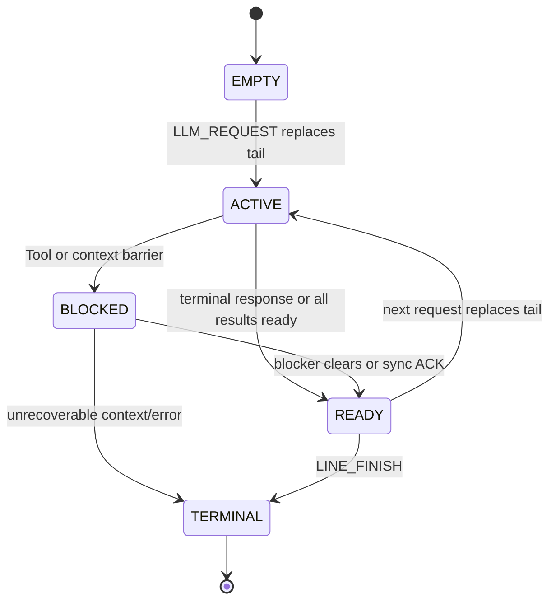

# FlowPilot：面向 OpenHands、vLLM 与 Web Tool 复用的延迟上下文调度器

> 文档性质：系统研究设计草案  
> 核心目标：在固定的单个 vLLM 实例与独立存储资源中，通过单实例请求排队、Web Tool 历史缓存（含搜索与 URL 获取）、在途合并、缓存命中后的延迟上下文同步，以及 capability-gated 的 KV/Tool 时序调度，降低 OpenHands 工作负载的端到端完成时间、上下文往返开销与重复工具开销。

## 0. 设计结论

**本版范围变更：** 调度域从“多个 vLLM 实例之间的选择”收缩为“一个固定 vLLM 实例前的 admission queue”。因此删除 `PlacementKey`、实例间迁移、异构 prefill 比较和多实例并发提交；Tool Cache 改为单实例下的事实 ready/准入/驱逐策略，KV 管理限定为两件事：决定已完成请求 KV 的当前去留（KEEP/OFFLOAD/DROP），以及查看目标请求的 prefix 情况。CPU restore 成本可纳入请求成本估计；恢复的触发、排队、资源分配、执行及重算选择全部由 vLLM 自主管理。FlowPilot 不建立恢复队列，不发送 RESTORE 命令，也不等待 GPU KV ready 才提交普通请求。

**KV 去留语义：** 实施采用本地 vLLM 0.29.0。请求正常结束时，由引擎对当时仍有效且纳入保护范围的 GPU KV 建立一次短时 GRACE，使用真实引用与可配置 `finish_grace_ttl_ms` 保证策略接管前、TTL 有效期间不被正常回收。KEEP 表示交接后正常参与 prefix cache 并表达相对保留偏好，不继续 pin、不保证最低存活时间；OFFLOAD 为选定合法恢复范围建立 CPU 副本，先取得复制保护再解除对应 GRACE，复制提交后降低 GPU 保留优先级，不主动立即驱逐 GPU；DROP 解除本 owner 对应的 GRACE 与保留意图，由引擎在不影响其他保护和请求、计算、传输安全的条件下尽早回收。TTL 到期无策略时，仅解除剩余 GRACE，回到正常缓存；查询和重试不续期。实际淘汰和共享需求合并由 vLLM 负责，CPU 副本仍可正常淘汰。Tool/DCS 租约保持各自语义。部分驻留通过同一个 descriptor 动态查询，并按实际 backend 规则报告可用前缀，详见 [vLLM KV 管理框架](docs/vllm-kv-management-framework.md)。

**Tool Reuse 范围：** 明确支持注册表允许的搜索、网页提取和 URL 获取结果复用。当前目标是 Tavily Search/Extract 与受限 curl GET 的 exact historical/in-flight；semantic 首先仅面向符合硬约束的 Tavily Search。URL 真实请求始终由 OpenHands 执行，不能将通用有状态 Shell 自动视为可复用工具。供应商结果只按实际暴露的信息校验，具体模块修复见 [Tavily 与 URL Tool Reuse 计划](docs/tavily-url-tool-reuse-plan.md)。

本文的目标部署由三部分组成：**OpenHands** 是本地 Agent Runtime，**FlowPilot** 是双向 OpenAI-compatible 网关与单实例调度控制面，**vLLM** 提供一个固定、兼容的推理实例：

```text
OpenHands -> FlowPilot Scheduler -> one vLLM instance
OpenHands <- FlowPilot Scheduler <- one vLLM instance
```

OpenHands 拥有 agent loop、权威对话历史、Action/Observation 顺序、安全策略和所有真实 Tool 执行。vLLM 拥有推理、内部 KV Cache，以及普通推理请求所需的 restore/recompute 全部控制权。FlowPilot 负责请求/回复代理、单实例 admission queue、line-tail frontier、Web Tool 复用和时序调度，但不执行 Tool，也不控制 vLLM 内部动态批处理。

身份层级固定为 `job -> line/conversation -> request/tool`。`job_id` 表示一次完整 workflow，`line_id` 表示其中一条可独立推进的执行线路，`request_id/llm_call_id` 表示一次 LLM 调用，`tool_call_id` 表示 provider 消息中的一次 Tool Call。OpenHands 的 root/parent conversation id 是外部身份和幂等锚点；只有在 Runtime 能保证其在当前 FlowPilot 部署内稳定且全局唯一时，才允许直接作为 `job_id`，否则必须映射到 FlowPilot 生成的 canonical `job_id`。身份边界由部署和认证配置确定，不在 workflow identity 中增加额外层级。子 agent 继承 root `job_id`，使用自己的 `conversation_id/line_id`，并通过 `parent_conversation_id`、`parent_line_id` 和可选的 `spawn_id` 建立来源关系。

在 OpenHands 显式授权的只读 Web Tool 范围内，FlowPilot 可以接管一段有界 continuation：把新增的 provider-valid assistant/tool 消息暂存在 `PendingContextDelta`，并机械构造下一次 LLM 请求。该过程称为 **延迟上下文同步（Deferred Context Synchronization, DCS）**。OpenHands 始终是上下文的最终权威所有者；FlowPilot 必须在本地执行、终止回复、容量上限、租约到期或故障时同步未确认增量。

核心处理顺序固定为：

1. **请求进入 scheduler（决策点 A）。** OpenHands 将完整 OpenAI-compatible 请求提交给 FlowPilot。FlowPilot 校验 `job/line/conversation/llm_call/context` 身份，原子更新当前 tail，查看目标请求的 GPU/CPU prefix，并根据单实例队列、prefill 工作量、可用的 CPU 恢复成本估计和 SLO 风险决定入队顺序。查询不触发恢复，CPU prefix 不妨碍普通请求获得准入。此时没有事实 Tool Call，不能做 Tool Cache 命中/LRU 更新，也不做 KV 去留决定；请求转发不能等待预测结果。
2. **预测与推理并行。** 请求 1 发往 vLLM 后，FlowPilot 可以异步调用外部 `ForecastRequest` 占位接口。返回值只包含版本化、带 TTL/置信度的 Top-N Tool family 与 duration quantiles，用于 Tool Cache 索引/元数据预热；超时、错误、低置信度、版本不兼容或晚到时直接丢弃。预测不创建 DAG 节点、不执行 Tool、不生成 Tool Result，也不改变 OpenHands 控制流。
3. **vLLM 回复先回到 FlowPilot。** vLLM 的流式 chunk、完成帧、usage 和 Tool Call fragments 均经 FlowPilot 代理；只有完整闭合的 Tool Call 才进入 resolution。若最终回复不含 Tool Call，则形成终止屏障：没有未确认增量时原样返回 OpenHands，否则把全部缺失上下文与最终回复一次性同步。
4. **事实 Tool Call 覆盖预测。** 对完整 assistant Tool Call 批次，实际 Tool 名称、参数、scope、freshness 和 schema 是权威事实。FlowPilot 先按这些事实查询历史 Tool Cache；预测候选不能断言命中，同一 assistant 回复中的多个 Tool Call 也不能被拆成两套不可重放的历史。
5. **历史命中。** FlowPilot 验证 Tool scope、授权策略和时效性，并按实际结果格式适配当前调用预算；没有可靠结构边界的文本只整体交付，预算不足不算命中。DCS 有效时，把完整 assistant Tool Call 与当前 `tool_call_id` 对应的 Tool Result 追加到 `PendingContextDelta`；否则立即同步给 OpenHands。两种路径都跳过真实 Tool 执行。
6. **历史 miss 后检查在途调用。** FlowPilot 原子执行“匹配兼容 leader 或注册新 leader”。兼容在途调用存在时，当前调用成为 follower；预测 duration 只可作为等待初值，leader 的实际状态与结果随后覆盖它。
7. **Follower 完成。** leader 在其 OpenHands Runtime 中完成真实 Tool 并提交 Observation 后，FlowPilot 验证发布结果、在交付时复查 freshness，并按 follower 自身预算适配结果，保留 follower 自己的 `tool_call_id`。DCS 有效时追加到该 line 的 `PendingContextDelta` 并继续；否则同步给 OpenHands。Follower 不复用 leader 的 LLM 回复、私有上下文或消息 identity。
8. **需要真实执行时回到 OpenHands。** 若历史和在途均未命中，当前调用成为 leader；非 Web Tool、不可安全复用、需逐次授权或混合 Tool Call 批次同样形成执行屏障。FlowPilot 先同步全部缺失消息并等待 ACK，随后由 OpenHands 按 provider 顺序在本地执行每个 Tool，产生匹配的 Observation，并上报 START/FINISH/FAIL/CANCEL、实际时延和结果大小。真实事件覆盖 forecast 和 ready-time 估计。
9. **LLM response 返回 scheduler（决策点 B）。** FlowPilot 在完整 response 中得到事实 Tool Call 后查询 Tool Cache。命中、follower 完成或本地 Tool 事件更新后继 continuation 的 `T_need`；FlowPilot 依据后继需求、容量和成本估计决定当前请求结束后 KV 的 `KEEP/OFFLOAD/DROP`。后继完整请求再次进入决策点 A 时，只查询 prefix、估算成本并正常排队；提交后由 vLLM 验证真实输入，自行恢复或重算。去留动作要求真实、版本兼容的对象、容量和动作接口；查询与恢复成本估计分别报告能力和来源。能力缺失时明确报告 unsupported，不虚构 KV handle、bytes 或测量值。

10. **继续、同步或结束。** 所需 Tool Result 全部 ready 后，有效 delegation 允许 FlowPilot 从 OpenHands 最近确认的请求快照和 `PendingContextDelta` 机械构造请求 2，并重新进入步骤 1；否则先把增量交还 OpenHands。最终回复、delta 消息/token/字节上限、隐藏轮数上限、lease 到期、摘要冲突、OpenHands 离线或 FlowPilot 降级都会终止隐藏 continuation 并触发同步或显式失败。

每条线路的 `LineTail` 只保存当前请求、粗粒度阶段、版本和外部状态引用；Tool resolution、依赖、上下文事务与 vLLM KV 事实由各自模块唯一持有。调度时按需计算 `T_need`、请求权重、prefix 工作量和可用的 CPU 恢复成本估计。

系统最值得主打的亮点是：

> **请求 1 的预测与 Tool Cache 预热隐藏在 vLLM 推理之后；事实 Tool Call 和真实 Tool 事件确定 `T_need`；FlowPilot 只决定当前 KV 去留并查看目标请求的 prefix，将有依据的 CPU 恢复成本纳入请求调度。FlowPilot 以 DAG 重要性、SLO 紧迫度和真实 ready-time 事实优化端到端完成时间，恢复始终由 vLLM 自主管理，同时保持 OpenHands 对 agent loop、上下文和 Tool 执行的权威所有权。**

本设计的在线调度边界如下：部署只绑定一个 vLLM 实例，FlowPilot 在该实例前维护一个逻辑 admission queue；FlowPilot 估计外部队列中的 prefill 工作量，并可纳入独立标记的 CPU 恢复成本估计；不预测 decode 或 vLLM 内部等待；队列状态更新必须原子完成，prefix 观察失效时派发前重新 probe 或明确按 COLD 估计。KEEP/OFFLOAD 不提供驻留保证，正式请求由 vLLM 重新验证并获取引用。

## 1. 系统边界与基本事实

### 1.1 三类核心实体

| 实体 | 负责内容 | 明确不负责的内容 |
|---|---|---|
| OpenHands Runtime | agent loop、线路编排、权威上下文及游标、delegation policy、Action/Observation 顺序、安全策略、所有 Tool 的本地执行、上下文增量原子应用与确认、实际上报 Tool 生命周期与结果 | 不绕过 FlowPilot 直接调用 vLLM，不独立维护全局 Web Tool 缓存 |
| FlowPilot Scheduler | 双向 OpenAI-compatible 代理、固定 vLLM 实例的逻辑 admission queue 与 credit、line-tail frontier、活跃线路依赖、Web Tool 历史缓存、在途匹配、受限 continuation、未确认上下文增量、heartbeat/prefix probe、prefill 请求排序、恢复成本估计和 capability-gated KEEP/OFFLOAD/DROP 策略 | 不执行 Tool，不永久取代 OpenHands 的权威历史，不跨线路拼接上下文，不在授权外推进 agent loop，不控制 vLLM 内部动态批处理、decode 或 restore 的顺序、时机与执行 |
| vLLM Instance | Prefill/Decode、内部调度、KV Cache 和自主 restore/recompute；可选扩展提供 prefix 查询、真实 tier/bytes/成本测量和 KEEP/OFFLOAD/DROP 能力 | 不直接与 OpenHands 建立绕过 FlowPilot 的回复路径，不负责 Tool 执行、Agent 状态或 `DEPENDS_ON` |

这里的“Tool Cache 位于调度器”指逻辑所有权：索引、语义匹配、准入、版本、等待关系和命中决策均由 FlowPilot 控制。Tool Cache 的载荷存储与 KV 的驻留/迁移由各自资源系统负责；本设计不假设二者共享物理容量。即使部署在不同主机上，二者通过 Tool ready、KV 保留价值、目标 prefix 状态和后继请求成本发生时序耦合；CPU prefix 无须在外部准入前变成 GPU ready。

### 1.2 请求与回复都必须经过调度器

OpenHands 通过静态 `LLM.base_url` 指向 FlowPilot，并提交 OpenAI-compatible 请求。FlowPilot 将请求绑定到启动时校验过的固定 vLLM 实例，并保留以下映射：

```text
(job_id, line_id, conversation_id, llm_call_id)
    -> (instance_id, model_id, session_id, binding_epoch)
```

请求 envelope 还可以携带 `parent_conversation_id`、`parent_line_id` 和 `spawn_id`，用于识别嵌套 sub-agent 的来源。它们是 delegation/correlation 元数据，不自动创建 DAG 边；只有 Runtime 明确上报等待关系时，才写入 `DEPENDS_ON`。

vLLM 的流式 token、最终文本和结构化 Tool Call 同样先返回 FlowPilot。没有启用 DCS 时，回复原样转发给对应的 OpenHands conversation；启用 DCS 后，只有完整、可解析且参数已经闭合的 Tool Call 才能进入缓存与在途匹配流程。缓存/在途命中的完成帧及其 Tool Result 先写入 `PendingContextDelta`，不逐轮回传；流式 token 在确认该轮可被延迟前只能缓冲或作为 provisional stream，不能先向 OpenHands 提交后又声称该轮尚未同步。

FlowPilot 构造内部 continuation 时必须复用 Agent 最近确认的请求快照，并严格追加同一线路的 provider-valid assistant/tool 消息；不得重写 system/developer 消息、tool schema、采样参数或本地状态。每个内部请求携带 `(context_epoch, base_context_cursor, delta_seq, delta_digest)`，以便之后与 Agent 的权威状态核对。

### 1.3 Tool 始终由 OpenHands 本地执行

FlowPilot 可以产生以下决策：

- `DEFER_WITH_CACHED_RESULT`：不执行本地 Tool；结果只追加到调度器的未确认上下文增量并继续 LLM；
- `DEFER_WAIT_FOR_INFLIGHT`：不重复执行；等待 leader 后把结果追加到未确认增量并继续 LLM；
- `SYNC_WITH_REUSED_RESULT`：DCS 未获授权或不可用时，立即同步当前缺失上下文并交付已验证的复用结果，不执行本地 Tool；
- `WAIT_AND_SYNC_REUSED_RESULT`：等待 leader 后立即同步当前缺失上下文并交付 follower 结果，不执行本地 Tool；
- `SYNC_AND_EXECUTE_AS_LEADER`：先同步 Agent 缺失的全部上下文，确认后由当前本地 Agent 执行并回报结果；
- `SYNC_AND_EXECUTE_LOCALLY`：先同步上下文，再执行非 Web Tool 或不允许复用的调用；
- `SYNC_AND_DELIVER_FINAL`：没有本地 Tool 但出现最终回复，或达到提前同步条件时，把全部未确认增量交还 Agent。

这些决策改变的是“是否需要重复执行”以及“上下文何时交还 OpenHands”，不是 Tool 的执行位置。FlowPilot 本身没有浏览器、Shell、搜索客户端或其他 Tool executor。存在未确认上下文增量时，本地执行必须发生在 `CONTEXT_SYNC_ACK` 之后；M1 无缺失增量时走正常本地执行边界。未确认增量不能与 OpenHands 新提交的分叉历史同时继续。

### 1.4 执行线路的来源对调度器透明

如何产生、承载和回收执行线路由 OpenHands 决定。FlowPilot 不建模这些过程；默认关闭的 OpenHands adapter 只负责为每条可独立推进的线路提供稳定 `job_id/line_id/conversation_id/context_epoch`、当前上下文游标和有界 delegation policy，并在确有跨线路等待时上报依赖关系。root conversation 可以作为外部 job 锚点；只有经过当前 FlowPilot 部署内的唯一性和生命周期校验后才可直接复用为 `job_id`。子 agent 使用自己的 conversation/line identity，继承 root job，并携带 parent identity；不能把任意 child conversation id 直接当作新的 job。

FlowPilot 不假设不同线路共享上下文或 KV。若底层推理引擎发现相同文本前缀，可以透明使用 Prefix Cache，但这不属于 DAG 语义。

### 1.5 非目标

- 不把预测模块的候选 Tool 当作事实 DAG 节点，不依据预测结果执行 Tool、生成 Tool Result 或绕过 Agent 授权；预测只作为预热和后续时序调度提示，实际接口与模型实现由独立模块提供；
- 不建模执行线路的创建、销毁和上下文分配过程；
- 不进行 Tool speculative execution；
- 不在缺少 Agent delegation lease 时自行生成 continuation；
- 不把 `PendingContextDelta` 当作跨 Job、跨 line 或无限期的完整会话存储；
- 不设计或控制 vLLM 动态批处理、restore 队列、恢复优先级、恢复 deadline 或恢复/重算选择；FlowPilot 只做 KV 去留与目标 prefix 查询，恢复成本仅作估计输入；
- 不把 LLM 的 Prefill、Decode、流式 token 或 KV I/O 分别建成 DAG 节点；
- 不预测 decode，不把 decode 时间或 vLLM 内部排队时间伪装成 FlowPilot 的在线成本；
- 不进行实例间路由或 KV migration；单实例 GPU/CPU offload 仅在 vLLM capability 提供真实事实和动作接口时启用；
- 不要求某一种并发实现（asyncio、线程、actor）；调度决策原子化、后端提交并发是语义要求；
- 不复用注册表允许的搜索、网页提取和 URL 获取之外的 Tool 结果；通用有状态 Shell、代码执行及写操作不因命令包含 URL 而取得复用资格；
- 不允许 OpenHands 绕过 FlowPilot 直接调用 vLLM 实例；
- 不声称在线求解完整工作流的全局最优调度。

---

## 2. Autellix 风格的 Tail Frontier 与依赖 DAG

### 2.1 只维护每条线路的最后请求与有界增量

FlowPilot 不在调度热路径保存已经被 Agent 确认的完整 `LLM -> Tool -> LLM` 历史图。对 Job $j$ 的每条执行线路 $l$，只维护最后一个请求，以及从 Agent 最近确认游标开始的一段有界未确认上下文增量：

$$
F_j^t=\{Tail_j^t(l)\mid l\in ActiveLines_j^t\}
$$

完整请求历史仍写入 trace，用于调试、离线重放和实验，但不参与在线图遍历。新请求到达同一 `line_id` 时，原 tail 被新请求原子替换；同一路线的先后关系由 tail pointer 隐式表达。

因此控制状态复杂度仍是 $O(|ActiveLines|+|ActiveDependencies|)$，但数据状态还包含 $O(\sum_l |PendingContextDelta_l|)$。该增量必须受每线路消息数、token、字节和 TTL 限制，已获 Agent ACK 的部分立即释放或仅写审计 trace，不能把“只维护 tail”误写成无界持有对话历史。若 Runtime 没有上报任何跨线路等待，在线“DAG”自然退化为一张 `LineTail` 表，调度器无需维护图结构。

### 2.2 LineTail 状态

`LineTail` 只承担线路热状态、版本校验和上下文交接指针，不承担所有模块的事实存储或派生计算：

```text
LineTail {
  job_id, line_id
  tail_request_id?
  phase: EMPTY | ACTIVE | BLOCKED | READY | TERMINAL
  context_epoch, base_context_cursor
  delta_ref?, delegation_ref?
  version
}
```

请求记录、Tool resolution、预测结果、KV 事实、依赖集合和 delta/lease 内容分别由对应模块按稳定引用保存。`phase` 只回答“是否有请求在运行、是否被外部条件阻塞、是否可继续或是否终止”；Tool 等待、context sync、错误原因和终止结果通过外部记录查询。SLO/DAG 权重、ready time、KV 层级和 blocking count 都是按需计算的投影，不写回 `LineTail`。

Tool Call 仍是 tail request 回复上的结构化属性，而不是 DAG 节点。由 Agent 提交或由 DCS 合法构造的下一次 LLM 请求会原子替换 `tail_request_id`；未确认的 provider 消息只由 `PendingContextDelta` WAL 持有，ACK 后释放。

### 2.3 只保留一种显式边

同一路线的顺序边无需存储。跨线路确有等待关系时，只使用一种通用边：

```text
waiter_line --DEPENDS_ON--> prerequisite_line
```

因此不需要按调用语义区分 `CONTINUE`、`EMIT`、`TOOL_RESULT`、`SPAWN`、`RETURN` 或 `JOIN_DEP`。具体控制流属于 Agent Runtime；FlowPilot 只接收“新线路已注册”和“线路 A 当前依赖线路 B/C”的事实。依赖满足后立即删除对应边。

一种边已经足够，因为在线调度只需要回答两个问题：某条线路是否被其他活跃线路阻塞，以及完成它能解除多少条线路的阻塞。若 Runtime 有 `ALL/ANY/quorum` 等就绪规则，应将规则作为 waiter line 的 readiness predicate 上报，或由 Runtime 消解后更新依赖集合，而不是把它们扩展成新的边类型。FlowPilot 对新增依赖做同 Job 校验、版本校验和环检测；发现环时拒绝该次更新并保留上一版本。

这种设计的好处是：

- 调度状态规模与活跃线路数相关，而不是与累计调用次数相关；
- Agent 框架可以自由实现并发线路、并行 Tool 或其他控制流；
- 调度算法只关心哪些 tail 可运行、哪些 tail 被阻塞；
- 边类型不会与具体 Agent 框架的语义耦合。

### 2.4 Tail 更新规则

```text
LINE_REGISTER:      创建空 LineTail
LLM_REQUEST:        校验来源/上下文后原子替换 tail_request_id，phase=ACTIVE
LLM_RESPONSE:       记录 response 引用；按 Tool resolution 进入 BLOCKED 或 READY
TOOL_RESOLUTION_UPDATE:
                    更新 Tool 外部记录，并重新计算线路可执行时间
CONTEXT_DELTA:      由 WAL 追加消息；ACK 后推进 base_context_cursor 并清理已确认增量
LINE_DEPENDENCIES:  在 DependencyIndex 中原子替换 DEPENDS_ON 集合
LINE_FINISH:        标记 TERMINAL；无等待者后回收在线状态
```

多个 Tool Call 可以同时附着在一个 tail response 上。只有当下一请求所需的 Tool Result 全部就绪时，线路才进入 `READY`；是否由 Scheduler 继续由 delegation 记录决定。Tool 未就绪或正在同步时保持 `BLOCKED`，具体 blocker 由 Tool Resolution Store 或 Deferred Context 给出。

### 2.5 Frontier 关键度

FlowPilot 不重建完整 critical path，也不把 Tool 类型/时间预测加入 DAG。它只根据已经上报的 `DEPENDS_ON` 计算请求的结构重要性：

$$
\kappa_t(l)=
1+\alpha\log(1+BlockingLines(l))
+\beta\frac{DownstreamDepth(l)}{H_{max}}
+\gamma\frac{Age(l)}{A_{ref}}
$$

`BlockingLines`、`DownstreamDepth` 和 `Age` 由 `DependencyIndex` 与调度器即时计算，不复制到 `LineTail`。SLO 紧迫度也独立计算，最终请求权重为 $W_q(t)=w_j\kappa_q(t)U_j(t)$。Tool Cache 命中、Tool 预测和 KV 状态不会改写 $\kappa$，只影响完整请求的形成时间、KV 保留价值与 prefix/成本观察，不产生恢复动作。

---

### 2.6 Identity、conversation 与嵌套 sub-agent

FlowPilot 不把 OpenHands 的所有 id 混成一个字段。身份关系固定为：

```text
job/workflow
  └── line/conversation branch
        └── request/llm_call
              └── tool_call
```

字段语义如下：

| 字段 | 语义 | 生成/校验规则 |
|---|---|---|
| `job_id` | 一次完整 workflow 的稳定身份 | 由 root adapter 生成并在当前 FlowPilot 部署内保证唯一，或在通过同一唯一性校验后复用 root conversation id；同一 workflow 的子 agent 继承 |
| `conversation_id` | OpenHands Runtime 的一条对话身份 | Runtime 生成；子 agent 通常拥有自己的 id |
| `line_id` | FlowPilot 可独立排队、阻塞和推进的线路 | 由 adapter 提供；没有分支时可以与 root conversation 映射，但概念上仍独立 |
| `parent_conversation_id` | 子 agent 的父 conversation | 仅用于来源和审计，不自动代表等待依赖 |
| `parent_line_id` | 子线路来源 | 只有 Runtime 明确等待父线结果时，才同时产生 `DEPENDS_ON` |
| `spawn_id` | 一次父子线路创建事件 | 用于幂等去重和 trace，不作为 DAG 节点 |
| `request_id` | FlowPilot 对一次 LLM 请求的稳定引用 | 每次新请求唯一；重试沿用同一 logical request id，并增加 attempt |
| `llm_call_id` | provider/gateway 层一次调用及流状态身份 | 每次 upstream call 唯一，负责 streaming、取消和 terminal 状态 |
| `tool_call_id` | assistant 消息中的一次 Tool Call | 必须原样匹配 provider 消息；复用结果时仍使用当前线路自己的 id |

新的 OpenHands adapter 是唯一的请求身份来源。每个请求必须携带完整的
`request_id`、`tail_request_id`、`attempt`、`llm_call_id` 和
`conversation_id`；FlowPilot 不从缺失字段推断身份，也不自动改写 attempt。
重试沿用 logical `request_id` 与 tail 引用，递增 `attempt`，并生成全新的
`llm_call_id`。

`parent_conversation_id` 不能无条件充当 `job_id`：conversation 可能是子 agent、可能跨 workflow 复用，也可能只在某个 Runtime 内唯一。允许复用时，必须保证 root conversation id 在当前 FlowPilot 部署内稳定且唯一；否则使用 FlowPilot 生成的 opaque `job_id`，并把 root conversation id 作为外部别名保存。这样既支持“parent conversation id 作为 job 锚点”，又不破坏 job 的 workflow 语义。

嵌套 sub-agent 的最小注册信息为：

```text
LINE_REGISTER(
    job_id,
    conversation_id,
    line_id,
    parent_conversation_id?,
    parent_line_id?,
    spawn_id?,
    context_epoch
)
```

父子关系本身不等于调度依赖。只有 child 必须等待 parent 的某个结果时，Runtime 才上报：

```text
child_line --DEPENDS_ON--> parent_line
```

这使 OpenHands 可以支持多层嵌套，而 FlowPilot 仍只维护 line-tail 和有界依赖，不需要猜测 Agent 内部如何创建或回收 sub-agent。

## 3. 端到端架构

```text
OpenHands Runtime <---- request / response ----> FlowPilot <---- infer / stream ----> fixed vLLM
    |                                               |                                  |
    +-- local Tool execution                        +-- admission queue / credit         +-- actual prefix validation
    +-- authoritative history                       +-- line-tail frontier              +-- internal restore/recompute
    |                                               +-- PendingContextDelta             +-- GPU/CPU KV backend
    +-- result / lifecycle report -----------------> Web Reuse Controller
                                                    +-- historical cache / in-flight registry

FlowPilot <---- asynchronous metadata forecast ----> External Tool Predictor
FlowPilot ------ KEEP / OFFLOAD / DROP ------------> vLLM KV controller
FlowPilot <----- prefix query / cost observations -> vLLM KV controller
```

### 3.1 单实例请求准入与队列

本版本只支持一个固定的 vLLM endpoint。FlowPilot 不做实例选择、跨实例负载均衡、请求迁移或异构 prefill 比较；部署配置在启动时校验模型、版本和 tokenizer 一致性，运行期间只维护该实例的：

- heartbeat、health、draining 和 admission credit；
- FlowPilot 外部 admission queue 的深度、顺序和队列工作量；
- GPU KV 水位，以及 capability 存在时的同实例 CPU offload 水位；
- prefix probe 观察值、KV event watermark 和观测时间；
- submission、响应、取消、失败的 credit 账本。

完整请求进入唯一队列后，按第 5.4 节的 `PriorityScore` 排序。请求必须先在队列快照上计算自己的前置工作量，再插入队列；派发前若 probe TTL、KV watermark 或 SLO 风险过期，则只重算受影响请求。有可准入请求、heartbeat 正常且 credit 可用时，消费 credit，将请求原子标记为 `DISPATCHING`，释放锁后提交给该实例。CPU prefix 不增加 GPU-ready 前提。FlowPilot 不预测或控制 vLLM 内部 decode/batch/restore 顺序，也不迁移或抢占已派发请求。

### 3.2 双向响应代理

FlowPilot 为每个 LLM Call 保留 correlation id。流式文本可以低延迟透传，但最终完成帧必须经过结构化检查：

```text
LLMResponseEnvelope {
  job_id, line_id, conversation_id, request_id, llm_call_id
  parent_conversation_id?, parent_line_id?
  instance_id, model_id, model_version
  finish_reason
  assistant_text
  tool_calls[]
  usage
}
```

不含 Tool Call 时，若线路没有未确认增量则完成帧直接转发；否则该帧作为终止屏障，与全部缺失上下文一起同步。含 Tool Call 时，FlowPilot 先对整组并行调用做决策：只有所有调用都可安全复用并处于同一 delegation policy 时，才把完整 assistant 消息及对应 Tool Result 追加到 `PendingContextDelta` 并继续推理；只要其中一个调用需要本地执行，就同步完整增量和该 assistant 消息，不能把同一并行 Tool Call 批次拆成彼此不可重放的两套历史。

```text
PendingContextDelta {
  job_id, line_id, context_epoch
  base_context_cursor
  first_seq, last_seq
  messages[]  # provider-valid assistant/tool messages in exact order
  tool_call_ids[]
  delta_digest, previous_digest
  created_at, expires_at, delegation_lease_id
  state: OPEN | SYNCING | ACKED | ABORTED
}
```

一个 line 同一 `context_epoch` 只允许一个 OPEN delta。摘要链用于检测重复、遗漏和乱序，不用于替代消息 schema 校验。

### 3.3 Web Reuse Controller

Web Reuse Controller 由五部分组成：

1. `Tool Classifier`：根据注册表和 adapter 判断搜索、网页提取或 URL 获取调用的 exact/semantic eligibility；
2. `Historical Cache`：存储规范化 descriptor、结果、约束字段、时效与 provenance；embedding 是 semantic 的可选派生索引；
3. `In-flight Registry`：登记尚未完成的 leader，并管理 follower；
4. `Result Adapter`：只按实际可观察的格式和状态校验结果，按预算整体交付或在可靠结构边界截取，生成 provider-valid Tool Result；
5. `Deferred Context Manager`：管理 base cursor、增量摘要链、delegation lease、内部 continuation 和同步/确认。

### 3.4 Local Agent Adapter

OpenHands adapter 至少提供：

- 让 OpenHands 执行 FlowPilot 标记为 leader 或普通本地调用的 Tool；
- 对最后回复中明确的非 Web Tool 可选估计 ready time，并上报实际开始、完成、失败和结果；
- 上报 leader 的开始、成功、失败、取消与结果；
- 校验 `context_epoch/base_cursor/delta_digest`，把缺失的 assistant/tool 消息原子注入本地 Agent 的正常历史，并返回 `CONTEXT_SYNC_ACK`；
- 只在同步确认后执行屏障上的本地 Tool，避免 Tool 观察与 assistant Tool Call 脱节；
- 注册稳定 `line_id`，并仅在存在跨线路等待时上报通用依赖集合。

---

## 4. Web Tool 历史缓存与在途合并

### 4.1 适用范围

复用范围由注册表显式配置，覆盖只读搜索、网页提取和受限 URL 获取，不通过 Tool 名称或命令中的 URL 模糊推断 eligibility。第一版支持范围为：

| Tool family | Exact historical/in-flight | Semantic historical/in-flight |
|---|---|---|
| Tavily Search | 支持，参数、adapter/schema 和 freshness 必须匹配 | 仅 general、无明确时间范围且非时间敏感的请求，经 M3 验证后启用 |
| Tavily Extract | 支持，保留 URL 列表顺序 | 第一版不启用 |
| 受限 curl GET / URL fetch adapter | 支持，须有实际隔离执行事实 | 第一版不启用 |

涉及登录态、个性化页面、写操作、支付、发送、删除、通用有状态 Shell、代码执行或数据库写入的调用不进入复用。URL 获取由 OpenHands 提供一次性、无 Shell 解释的执行适配；FlowPilot 只做 parser、descriptor、匹配、结果校验和交付。保留 TerminalTool 入口时必须证明无 session、环境、工作目录、文件及输入流依赖，parser 接受不等于可以 active reuse。

URL 第一版只接受一个 literal URL 的受限 curl GET；不开放重定向、认证/cookie、自定义 header、上传、文件输出或变量展开。公共目标、实际解析地址和网络策略由真实 executor 验证，一次性 argv 也需排除 curl 默认配置和代理环境影响。不同 executable family 不直接交叉复用。具体参数、URL 规范化测试向量和执行事实见模块计划。

### 4.2 匹配约束

Exact 和 semantic 共用以下内部硬约束；这是服务端匹配视图，不是要求客户端提交新的隔离字段：

```text
ReuseConstraints {
  deployment_id, namespace_id
  canonical_tool_family
  tool_version
  adapter_id, adapter_version, tool_schema_version
  locale, language, region
  safe_search_policy
  time_sensitivity_class
  data_source_constraints
  security_policy_id, freshness_policy_id
  result_schema_version
}
```

只有指定为可复用的 Tool family 且版本、结果 schema、freshness、locale、语言、地区和其他 Tool 约束兼容的候选才计算 embedding 相似度。query 内容本身不再作为私有/公共分区条件；在该 Tool family 的复用策略允许时，所有 query 内容都可以参与匹配。涉及登录态、写操作或非 allowlist Tool 的调用仍不得进入复用流程。

Gateway 直接 resolve、控制面 resolve endpoint 和已有 DCS 的复用调用使用同一可信上下文解析入口，从认证入口和权威 job/line 记录取得 deployment/namespace、adapter 和授权策略。内部调用不得绕过该校验或缺省成另一共享作用域。

Exact key 由上述硬约束和 canonical arguments 生成，包含稳定 freshness policy 版本，不包含当前时间、origin、leader identity、observed_at 或 expires_at。默认参数只有在实际执行链确认等价时才补齐。结果保存不可变 observed_at/expires_at，客户端 TTL 只能被服务端策略缩短，重复发布或建向量不能续期。

依赖本地 secret/环境展开的输入在 lookup、join 或 embedding 之前拒绝复用；Tavily query/urls 中的 `$VAR`、`${VAR}` 等不能当作稳定字面量。同一 adapter 对真正执行的非敏感参数计算 canonical input_digest，与 binding 输入关联；不能将展开后的 secret 发给缓存、hash 或向量服务。

### 4.3 固定查找顺序

对完整的 Web Tool Call $c$：

```text
resolve(c, trusted_context):
    descriptor = canonicalize(c.tool_name, c.arguments, c.scope, trusted_context)
    if not eligible(descriptor):
        return SYNC_AND_EXECUTE_LOCALLY
    defer_allowed = delegation_policy.allows_deferred_reuse(c)

    historical = historical_cache.exact_lookup(descriptor)
    if not valid_for_delivery(historical, c.output_budget) and semantic_enabled(descriptor):
        historical = historical_cache.semantic_lookup(descriptor)
    if valid_for_delivery(historical, c.output_budget):
        if defer_allowed:
            return DEFER_WITH_CACHED_RESULT(adapt(historical.result, c.output_budget))
        return SYNC_WITH_REUSED_RESULT(adapt(historical.result, c.output_budget))

    decision = inflight_registry.match_or_register(descriptor, c.owner_agent)
    if decision.is_follower:
        if defer_allowed:
            return DEFER_WAIT_FOR_INFLIGHT(decision.binding_id)
        return WAIT_AND_SYNC_REUSED_RESULT(decision.binding_id)

    return SYNC_AND_EXECUTE_AS_LEADER(decision.binding_id)
```

历史缓存必须先于在途表。这样可避免在已有有效答案时仍等待较慢的在途调用，也使 lookup 行为可解释和易于测试。

完整顺序为 `exact historical -> semantic historical（获准时）-> exact in-flight -> semantic in-flight（获准时）-> register leader`。每级命中都须满足 freshness、授权与当前输出预算，不能交付的候选不算命中。Exact descriptor、lookup、in-flight 和结果发布不调用 embedding，也不要求存在向量。模型不可用、向量损坏或索引不匹配只使对应 semantic 路径不可用，不得删除有效 exact origin。

历史 miss 之后，“查找在途候选”和“注册新 leader”必须是一个原子操作。实现上可以在规范化 descriptor 的候选分区内加短锁，或使用带版本号的 compare-and-bind：锁内重新做一次在途匹配，确认仍无兼容 binding 后才能创建 leader。否则两个同时到达的相似请求可能都在第一次查询中看到 miss，并各自开始本地执行。

Embedding 与候选评分在锁外完成；join/register 前复核版本、freshness、策略和最新兼容 binding。不得按创建时间提前截断尚未评分的候选；top-K 作用于硬过滤和打分后的结果。语义索引异步构建失败不回滚 exact 发布。

### 4.4 Leader/Follower 执行语义

Leader 只是一条“由哪个本地 Agent 执行”的绑定关系：

```text
InFlightBinding {
  binding_id
  canonical_descriptor
  leader_agent_id
  leader_tool_call_id
  followers[]
  start_time
  predicted_finish_time
  lease_deadline
  status
  execution_ref?
  publication_ref?  # committed result, observed_at and expires_at
}
```

Gateway 看到 provider Tool Call 时尚无 OpenHands Action，使用稳定的 `ToolCallRef=(deployment_id, namespace_id, job_id, line_id, tail_request_id, llm_call_id, tool_call_id)` 登记。真实 START 被 frontier 接受后，Tool Reuse 原子关联 `ExecutionRef=(ToolCallRef, action_id, execution_attempt, start_event_id)`，验证 leader、adapter 和实际 input_digest。空 action_id 只表示尚未关联，不能作为任意 Action 的通配符；补充 Action 也不能创建第二个 binding。Follower 用自己的 ToolCallRef 等待和交付，不伪造 START。

流程如下：

1. FlowPilot 把 `SYNC_AND_EXECUTE_AS_LEADER`、缺失上下文增量与原始 Tool Call 发给 leader 所在本地 Agent；
2. 存在缺失增量时，leader Agent 校验游标和摘要，原子应用增量并返回 ACK；
3. leader 在本地执行注册的搜索、提取或 URL 获取 Tool，上报 START 和匹配的 FINISH/FAIL/CANCEL；
4. follower 按 delegation 进入 `DEFER_WAIT_FOR_INFLIGHT` 或 `WAIT_AND_SYNC_REUSED_RESULT`，不重复执行；
5. leader 完成并由 OpenHands 提交本地 Observation 后，回报经过既有 secret policy 处理、未经 Agent 总结改写的实际 Observation 和发布凭据；
6. FlowPilot 校验 ExecutionRef、START/FINISH、input/result digest、结果大小和实际可观察的成功状态；原子提交 publication receipt、载荷引用与允许历史缓存时的条目，再将 binding 标为 complete；
7. 针对每个 follower，在首次消费时重查 freshness 并按其预算适配结果。DCS 获准时追加 follower 自己的 provider-valid assistant/tool 消息并继续，否则立即交付 OpenHands；
8. DCS follower 后续遇到本地执行或终止屏障时，同步该线路累计缺失的上下文。

Follower 复用的是 leader 的 Tool Result，不复用 leader 的 LLM 回复、私有上下文或后续推理。每条 follower 线路保留自己的 assistant Tool Call ID、消息顺序、上下文游标与截取预算；同步时不得复制 leader 的事件 envelope。

Trusted origin 的信任根是受信 OpenHands Runtime 的真实执行。FINISH 和 publish 对同一规范化 Observation 使用相同的序列化、result_digest 和 result_size；摘要能关联载荷，不能证明供应商内容真实或未暴露的完整性。origin 保存不可变 ExecutionRef，Tool 生命周期可变状态仍只归 frontier。

Publish 先验证提交载荷并查询持久化 receipt，再对首次提交检查 running binding。相同 publication fingerprint 重放原提交确认、origin_id 和有效期，不要求 binding 仍 running，也不重新交付过期结果；不同输入、结果、cacheable 或请求 TTL 的重试属于冲突，拒绝并撤销后续复用资格。数据库提交是发布终态的权威，内存 complete 和 follower 唤醒发生在提交之后；提交后响应丢失或进程退出可按 receipt 恢复，不能出现 complete 但载荷未落盘。

`cacheable=false` 仅跳过历史索引，仍要求可信成功结果，并为在途 follower 保留带 expires_at 的短期载荷。Telemetry、校验或发布失败不能改变 leader 已取得的本地 Observation，也不能导致该 Tool 再执行一次；仅重试事件/发布，follower 按失败或 lease 策略重新匹配。

### 4.5 实际结果校验与预算适配

历史和在途命中都不能无上限复制结果。`Result Adapter` 根据以下信息确定追加到内部 continuation 并最终同步给 Agent 的长度：

- 当前 Tool Call 的显式 `max_results`、`top_k`、时间范围等参数；
- 本地 Agent 或模型请求声明的 Tool Result token/byte budget；
- 当前缓存结果的实际结构和实际大小；
- 下一次 LLM Call 的上下文余量；
- Tool schema 对结果条目完整性的要求。

有可靠结构的结果只能按实际条目或文档边界截取，不能在字节中间任意切断。没有可靠边界的返回值作为一个不可拆分 Observation 整体保存和交付；连同必要 provenance 超出预算时返回明确的 `budget_exceeded`，不猜测分隔符、不生成摘要，并由当前调用继续匹配或转本地执行。已完成的 leader 不因某个 follower 预算不足重跑。

Tavily 以固定接入版本实际提供的信息为准。当前 `tavily-mcp@0.2.1` 将 Search/Extract 结果格式化为 MCP 文本，未透出 `failed_results`，正文的 `Title:/URL:/Content:` 也不是可靠的条目边界。因此第一版校验 MCPToolObservation 的 tool_name/content/is_error、实际内容块、载荷 digest/大小及本地执行错误，按 `whole_observation` 复用；不要求供应商没有提供的 response version 或完整性证明。`upstream_completeness=unknown` 不阻断成功返回的完整 Observation 复用，也不能被报告为所有 URL 均成功或供应商结果完整。只有后续实际接口提供结构化信息，才升级 adapter 扩展校验。

调度器私有审计记录携带：

```text
ResultProvenance {
  reuse_type: HISTORICAL | INFLIGHT
  source_binding_or_entry_id  # control-plane only; not exposed to LLM
  source_query_digest
  created_at
  freshness_deadline
  original_size
  returned_size
  truncation_policy
  similarity_score            # audit only
}
```

进入 provider Tool Result 的 provenance 只能包含经过白名单允许的有界字段，例如 `reuse_type`、`observed_at` 和结果 schema 版本；不得把 binding id、leader input、reuse scope、相似度阈值或调度状态暴露给 LLM。完整审计 provenance 留在调度器控制面，并在上下文同步 ACK 中以 digest 引用。

历史缓存保存经过安全清洗的规范化完整 Observation，而不是仅保存某个 follower 的截断版本。只有实际格式支持可靠结构化截取时，才能为不同 follower 生成不同长度的合法输出；Tavily 当前文本路径保持内容块顺序和整体载荷。

### 4.6 失败、超时与取消

- leader 失败：默认唤醒 follower，并让它们各自重新进入匹配流程；必要时选举一个新 leader；
- leader lease 超时：binding 失效，避免 follower 无限等待；
- 结果过期：`expires_at` 与执行 lease、terminal retention 分别管理。历史 exact/semantic、completed binding 的 poll、Gateway 交付及 DCS 首次消费都检查 `expires_at > now`；候选查到后因等待/评分/适配而过期也不能交付。过期 follower 重新匹配，不因较长 binding 保留期继续复用；
- follower 取消：只移除该 follower，不取消仍被其他请求需要的 leader；
- leader 所在 Job 取消：若本地执行可安全继续且仍有 follower，可转为 detached leader；否则失败并重新选举；
- 结果校验失败：不写历史缓存；DCS follower 冻结并同步失败/回退信号，由 Agent 在 ACK 后重新执行，非 DCS follower 立即同步并按原策略回退本地执行；
- FlowPilot 重启：持久化的历史和已提交 publication 可恢复，未经确认的 running binding 按失败处理，除非本地 Agent 能重新确认执行状态；
- `PendingContextDelta` 丢失或摘要不一致：禁止继续内部 continuation；若可从 WAL 完整恢复则重放同步，否则返回显式 `CONTEXT_DIVERGED` 并将 line phase 设为 `TERMINAL`，由 Agent 从最后确认游标恢复，不能猜测缺失消息；
- 同步超时或 Agent 拒绝 ACK：冻结该 line 的内部 continuation，租约到期后释放资源；不能把未确认上下文标记为已交付；
- 终止回复、增量容量上限或 delegation lease 到期：触发提前同步，即使尚未出现需要本地执行的 Tool。

复用决策通过控制面携带 expires_at 和结果关联信息，供最终消费方校验，不把这些控制字段混入 provider-visible provenance。已进入 Agent 历史，或已经被 DCS 合法消费并写入 provider-valid 增量的消息，其后同步/ACK 重放保持原文；TTL 到期不能用于篡改既有历史。维护任务可延迟物理删除仍被引用的载荷，但引用保留不延长复用有效期。

---

## 5. 请求成本与 SLO

### 5.1 只保存事实，按需生成调度投影

在线控制不保存请求画像、跨阶段 hint 或多套压力值。FlowPilot 只保存各所有者产生的事实：

| 事实 | 所有者 |
|---|---|
| 当前完整请求、token 数、模型、deadline | Request Store |
| 已闭合 Tool Call、resolution、状态、ready-time 估计/实测值 | Tool Resolution Store |
| 活跃 `DEPENDS_ON` | Dependency Index |
| context cursor、delta digest、delegation lease | Deferred Context |
| KV 对象、tier、bytes、prefix 与恢复/重算实测样本 | 推理引擎 KV Directory；派生成本估计由 Scheduler 临时计算并保留来源 |

调度时为当前 tail 临时生成：

```text
SchedulingProjection {
  job_id, line_id, conversation_id
  tail_request_id, tail_version
  ready: true | false
  workflow_started_at, deadline
  workflow_elapsed_at_request, CP_q, remaining_slo
  instance_id, queue_epoch?
  prefix_state_ref?, prefix_observed_at?, prefix_event_seq?
  prefill_work_units?, queue_work_units?, prefill_rate?, prefill_slack_proxy?
  priority_score?, priority_contributions?, release_depth?
  t_need, request_weight
  gpu_prefix_tokens?, recoverable_prefix_tokens?, prefix_reuse_basis?
  restore_cost_estimate_ms?, restore_cost_basis?, cost_observed_at?
}
```

投影不写回 `LineTail`，也不作为恢复时的权威状态。任何动作执行前都重新校验 `tail_request_id/tail_version`，因此 Tool 命中、Agent 提交新请求或上下文同步不会留下陈旧投影。

请求尚未形成时，prefill 工作量和 Tool ready-time 可以为空；系统可结合 `T_need`、实际等待年龄与水位决定已有 KV 去留，不安排恢复。请求形成后，使用真实 token、prefix probe、唯一 admission queue 和实例状态生成短期投影。offline prefill profile 只作为可选的粗粒度 prefill 速率（token/s），不是必须的逐请求毫秒预测；decode 成本不进入在线投影，vLLM 内部排队时间也不被 FlowPilot 伪造为可预测毫秒数。

### 5.2 SLO 与 DAG 权重

SLO 描述 workflow 当前有多急，不依赖对完整未来 critical path 的预测。对 workflow $j$，令到达时间为 $A_j$、deadline 为 $D_j$、原始 SLO 为 $S_j=D_j-A_j$，直接从剩余 deadline budget 计算：

$$
U_j(t)=\min\left(
U_{max},
\frac{S_j}{\max(D_j-t,0)+\epsilon S_j}
+\lambda_o\frac{[t-D_j]^+}{S_j}
\right)
$$

请求 $q$ 的联合调度权重为：

$$
W_q(t)=w_j\kappa_q(t)U_j(t)
$$

其中 $\kappa_q$ 只来自已知 DAG 结构和等待年龄。这里采用方案 A 定义请求的 workflow 关键路径时间：设 workflow 首个请求到达时间为 $t^0_{w_q}$，当前请求 $q$ 到达时间为 $a_q$，则

$$
CP_q = a_q-t^0_{w_q}
$$

`CP_q` 在请求进入队列时冻结，表示该请求到达前 workflow 已经消耗的时间；它不是对未来 DAG 的完整关键路径预测。等待中的当前时间使用独立的 $Age_q(t)=t-a_q$ 表示，不能把二者混成一个不断增长的 `CP_q`，否则会重复计算等待。子 line 继承同一 workflow 的 $t^0_{w_q}$，但仍使用自己的 $a_q$。若已经存在明确 Tool Call，可用 `T_need` 评估 KV 的保留价值；CPU 恢复成本另作条件估计，不构造恢复 deadline 或 restore laxity，也不能用预测 Tool 改写 DAG。

请求排队使用连续的 SLO 紧迫度与独立等待年龄，不再使用离散风险等级。SLO 不放宽 cache freshness、Tool 复用策略或语义相似度阈值；默认在途 follower 仍等待 leader。Job 公平项默认权重为 0，不作为排序门槛；防止长时间等待依靠持续增长的 Age 加分。请求的具体加权公式见 §5.4。

### 5.3 重算触发点

只在会改变 `ready`、`T_need`、`W_q` 或 KV 事实的事件上重算投影：

- 新 LLM 请求替换 tail；
- 完整 Tool Call 到达及历史/在途/本地 resolution 确定；
- Tool 完成、失败、取消或 ready-time 估计显著变化；
- `DEPENDS_ON`、deadline 或公平份额变化；
- KV tier、恢复成本或资源水位变化；
- context sync ACK、delegation 撤销或线路结束。

Forecast 返回只影响可选预热和 miss 时的 ready-time 初值，不改变 DAG、请求可执行性或线路 phase。

### 5.4 Prefill 工作量、恢复成本估计与单实例 admission queue

FlowPilot 为唯一 vLLM 实例维护一条外部 admission queue，排序只决定哪个完整请求下一步获得 admission credit。CPU prefix 是请求成本的一部分，不是外部队列的就绪屏障。FlowPilot 不预测 decode、vLLM 内部等待或恢复完成时刻。

对目标请求 $q$，区分：

- $P_q$：prompt token 数及其 exact/estimated 来源；
- $H_q^{GPU}$：目标请求在当前 GPU 可消费的 prefix 观察值；
- $H_q^{ALL}$：兼容 backend 按实际普通加载规则可从 GPU/CPU 恢复的候选 prefix 范围，不能直接用对象集合并集计算；CPU 对象并不等于 GPU 已就绪；
- $U_q^{GPU}=\max(0,P_q-H_q^{GPU})$、$U_q^{ALL}=\max(0,P_q-H_q^{ALL})$：分别假设不读取 CPU、以及引擎成功使用该 CPU prefix 时的 prefill 工作；
- $B_q$：请求插入前，外部队列中排在它前面的同口径 prefill 工作单元。

只有与当前请求真实前缀匹配的观察才作为可靠命中；只传旧 descriptor ID 时得到旧前缀的驻留事实，未证明延续的结果标为条件估计。无可靠目标 prefix 时，基线令 $H_q^{GPU}=0$、按 `COLD` 排序，并另存条件观察。查询和可选的输入验证都不 pin、不预留恢复资源、不触发 restore；普通请求仍由 vLLM 在推理入站验证实际输入。

M5 的成本项使用自身 `U_q^{GPU}`，单位为 tokens；插入前 `B_q` 单独记录，不参与成本项。M6 可以使用兼容 backend 的真实对象字节、复制实测历史或标明版本的校准模型，估算 $\widehat C_q^{restore}$。有可信离线 prefill 速率 $\rho$ 时，可形成条件成本：

$$
\widehat C_q^{CPU}=U_q^{ALL}/\rho+\widehat C_q^{restore}
$$

这表示“若引擎采用所观察到的 CPU prefix”的服务成本估计，不保证引擎会恢复，也不是 TTFT 或内部排队 ETA。可比较的同口径成本可以进入归一化成本项；必须记录采用的 token/time 口径、prefix 假设、模型版本和观测时间，不把毫秒与 token 直接相加或混排。估计不可用时保留 token 工作量排序，CPU 恢复成本标为 unknown，不记为零；查询能力与成本估计能力分别报告。GPU prefix 与纯重算也可形成同口径成本用于诊断，但 FlowPilot 不替引擎选择恢复方案。KV bytes 只能来自真实对象，不能从 token 数推算。

队列使用离散 release state：

```text
0 = heartbeat healthy and admission credit available
1 = healthy but credit exhausted or queue window full
2 = draining, overloaded, or heartbeat stale; no new admission
```

`CP_q` 在入队时冻结，`Age_q` 独立表示等待时间。Tool 等待中的 continuation 不占 admission queue；Tool ready 后形成的完整请求按依赖与上下文契约入队，无须等待 GPU KV ready。预测不能改变入队资格或队列顺序，事实 Tool resolution、prefix probe、KV watermark 和 heartbeat 才能使相关投影失效。

$$
PriorityScore(q)=w_s U_q+w_a A_q+w_p I_q+w_d D_q-w_c C_q-w_f F_j
$$

分数越大越先发送，仅同分时按到达序号 FIFO。默认权重为 `slo=0.55, age=0.35, progress=0.05, release=0.03, cost=0.02, fairness=0`，全部可配置；不再设置独立的公平资格或 cache tier 优先级。

- `S=max(deadline-workflow_started_at, 0.001s)`，`R=deadline-now`。未过期时 `U=S/(S+R)`；过期后 `U=1+min(1,-R/S)`；无 deadline 时 `U=0`。SLO 分量连续，没有风险分档。
- `A=Age/age_reference_seconds`，默认参考值 5 秒，等待年龄不截断；其余有界项不会永久压住足够久的请求。
- `I=min(1,CP/S)`，`CP` 在请求到达时冻结；无 deadline 时进度参考值为 60 秒。
- `D=blocking_line_count/(1+blocking_line_count)`，只来自真实显式依赖。
- `C=U_GPU/(4096+U_GPU)`，仅有可信 token 工作量时计入；当前适配器没有目标内容匹配证明，因此使用 cold tokenizer 工作估计，未知工作量贡献为 0 并标记 `unknown`，不报告为零 token 或缓存命中。
- `F=inflight_job/(1+inflight_job)`，是可选的 Job 在途并发惩罚；默认关闭，不实现强公平份额。内部 continuation 与 Agent 请求使用同一公式与 credit。

`B_q` 是插入前快照中分数排在当前请求之前的 token 工作量，仅作诊断；不把队列位置反过来混入自身成本分数。前置请求成本未知时标记 `queue_work_complete=false`。派发和状态查询重新计算时间项，依赖变更刷新受影响 Job 的释放价值；已派发请求不重排。每次选择记录总分及各项贡献。

```text
WAITING_TOOL --Tool ready / complete request / dependencies satisfied--> READY_QUEUE
READY_QUEUE --credit--> DISPATCHING -> INFLIGHT -> terminal
                         |
                         +-> ordinary inference ingress
                             -> vLLM validates prefix, restores or recomputes
```

FlowPilot 不设置 `WAITING_KV` 状态或恢复队列。`READY_QUEUE` 表示请求可提交，GPU_HOT、CPU_OFFLOADED 和 COLD 均可准入。credit 在实际派发时原子消费；提交后的引擎恢复等待属于该 GatewayCall 的生命周期，在响应、取消、提交失败或上游终止时恰好归还一次。

队列是 work-conserving 的：当 `free=max(0,admission_limit-inflight)>0` 且队列非空时，原子地按 `PriorityScore` 取出至多 `free` 个请求，随后在锁外提交到固定实例。既不抢占已提交请求，也不等恢复遥测才派发。$B_q$ 来自插入前快照；heartbeat/响应/Tool/KV 事件只重算受影响的未派发投影，不全量重排无关请求。

## 6. Tool Resolution 与下一请求调度

### 6.1 预测占位与事实分析边界

请求到达时允许调用独立预测模块，但预测结果只进入 `ForecastResult`，用于 Tool Cache metadata 预热和 Tool miss 后的有界时长先验。只有 LLM 完成帧中的 Tool Call 名称和参数已经闭合后，FlowPilot 才创建事实 `ToolResolutionRecord`。预测候选不是 Tool Call、不是 DAG 节点，也不改变执行语义。

因此调度器只在两个事件上改变相关状态：

| 事件 | 允许的动作 | 明确禁止的动作 |
|---|---|---|
| `LLM_REQUEST_ARRIVAL` | 校验身份、更新 tail、prefix probe、计算 `PriorityScore`、进入唯一 admission queue；异步提交可取消的 Tool Cache metadata prewarm | Tool Cache hit 判定、真实 LRU 更新、Tool Result 准入/驱逐、KV KEEP/OFFLOAD/RESTORE/DROP |
| `LLM_RESPONSE_ARRIVAL` | 闭合 Tool Call 后做 exact/semantic lookup、更新真实命中 LRU、注册/join in-flight、计算 `T_need`；读取 KV facts 并决定结束后的 KEEP/OFFLOAD/DROP | 发送 RESTORE 或控制引擎恢复顺序；用 forecast 当作事实命中、从 token 数推导 KV bytes/restore cost、改写已在 vLLM 中运行的请求或其内部 batch |

Tool finish、cache-hit delivery 和 KV action completion 是决策点 B 产生的异步完成事件：它们只更新事实并重新触发受影响 continuation 的 `T_need`、prefix 和成本投影，不创建第三类调度时点。

```text
ForecastRequest {
  schema_version, request_id, job_id, line_id
  model_id, history_features_ref, tool_catalog_version
  deadline, requested_top_n
}

ForecastResult {
  schema_version, based_on_request_id
  candidates: [{tool_family, probability, duration_p50, duration_p90}]
  confidence, predictor_version, expires_at
}
```

占位接口必须是异步、可取消和非阻塞的；超时、错误、低置信度、版本不兼容或晚于 Tool Call 到达的结果直接丢弃。占位 envelope 只允许 metadata/features reference，不允许把完整 prompt、Tool 参数、凭据或缓存 payload 写入 trace。预测模块的训练、模型结构、推理部署和准确率优化不属于本设计，由负责该模块的实现方提供。

```text
ToolResolutionRecord {
  tool_call_id, tool_family
  resolution: HISTORICAL_HIT | INFLIGHT_FOLLOWER | LOCAL_LEADER | LOCAL_ONLY
  status: RESOLVING | WAITING | READY | FAILED | CANCELLED
  ready_at_estimate?
  actual_latency_ms?, actual_result_bytes?
  source: CACHE_FACT | INFLIGHT_STATE | WEB_HISTORY | LOCAL_MODEL
  confidence, version, updated_at
}
```

### 6.2 不同 Tool 的 ready-time 来源

- **历史 Web 命中**：结果 ready；记录实际 lookup、验证和截取成本；
- **在途 Web 命中**：根据 leader 状态估计 `ready_at_estimate`；
- **新的 Web leader**：使用调度器保存的相似历史调用估计执行时间和输出长度；
- **非 Web Tool**：本地 Agent 使用明确名称、参数、输入规模和本地队列估计并上报；
- **低置信度**：使用保守分位数，仅影响 SLO/KV 优先级，不改变 Tool 执行语义。

### 6.3 版本化动作，不保存中间提示

Scheduler 不保存跨阶段的 continuation hint 或请求画像。决定当前 KV 去留或请求准入时，从当前 tail 版本、Tool resolution、deadline、依赖和 KV 事实生成临时投影。

KEEP/OFFLOAD/DROP 携带 `line_id/tail_request_id/tail_version`、引擎对象引用、owner 和策略版本。发送前校验权威 tail，vLLM 按对象 generation 与已接收的策略/版本事件校验执行；过期决策丢弃并重算。引擎不能假定已获知尚未送达的网关 tail 更新，所有动作仍需检查真实请求、计算和传输引用。prefix 查询是只读观察；CPU 恢复估计保留来源、观测时间和适用条件，不产生 RESTORE 命令、恢复优先级或最迟恢复时间。

### 6.4 LLM 请求排队边界

FlowPilot 的单实例调度单位是完整 LLM 请求。请求有两种合法来源：Agent 提交的完整请求，或由“最近确认的完整请求快照 + 同线路未确认消息增量”机械构造的 delegated continuation。它根据 $W_q(t)$、真实 input tokens、显式 `max_tokens`、唯一 admission queue 和同实例 KV 状态决定外部请求的排队顺序，CPU 恢复成本仅作估计输入，但不重排 token iteration，也不修改推理实例内部动态批处理。

在 Tool 尚未完成时还不存在可运行的下一 LLM 请求。Tool Result ready 后，若 delegation 有效，FlowPilot 立即构造内部 continuation；否则先同步给 Agent。两种来源使用同一 Job 公平记账和同一 ready queue。

### 6.5 线路公平性

所有 line 使用同一个 admission queue，公平份额按 Job 记账。一个 Agent 实现即使创建大量线路，也不会成比例放大 GPU 份额。FlowPilot 只看到 line id 和依赖，不解释线路来源。

---

## 7. 核心亮点：以请求 2 启动时间为中心的 KV/Tool Cache 联合调度

### 7.1 两类状态为何耦合

Tool Cache 与 KV Cache 不共享物理容量。Tool resolution 决定下一请求何时形成，并影响等待期间保留 KV 的价值；KV 当前驻留情况影响后继请求的 prefill 与引擎恢复成本。

```text
request 1 -> vLLM inference + optional asynchronous Tool metadata prewarm
response 1 -> factual Tool resolution -> KEEP / OFFLOAD / DROP decision
Tool result ready -> OpenHands or authorized DCS forms complete request 2
request 2 -> query target prefix -> estimate cost -> admission queue
dispatch -> vLLM validates actual prefix -> engine restores or recomputes
```

$$
T_{need}(q)=T_{tool\_ready}(q)+C_{continue}(q)
$$

`T_need` 表示形成请求的时间，形成后还需要外部排队和准入。分别记录请求到达、派发、引擎实际恢复/计算事件（若有）和首 token 时间。不能用 `max(T_need,T_KV)` 替代真实请求启动时间，也不把 GPU KV ready 作为 FlowPilot 派发的前提。

FlowPilot 的 KV 工作只有当前去留决策和目标 prefix 查询。CPU restore 的成本估计可以解释或改善外部排序，但实际触发、排队、目标分配、复制和恢复/重算选择由 vLLM 控制。因而不宣称 FlowPilot 把 restore 隐藏在 Tool 执行期间。

整体目标优先最大化 SLO goodput，其次降低加权 JCT、重复 Tool 开销和实际 KV 恢复/重算成本：

$$
\min J=\lambda_m\,SLOMiss+\lambda_f\,WeightedJCT
+\lambda_T\,DuplicateToolCost
+\lambda_K\,(RestoreCost+RematerializeCost)
+\lambda_W\,WastedPrewarm
$$

其中 `lambda_m` 应显著大于 `lambda_f`；缓存命中率和原始吞吐是解释指标。

### 7.2 物理资源域

为避免把分布式资源错误地当成同一块内存，FlowPilot 明确区分：

| 层级 | KV | Tool Cache | 是否直接竞争 |
|---|---|---|---|
| LLM GPU HBM | 活跃 KV、待恢复 KV | 默认不存 Tool payload | 否；Tool 状态只通过时间影响 KV 策略 |
| LLM Host DRAM | Offloaded KV | Tool Cache 由独立存储控制 | 不竞争；只通过 ready time 耦合 |
| Shared CPU Memory | 同一实例的 offloaded KV | Tool Cache 结果（若部署在同机） | 仍视为独立配额；不建立 KV/Tool 二选一容量模型 |
| Shared NVMe/Object Store | 本设计默认不做实例间 KV migration；若扩展支持单实例冷 checkpoint，必须作为独立、显式 capability | 冷 Tool 结果 | 各自容量和 I/O 计费；联合决策只比较端到端时间收益 |
| 分离的 Scheduler Host | 无本地 KV 时 | Tool Cache 索引与 payload | 不按字节竞争；通过网络/恢复延迟协调 |

联合调度是逻辑统一、物理资源解耦的。除非未来遥测明确证明某部署存在需要独立治理的共享瓶颈，否则 FlowPilot 不把 KV 和 Tool Cache 放入同一容量约束，也不使用跨类型 density 做驱逐决定。

### 7.3 统一协调视图

```text
SchedulingView {
  job_id, line_id, conversation_id
  tail_request_id, tail_version
  instance_id, queue_epoch?
  request_weight
  CP_q, workflow_started_at, remaining_slo
  prefix_location?, cached_tokens?, prefix_event_seq?
  prefill_work_units?, queue_work_units?, prefill_rate?, prefill_slack_proxy?, priority_score?, priority_contributions?
  tool_ready_at, request_need_at
  gpu_prefix_tokens?, recoverable_prefix_tokens?, prefix_reuse_basis?
  restore_cost_estimate_ms?, cost_basis?, cost_observed_at?
  resource_domain
}
```

`SchedulingView` 是一次调度计算的短生命周期输入，不是存储对象。Tool Cache、KV Directory 和 Dependency Index 分别提供自己的事实；联合控制器读取 ready time、请求权重、目标 prefix 和成本估计，用于 KV 去留与外部准入；不计算硬性的 KV ready deadline。KV 的 owner、Tool Result 的 scope、大小、freshness、follower 数和 I/O 成本仍由各自控制器管理。

`PendingContextDelta` 不进入 `SchedulingView`。它是正确性关键的 pinned state，达到水位时触发同步，不能被联合控制器淘汰。

### 7.4 KV 去留价值与恢复成本估计

决策点 B 的动作集合固定为 `KEEP/OFFLOAD/DROP`，对象是已完成请求当前仍存在的 KV。Tool 状态提供后继需求、等待时间和 $T_{need}$，$W_q(t)=w_j\kappa_q(t)U_j(t)$ 提供 workflow/DAG/SLO 权重。GPU/CPU 水位、共享引用与真实 backend 能力约束哪些去留动作可接受。

引擎在正常 finish 点先登记 descriptor 并取得去重 GRACE 引用，再正常释放原 request 引用，避免等待策略期间的回收空窗。GRACE 按引擎单调时钟计时，保护结束时仍存在的已计算 GPU 状态，不补回此前丢失的检查点；独立记录范围、generation 和 deadline。到期处理必须在引擎空闲时也能推进，释放仅使剩余块重新可回收，不默认 DROP，不延长请求生命周期或占用网关 credit。已承诺的保护不因正常容量压力提前撤销。

新增保护引用不能改变推理对请求共享前缀的判断：common-prefix/cascade attention 必须依据真实请求的 block-table 共享关系，不再用包含 GRACE、计算或复制保护的总 `ref_cnt` 代替共享请求数。原生自动 store 与显式 OFFLOAD 也必须共用有效计算范围和配置过滤规则，不能将已采样但未计算 KV 的末 token 写成可复用完整块；`max_offload_tokens=None` 与 0 分别表示不额外限制和不新建存储，合法上限裁剪不触发内部断言。原生 store 修正先于 CPU 路径基线验收，共享前缀修正与 GRACE 同步实施；具体落点及数值回归见 [KV 框架 §4.3、§5.2 和 §11](docs/vllm-kv-management-framework.md)。这些修复均由 vLLM 负责，不改变 OpenHands 或网关恢复权限。

KEEP 先登记软偏好再解除对应 GRACE；其自身不增加保留引用或不可回收容量，也不保证后续存活时间。OFFLOAD 保存选定恢复位置所需的兼容 CPU 状态；已有 READY 副本直接复用，需要复制的对象先取得原生传输保护，再解除对应 GRACE，完成后只降低 GPU 保留优先级。GPU 可以继续驻留，CPU 副本也可正常淘汰。DROP 解除本 owner 对应的 GRACE 与保留意图，在引擎确认无其他保护、请求、计算、传输冲突且没有其他保留需求时尽早清理。ACCEPTED 不等于交接完成；部分接管只解除对应子集，其余保持原 deadline。FlowPilot 可比较后继成本，但不会在下一请求到达时强制恢复或重算。

对满足安全回收条件的候选，vLLM 合并共享需求后优先考虑 DROP，再考虑已具备兼容 CPU 备份的 GPU 副本，最后考虑 KEEP 候选；这些是软偏好，实际淘汰仍由引擎决定。CPU 复制未完成、失败或副本已失效时，不得把 GPU 副本当成已有备份。OFFLOAD 目标范围、实际提交字节、复用既有 CPU 字节和 GPU 实际回收量分开报告；部分复制完成不等于完整可恢复前缀。第一版以合法恢复点所需的完整 CPU 备份为目标，允许部分完成并报告实际范围，不要求 GPU 副本同步离开。

恢复成本估计 $\widehat C^{restore}$ 可以来自引擎测量、兼容布局的历史样本或用真实对象字节与实测复制速率校准的模型。需标明 sample/model 版本、适用布局、观测时间与不确定性；未知成本不伪装成实测零值。恢复字节不能从 token 数推定。成本表示引擎采用 CPU prefix 时的条件服务开销，不包含凭空推断的内部排队、decode 或精确完成 ETA。

决策点 A 根据目标 prefix 分别得到 GPU 命中与 GPU/CPU 可恢复候选，再按 §5.4 计算 prefill 工作和可用的恢复成本估计。只查询旧 descriptor 时，尚未证明它与当前输入一致；可记录条件估计，正式请求仍由引擎验证。可选 proof/prepare 只提高成本信息质量，不是发送普通请求或由引擎恢复的前提。

### 7.5 单实例 Tool Cache 的预热、准入与驱逐

**决策点 A：请求进入 scheduler。** 预测模块可以异步返回 `ForecastResult`。在单实例部署中，预测不参与排队顺序；它只产生可取消的 Tool Cache metadata prewarm 任务。预热任务按 `(expires_at, probability, expected_saved_wait)` 排序，并受独立的 prewarm concurrency 与 metadata budget 限制。预热只建立索引、schema 和候选 key，不写入 Tool Result，不标记 hit，也不触碰物理 LRU 的 recency。预测晚到、过期或低置信度时直接丢弃。

**决策点 B：LLM response 返回 scheduler。** 只有完整闭合的 assistant Tool Call 才能以实际 `tool_family`、参数规范化结果、scope、schema、freshness 和 reuse policy 生成 cache key，并按固定顺序执行：

```text
exact historical lookup -> semantic historical lookup (allowlisted)
-> compatible in-flight leader join -> LOCAL_LEADER / LOCAL_ONLY
```

只有 lookup 返回完整结果、scope/schema/freshness 校验通过且结果已经交付给当前 continuation 时，才执行一次 `touch(hit_at)`，把条目移到 LRU 头部并增加真实命中计数。metadata 预热、预测候选、lookup miss、过期条目、校验失败和仅注册 follower 都不能更新 recency。leader 的新结果只有在真实 Tool 成功、provenance/freshness 校验通过并完成交付后才写入 cache；follower 不因等待或 join 更新 LRU。

准入与驱逐只在 Tool Cache 自身容量内进行。对候选条目 $o$ 定义：

$$
V_{tool}(o)=\sum_q W_q(t)\,P_{hit}(q,o)\,[T^{miss}_{2,q}-T^{hit}_{2,q}]^+
- C_{store}(o)-C_{evict}(o)
$$

其中 $P_{hit}$ 只能来自历史命中统计和经校准的预测，实际命中随后覆盖它。准入优先级为 `freshness-valid`、`blocking_line_count`、`V_tool`、`last_real_hit_at`；过期、scope/schema 不兼容和未完成 provenance 的条目直接拒绝。驱逐先清理过期条目，再清理无未确认 delta、无 follower、低 $V_{tool}$ 的条目；正在交付的结果、未 ACK 的 `PendingContextDelta` 和仍有 follower 的条目受保护，但保护不放宽 freshness。交付义务暂时超过容量预算时显式报告超额，不静默删除受保护结果。

准入只在决策点 B 的真实 leader 结果产生后进行；先保护当前交付、未 ACK 的 `PendingContextDelta` 和仍有 follower 的条目，再按 `freshness-valid`、`blocking_line_count`、$V_{tool}$、`last_real_hit_at` 比较候选。驱逐先删过期条目，再删无保护对象中 $V_{tool}$ 最低者；LRU 只作为同价值对象的次级顺序。Tool Cache 不改变唯一 LLM admission queue 的 priority 权重，只改变事实 `T_need` 和完整 continuation 的形成时间。缓存 miss 的 duration forecast 只能作为有界 ready-time 先验，最终由真实 Tool finish 覆盖。

当前实现使用可观测事实的基线：`value_density = measured_tool_latency_ms * (1+real_hit_count) * remaining_freshness_fraction / payload_bytes`。这是历史节省工作量的启发式，不声称是经过校准的命中概率；未知执行耗时没有节省工作量加分。过期对象先删除，其余无保护对象按价值密度升序淘汰，LRU 仅用于同值排序。真实发布后立即执行预算维护，新结果也参加竞争；不因预测写入缓存。

正在交付的结果有临时引用；带 follower 的发布结果（包括不可进入历史缓存的结果）保留到绑定取消或既有重试期限。当前没有 follower 交付 ACK，因此成功 poll 后仍保护可重试的交付。DCS WAL 持有独立完整 payload，Tool cache 淘汰不会删除未 ACK delta。保护对象暂时超过预算时输出 `over_capacity_bytes`，继续淘汰无保护对象；不会悄悄删除等待交付的数据或把 Tool 发布伪装成失败。freshness 到期仍禁止复用。

### 7.6 独立容量约束与保护规则

Tool Cache 使用自身的容量和 freshness 约束；KV 使用推理引擎提供的 GPU/CPU 容量和同实例 offload/restore 约束。NVMe 或实例间 KV migration 不是默认动作。二者不放入同一个容量预算。必须优先保护：

- 正在运行 LLM 所需的 KV；
- 已命中且等待交付的 Tool Result；
- 尚未 ACK 的 `PendingContextDelta`；
- SLO critical 或阻塞多个 line 的对象。

对 KV，运行请求、计算和 DMA 的安全引用，以及尚有效的 finish GRACE 引用必须保留。GRACE 是有界的策略交接保护；SLO/DAG 价值只提高之后可回收缓存的保留偏好，不转化为 KEEP 的 pin 或硬存活承诺。GRACE 实际占用的不可回收 GPU 容量须计入水位，CPU/GPU 缓存副本均由引擎管理。

容量不足时，各自的资源控制器独立执行 admission/eviction；联合控制器只根据后继请求成本、SLO 和实际端到端影响调整去留与请求优先级，不把 Tool Result 与 KV 当成同一种可互相替代的对象。

### 7.7 KV 去留与目标 prefix 查询主策略

FlowPilot 在两个决策点工作，vLLM 始终拥有恢复控制权。

**决策点 A（`LLM_REQUEST_ARRIVAL`）**：校验完整请求和上下文，查询目标 prefix 的 GPU/CPU 情况，保留内容匹配依据和观察时间，计算 prefill 工作及有依据的 CPU 恢复成本估计，进入唯一 admission queue。CPU_OFFLOADED 请求正常参与排序和 credit 准入；查询不触发复制，FlowPilot 不等待 GPU ready。普通请求提交后，vLLM 重新验证真实 prefix，决定直接命中、恢复或重算。

**决策点 B（`LLM_RESPONSE_ARRIVAL`）**：response 闭合后先做事实 Tool resolution，再决定当前 KV 去留。终止回复无后继需求；真实 Tool hit、follower 完成或本地 Tool 状态影响后继需求与预计等待。FlowPilot 只发送带版本的 KEEP/OFFLOAD/DROP。后续真实 Tool/KV/容量事件可以重新评估同一保留决策，不产生恢复控制权。

| 条件 | FlowPilot 行为 |
|---|---|
| 终止回复、无未确认 continuation，且引擎允许释放 | 按保留价值与水位选择 DROP；共享引用由引擎保护 |
| 有后继需求、KV 在 GPU、值得保留 | KEEP，先登记软偏好再解除对应 GRACE；随后有压力时仍可淘汰 |
| 有后继需求、GPU 压力高、backend 支持兼容 CPU 存储 | OFFLOAD，先取得复制保护再交接 GRACE，保存选定 CPU 范围；完成后降低 GPU 保留优先级 |
| GRACE 到期仍无有效策略接管 | 引擎解除剩余保护引用，回到正常 prefix cache，报告到期与当前范围 |
| CPU 中保留的状态价值低或 CPU 压力高 | 对决策点 B 的既有对象重新评估 DROP |
| 目标请求查询到 CPU prefix | 纳入条件恢复成本估计并正常入队，不发送恢复指令 |
| 查询、估计或去留动作能力缺失 | 分项报告 unsupported/unknown；按可用事实正常提交请求 |

入队资格由完整请求、Tool/依赖和上下文契约决定，派发还需 heartbeat 与 admission credit。GPU KV readiness 不是额外条件。FlowPilot 不建立 `KVRestoreQueue`，不设置 restore laxity、恢复 deadline 或恢复优先级，不申请 H2D 目标资源，也不向引擎下达恢复/重算方案。vLLM 可能自主恢复，也可能因实际匹配、资源或 backend 状态选择重算；这些结果用于观测和后续估计校准。

### 7.8 无预测路径

对尚在等待后继需求的已完成 KV，使用实际等待年龄、DAG/SLO 权重和自身水位决定去留：

```text
request finish -> short GRACE holds -> policy handoff or TTL expiry
GRACE --TTL expires without policy--> normal prefix cache (evictable)
GRACE --KEEP applied / release holds--> normal prefix cache (evictable)
GRACE --OFFLOAD source protection acquired--> native copy lifecycle
GPU --KEEP preference--> normal prefix cache (evictable)
GPU --OFFLOAD / CPU copy committed--> GPU+CPU (GPU may remain)
GPU+CPU --vLLM GPU eviction--> CPU
GPU/CPU --DROP when safe and no other retention demand--> reclaimable

complete successor request -> query prefix / estimate cost -> admission -> vLLM
vLLM -> validate / acquire / restore or recompute using its own policy
```

Tool hit 或 Tool finish 促成下一完整请求，不触发 FlowPilot restore。预测不可用不会阻塞普通请求，也不改变引擎恢复策略。KEEP/OFFLOAD/DROP 仅作用于同一实例、具备真实 capability 的对象；缺失时交由 vLLM 本地 KV 策略处理。外部队列通过 Job 公平性与等待年龄避免饥饿，FlowPilot 不抢占正在运行的 KV。

### 7.9 依赖保护

依赖保护只读取通用 `DEPENDS_ON`：

- `blocking_line_count` 越高，相关 KV、在途 follower binding 和 Tool Result 获得越高 boost；
- prerequisite line 完成后立即删除边并撤销 boost；
- 已完成但 waiter 尚未消费的结果只保护必要载荷，不无限保护整个历史；
- 多个 tail 同时 ready 时仍按 Job 公平份额进入唯一 admission queue。

这使联合状态管理与 tail frontier 发生联系，但不要求 FlowPilot 理解线路如何被 Agent 拉起。

### 7.10 实际事件后的原子闭环

联合控制器在以下实际事件上滚动重算，而不是只在内存耗尽时被动淘汰：

- Web 历史命中、在途绑定、leader 完成或失败；
- 上下文增量追加、内部 continuation、同步开始/ACK/超时；
- 本地 Tool 开始、完成、失败或结果实际大小确定；
- tail request 被替换、Tool resolution 更新或 `DEPENDS_ON` 集合变化；
- Tool Cache 条目准入、过期或命中统计跨阈值；
- KV 层级变化、GPU/CPU/NVMe 水位或 I/O 队列跨阈值；
- 唯一 admission queue、deadline、依赖或 ready continuation 集合变化。

历史命中、在途绑定或实际 Tool 完成后，FlowPilot 原子完成：

1. 更新 Tool Resolution Store 中的 resolution、ready time 和结果大小；
2. 对复用结果追加 provider-valid assistant/tool 消息，推进 delta seq/digest；对本地屏障冻结 delta 并发起同步；
3. 从当前事实重算 `SchedulingView`；若 `T_need` 或 `W_q` 改变，重新评估当前 KV 去留，并更新受影响的外部请求队列投影；
4. 在 delegation 有效且 delta 未超限时排入内部 continuation，否则保持同步屏障。

Tool Cache 和 KV 各自在自己的容量约束内准入/驱逐；联合控制器只通过事实需求、prefix/成本估计和 $W_q$ 协调 KV 去留与请求准入，不维护第三套资源价格或画像状态。

### 7.11 单实例 heartbeat、prefix probe 与派发

#### 7.11.1 实例状态通知

部署只注册一个固定 vLLM 实例。该实例周期性发送：

```text
INSTANCE_HEARTBEAT {
  instance_id, model_id, model_version
  heartbeat_seq, observed_at, status
  num_running_reqs, num_waiting_reqs?
  admission_limit, inflight_reqs
  kv_gpu_usage, kv_gpu_capacity
  kv_cpu_usage?, kv_cpu_capacity?
  prefix_cache_enabled, kv_event_seq?
}
```

heartbeat 只用于 health、draining、admission credit、容量和 event watermark；不携带完整 prefix inventory，也不代表 vLLM 内部等待时间。超过 `heartbeat_deadline` 后停止新 admission，已经接受的 GatewayCall 正常收尾。

#### 7.11.2 Prefix probe

prefix probe 使用与正式请求兼容的 tokenizer、block hash、block size、salt/extra keys 和 token identity，并提供无副作用的 `peek`。可以查询引擎在上轮 response 登记的 descriptor，也可以查询经过验证的目标请求 hash；两者必须区分内容匹配依据。结果为单实例上的 best-effort 观察：

```text
prefix_probe(prefix_descriptor)
  -> {
       gpu_ready_tokens,
       recoverable_tokens?,       # actual backend lookup rules, not set union
       cpu_standalone_tokens?,    # recoverable without existing GPU replicas
       gpu_resident_blocks_by_group?, cpu_ready_blocks_by_group?,
       lookup_basis,              # backend/config and boundary assumptions
       grace_state?, grace_remaining_ms?, grace_protected_manifest_ref?,
       reuse_basis, count_basis,
       location: GPU_HOT | CPU_OFFLOADED | COLD,
       restore_bytes?,            # real engine objects only
       restore_cost_estimate_ms?, cost_basis?, cost_model_version?,
       block_sizes_by_group,
       observed_at,
       kv_event_seq?
     }
```

这里必须区分 vLLM 已有能力和 FlowPilot 需要新增的能力。vLLM 的 V1 scheduler 在真正调度一个请求时，使用请求已经携带的 `block_hashes` 调用 `KVCacheManager.get_computed_blocks()`，内部通过 `find_longest_cache_hit` 得到实际命中的连续 token 数；OpenAI response 中的 `usage.prompt_tokens_details.cached_tokens` 也是这次实际 lookup 后才能得到的统计，不能作为入队前查询接口。标准 OpenAI-compatible server 没有“只给 prefix descriptor、返回当前 GPU 命中情况”的通用 API。

因此，入队前 probe 需要真实引擎扩展。默认可由引擎在 response 时登记已有 hash 与合法恢复点并返回 descriptor ID；FlowPilot 后续只传 ID 查询当前 GPU/CPU 状态，不要求重新上传 prompt、tokenize 或 prepare。该结果首先描述旧前缀的可用性；与目标请求的延续尚未证明时，只能给出条件成本观察，不能冒充目标请求已验证命中。正式推理仍执行输入验证。

同一 descriptor 在 GRACE 结束后的自然淘汰、部分 OFFLOAD、CPU eviction 或 DROP 后返回更新的范围，允许缩短/归零；兼容内容重新进入缓存后也可能增长。GRACE 字段仅报告观察时刻既有的保护范围和剩余时间，查询不建立保护或续期，也不保证网络返回时仍有效。实际驻留块数和可用前缀长度分开报告，前者按 group/layout 计数，后者还受内容连续性、合法恢复点和 backend 加载规则约束。GPU/CPU 对象并集完整不等于原生路径可以任意交替拼接；查询不支持的范围标为 unknown/unsupported，不伪造命中。descriptor metadata 被回收才返回 DESCRIPTOR_EXPIRED，物理块丢失本身不使内容身份失效。

若部署已经具备目标请求的可信 token IDs，也可以由兼容 adapter 计算 block-hash 链，只提交 `model/tokenizer/version/block_size/hash chain` 查询。可选 proof/prepare 用于提高入队时的精度，不触发恢复且不是正常请求的前置条件。两种查询都必须读取引擎权威位置状态并返回事件水位；仅凭“上次 KEEP”的网关记录不能证明仍驻留。完整协议见 [vLLM KV 管理框架](docs/vllm-kv-management-framework.md)。

另一种实现是开启 vLLM KV events，让 FlowPilot 通过 `BlockStored`/`BlockRemoved` 事件重建 hash 到 tier 的 metadata mirror。这个 mirror 只能在事件序号连续、没有 reset、并且事件发布端确认已追平时作为候选信息；事件延迟、丢失或 GPU block 被重新分配时必须标记 stale，并在派发时让 vLLM 重新做权威 lookup。事件本身也不是 pin/lease，不能阻止 vLLM 的 prefix-cache eviction。

请求入队时 probe 一次；等待超过 `prefix_probe_ttl`、KV event watermark 变化或 SLO 紧迫度显著变化时，在派发前再次 probe。probe 不 touch、不 pin、不触发 restore；可靠命中可用于 prefill 工作估计，prefix 所在 tier 仅作诊断，不形成独立排序等级。GPU_HOT、KEEP 回执或 CPU 存储完成均不是未来驻留保证。stale probe 让投影失效并重新查询或明确按 COLD 重算，不产生正确性错误，也不要求等待引擎恢复完成。

#### 7.11.3 同实例 KV 驻留价值

对完成请求的 line tail，KV Directory 报告该固定实例上的 GPU/CPU 副本、真实 bytes、成本测量与 capability version；派生成本由 Scheduler 按 §7.4 标明来源。设下一请求到达先验为 `p_continue`、等待时间为 `tau`、DAG/SLO 重要性为 `U_l`，在真实 facts 和相应成本依据可用时计算：

$$
V^{GPU}=U_l\,p_{continue}\,Decay(\tau)\,S^{GPU}/GPUBytes
$$

$$
V^{CPU}=U_l\,p_{continue}\,Decay(\tau)\,\max(0,S^{CPU})/CPUBytes
$$

`S^{GPU}`、`S^{CPU}` 表示基于同实例 prefix 与成本测量/估计的预期节省，不能当作实际恢复时间；分母 bytes 来自真实对象。Tool Cache 命中、Tool miss 和终止回复分别缩短 `tau`、延长 `tau` 或令 `p_continue=0`，从而触发 KEEP/OFFLOAD/DROP 的局部重算。缺少成本依据时不计算该价值公式；缺少动作能力时该动作返回 unsupported，查询及普通推理仍可独立使用。

当前 vLLM KV control v1 适配器使用 `/v1/kv/{capabilities,resolve,query,apply,status,telemetry}`，在普通推理 `kv_transfer_params.kv_control_binding` 内携带完整 GatewayCall 身份。完成响应后异步 resolve descriptor，每次决策重新 query；事件缺口不复用旧观察。版本、owner、engine epoch、源 llm_call 与当前 tail 均需一致。动作超时使用相同 idempotency key 重试；`ACCEPTED` 后轮询状态，`PARTIAL/FAILED` 不视为完成。

当前引擎没有目标 continuation proof 或 restore-cost estimate，因此排队保留 cold 基线，也不计算上述缺少成本依据的价值公式。KV 基线策略为：明确 line finish/无可恢复 prefix 时 DROP；后继 READY 或预计很快就绪、且空闲 GPU allocation 高于配置阈值时 KEEP；等待较久/未知或 GPU 压力时，在 CPU store、CPU reuse、offload preference 均支持时 OFFLOAD；缺少 offload 能力但支持 GPU preference 时 KEEP，并注明能力限制。所有决定均是软偏好；CPU 容量与实际复制由引擎判定，未提供的容量比率/恢复耗时不推算。只有显式 line finish 才是终止事实，普通无 Tool 回复仍可能有后续输入。

#### 7.11.4 单实例 admission 与 credit

当前默认关闭的 admission 实现通过 vLLM `/health` 获取真实健康信号；admission limit 是显式配置的网关最大在途数，来源标为 `configured_gateway_limit`，不是引擎报告的 batch 容量。heartbeat TTL 过期停止新派发，已接受请求继续完成。当前没有可用的引擎 admission-capacity heartbeat；不伪造该遥测。`/tokenize` 只在启用 admission 时用于 prefill 工作估计，不可用时明确报告未知。


```text
on request:
    validate identity/context and atomically replace tail
    query target prefix with explicit content/count basis
    compute P, H_gpu, H_all, U, B from the pre-insertion queue snapshot
    include a sourced CPU restore-cost estimate when available
    create short-lived projection and insert into admission_queue
    dispatch_if_credit_available()

on dispatch:
    atomically select up to free requests by descending PriorityScore
    mark DISPATCHING and decrement credit
    release lock; submit selected requests to the fixed adapter

on response/cancel/failure:
    atomically release credit exactly once
    recompute only affected projections and dispatch_if_credit_available()
```

`num_waiting_reqs` 若存在必须标明统计口径；FlowPilot 不把它当成自己的 queue depth，也不试图重排 vLLM 内部队列。任何请求在 `DISPATCHING/INFLIGHT` 后都不能迁移或抢占，KV 也不离开该实例。

#### 7.11.5 事件边界

```text
LLM_REQUEST_ARRIVAL:
  validate -> tail replace -> prefix probe -> queue projection -> enqueue
  -> optional forecast metadata prewarm
  -> CPU prefix contributes a conditional restore-cost estimate; ordinary dispatch
  -> vLLM owns actual prefix validation, restore/recompute and internal ordering

LLM_RESPONSE_ARRIVAL:
  release credit -> close factual Tool Call -> Tool lookup/LRU touch
  -> compute successor T_need -> read KV facts -> choose KEEP/OFFLOAD/DROP
  -> WAITING_TOOL | successor request handoff

TOOL/KV completion:
  update owner facts -> refresh T_need / retention value / prefix-cost projections
  -> reschedule only affected requests that have not been dispatched
```

事件处理可以由一个中心事件循环原子执行；不存在跨实例并发提交；固定实例的多个已准入请求可以按 adapter 能力并发发送。预测结果只可触发可取消的 Tool Cache metadata prewarm，不更新真实 LRU、不改变 admission 顺序、不延迟 LLM 请求。KEEP/OFFLOAD/DROP 必须带有决策点 B 产生的后继需求引用；决策点 A 的 prefix 查询只影响成本与外部排序；FlowPilot 在任何阶段都不发送 RESTORE 命令。

## 8. Line-Tail 事件协议与状态机

### 8.1 最小事件集合

```text
JOB_SUBMIT(job_id, default_slo)
LINE_REGISTER(job_id, line_id, conversation_id?, parent_conversation_id?,
              parent_line_id?, spawn_id?, context_epoch, deadline?, weight?)
LINE_DEPENDENCIES(job_id, line_id, prerequisite_line_ids[], version)
LINE_FINISH(job_id, line_id, tail_request_id)

LLM_REQUEST(job_id, line_id, conversation_id, request_id, attempt, llm_call_id,
            parent_conversation_id?, parent_line_id?, model, messages_meta,
            token_counts, deadline?, origin: AGENT | SCHEDULER_DELEGATED,
            context_epoch, base_context_cursor, delta_digest?)
LLM_ENQUEUED(request_id, attempt, llm_call_id, instance_id, queue_epoch, queue_position)
LLM_ADMISSION(request_id, instance_id, credit_before, credit_after, queue_epoch)
LLM_DISPATCHED(request_id, llm_call_id, instance_id, dispatch_epoch)
LLM_RESPONSE(job_id, line_id, conversation_id, request_id, llm_call_id,
             finish_reason, tool_calls, usage)

INSTANCE_HEARTBEAT(instance_id, heartbeat_seq, status, load, admission,
                   kv_usage, prefix_capability, prefill_profile_version,
                   kv_event_seq?)
KV_EVENT_BATCH(instance_id, kv_event_seq, events[])
PREFIX_PROBE_RESULT(request_id, instance_id, observed_at, kv_event_seq,
                    gpu_cached_tokens, cpu_cached_tokens?, location)

FORECAST_REQUEST(request_id, predictor_schema, requested_top_n,
                 deadline, tool_catalog_version)
FORECAST_RESULT(request_id, candidates_meta[], confidence,
                predictor_version, expires_at)
FORECAST_DISCARDED(request_id, reason)

TOOL_RESOLUTION_UPDATE(tool_call_id, resolution, status,
                       ready_at_estimate?, actual_latency_ms?,
                       actual_result_bytes?, source, confidence, version)
CONTEXT_DELTA_APPEND(line_id, context_epoch, delta_seq,
                     assistant_message, tool_messages[], delta_digest)
INTERNAL_CONTINUATION(line_id, parent_llm_call_id, delta_digest)
CONTEXT_SYNC_REQUEST(line_id, context_epoch, base_context_cursor,
                     first_seq, last_seq, messages[], delta_digest,
                     barrier_reason, pending_local_tool_calls[])
CONTEXT_SYNC_ACK(line_id, context_epoch, last_seq, delta_digest,
                 new_context_cursor, new_context_digest)
CONTEXT_SYNC_FAIL(line_id, context_epoch, delta_digest, reason)
LOCAL_TOOL_START(tool_call_id, binding_id?)
LOCAL_TOOL_UPDATE(tool_call_id, progress?, ready_at_estimate?)
LOCAL_TOOL_FINISH(tool_call_id, binding_id?, result, result_size,
                  provenance, measured_latency)
LOCAL_TOOL_FAIL(tool_call_id, binding_id?, error_class)

KV_STATE(session_id, instance_id, tier, bytes, restore_cost)
KV_RETENTION_ACTION(session_id, keep|offload|drop, source, target)
KV_ENGINE_OBSERVATION(session_id, restore|recompute, measured_cost?, outcome?)
```

事件使用 `(job_id, line_id, context_epoch, id)` 做幂等去重；`job_id` 必须在同一 FlowPilot 部署内全局唯一。Agent Runtime 可以任意创建线路，但不得复用仍活跃的 `line_id/context_epoch`；`LINE_DEPENDENCIES` 用 version 原子替换依赖集合。`CONTEXT_SYNC_ACK` 只有在 seq、WAL delta digest 和 base cursor 全部匹配时才能推进权威游标；`new_context_digest` 是 Agent 原子应用后的权威历史摘要，不能用 WAL delta digest 代替。重复 ACK 幂等，冲突 ACK 使线路进入 `TERMINAL`，禁止继续推理或执行 Tool。

最终 ACK 清空全部 pending 消息并撤销 Scheduler writer 后，线路控制权已经回到 Agent；同一 epoch 内随后新增的本地 Tool Observation、普通 LLM 请求或最终回复属于合法的 Agent-ahead 状态，reconciliation 应要求以该权威 cursor/digest 签发新 delegation，而不能把它误判为 Scheduler 分叉。只有在 OPEN/SYNCING writer 或未确认 delta 仍存在时，从同一 base cursor 出现冲突历史才进入 `CONTEXT_DIVERGED`。

### 8.2 Tail 状态机



状态机不包含线路创建或回收语义。`DEPENDS_ON` 只表达当前 ready tail 的阻塞事实。下一次 LLM 请求可由 Agent Runtime 构造并提交，也可由 FlowPilot 根据有效 delegation 机械构造；后者必须在同一 `context_epoch` 内串行推进，不能与 Agent 侧分叉并发。

### 8.3 事件处理边界

事件处理器只做“校验、写入所属模块、更新 LineTail phase、触发重算”四件事，不把完整策略展开成一个中心化主循环：

```text
LLM_REQUEST:
    validate identity/context/delegation
    atomically replace tail_request_id; phase = ACTIVE
    query target prefix; create/update prefill and optional restore-cost projection
    enqueue in the fixed admission queue without a GPU-ready barrier
    start optional non-blocking forecast; do not wait for prediction

INSTANCE_HEARTBEAT / KV_EVENT_BATCH / PREFIX_PROBE_RESULT:
    update instance registry or the owning KV fact store
    advance watermarks and mark stale projections
    do not mutate LineTail or synchronously reorder unrelated queued requests

LLM_ADMISSION / LLM_DISPATCHED:
    atomically consume fixed-instance credit
    record queue_epoch/dispatch_epoch
    submit selected upstream calls outside the state lock

LLM_RESPONSE:
    validate current llm_call_id and complete Tool fragments
    write response/Tool facts to Request Store and Tool Resolution Store
    choose phase = BLOCKED | READY
    trigger scheduling projection recompute

TOOL_RESOLUTION_UPDATE / LOCAL_TOOL_*:
    validate lifecycle and current tail identity
    update Tool Resolution Store / reuse binding
    if all required results ready: phase = READY
    trigger scheduling projection recompute

CONTEXT_SYNC_ACK:
    validate cursor, seq and digest; commit WAL
    phase = BLOCKED when local execution follows, otherwise READY

DEPENDENCY_OR_KV_EVENT:
    update the owning index
    recompute only affected lines
```

网关流式读取、上游关闭、重试和取消由每个 `llm_call_id` 的 GatewayCall 状态机负责；DCS 的 OPEN/SYNCING/ACKED/ABORTED 由 `PendingContextDelta` 负责；Tool lifecycle 由 Tool Resolution Store 负责。它们都不再扩充 `LineTail.phase`。

重算器只遍历受事件影响的 active line，并从各模块读取事实生成临时 `SchedulingProjection`。动作在执行前校验 `tail_version`；过期动作直接丢弃，不执行跨模块回滚。

---

## 9. 调度策略

### 9.1 优化目标

设 Job $j$ 的到达与完成时间为 $A_j,C_j$，deadline 为 $D_j$，SLO 长度为 $S_j=D_j-A_j$。FlowPilot 首先最大化 SLO goodput：

$$
Goodput_{SLO}=\frac{1}{H}\sum_jw_j\mathbf{1}[C_j\le D_j]
$$

在线近似最小化：

$$
J=\lambda_m\sum_jw_j\mathbf{1}[C_j>D_j]
+\lambda_l\sum_jw_j\frac{[C_j-D_j]^+}{S_j}
+\lambda_f\sum_jw_j\frac{C_j-A_j}{S_j}
+\lambda_T DuplicateWebExec
+\lambda_K(RestoreCost+RematerializeCost)
+\lambda_W WastedPrewarm
$$

其中 $\lambda_m\gg\lambda_l\gg\lambda_f$。GPU 利用率、原始吞吐率和缓存命中率是诊断指标，不单独作为最终目标；FlowPilot 不优化或控制 LLM batch composition。

### 9.2 Job、LineTail 与单实例 admission queue 调度

调度只有一条物理队列。Job 仅用于关联 workflow 与可配置的在途并发惩罚，公平性默认权重为 0；不存在 Job 公平资格门槛。LineTail 提供显式 `DEPENDS_ON`、冻结的 `CP_q`、deadline 与阻塞 line 数，等待年龄在队列内独立增长。完整请求满足 Tool、依赖与上下文条件后，按 §5.4 的加权分数降序选择下一批。

内部 continuation 与 Agent 请求共享公式与 credit。等待 Tool 或未满足依赖的 continuation 不占物理队列；ready 不要求 GPU KV 已驻留。

外部准入 credit 为：

$$
free=\max(0,admission\_limit-inflight)
$$

当 `free > 0` 且队列非空时，调度器在一个原子临界区按 `PriorityScore` 取出至多 `free` 个请求并标记 `DISPATCHING`，随后在锁外向固定实例提交。响应、取消、提交失败和连接终止都恰好归还一次 credit，并只触发受影响请求的局部重算。不存在 PlacementKey、跨实例候选、请求迁移或跨实例并发提交。

请求进入 `DISPATCHING/INFLIGHT` 后不得迁移或抢占；prefix 观察过期只会影响尚未派发请求。FlowPilot 不预测 decode，不模拟 vLLM internal waiting，不把内部 batch composition 当成可控变量。

### 9.3 在途绑定与 SLO

历史 miss 后，只要在途调用通过语义阈值以及 scope、freshness、结果 schema 等硬约束，默认就成为 follower。FlowPilot 根据 leader 状态更新 follower 的 `ready_at_estimate`，但预测不改变默认复用语义。

等待由 leader 完成、leader 失败、lease 到期或 follower 取消结束。若产品策略允许 hard-SLO fallback，只有实际 deadline 已到期的 follower 在 lease guard 触发后才能脱离 binding 并本地执行；默认关闭该能力，避免预测误差制造重复 Tool。

### 9.4 Backpressure

FlowPilot 不执行 Tool，因而不能像集中式 Tool Dispatcher 那样控制所有本地 worker，但可以：

- 对 LLM 请求做准入与实例排队控制；
- 限制单个 Job 同时进入 LLM ready queue 的 line 数；
- 对大量相似 Web Search 使用 follower 合并，减少本地 Tool 压力；
- 根据本地 Agent 上报的 Tool 状态与进度更新对应 `T_need`、KV 与优先级；
- 对调度器缓存、在途表和结果交付实施容量上限。
- 对每条 line 的未确认轮数、消息数、token、字节、TTL 和内部 continuation 深度设硬上限；达到任一上限立即同步或停止 delegation；
- 对同一 Agent 的并发 `CONTEXT_SYNC` 数量与同步字节限流，防止大量隐藏轮次在本地 Tool 到来时形成突发回补。

不能声称 FlowPilot 直接调度或抢占本地 Tool worker。

---

## 10. 正确性、安全与可观测性

### 10.1 复用正确性

语义复用的风险高于 exact-key cache。系统必须提供：

- 硬约束过滤后才进行向量检索；
- 针对 Tool family 的独立相似度阈值；
- exact match、semantic match 和 in-flight match 的分层统计；
- freshness、版本、locale、授权域和 Tool 复用策略隔离；
- 原始 query、规范化 descriptor、相似度和结果来源审计；
- 按 Tool family 快速关闭语义复用的 kill switch；
- 对低置信度候选回退本地执行。
- Exact 不依赖 embedding/semantic index；只有共享输入关联、发布或 freshness 契约本身失效时才关闭受影响 family 的全部复用，不能只关闭 semantic 后继续提供错误 exact 结果；
- Agent 在请求入口签发的 delegation policy 必须精确限定可复用的 Tool family、只读/幂等属性、adapter/schema 版本、最大隐藏轮数和过期时间；未授权调用一律形成本地执行屏障；
- 被复用的 Tool Result 必须使用当前线路自己的 `tool_call_id` 构造 provider-valid tool 消息，不能复用来源记录或 leader 的消息 identity；
- assistant Tool Call、对应 Tool Result 与后续 assistant 回复的顺序必须在增量中完整保留，并通过 cursor/digest/ACK 实现幂等 exactly-once apply；
- Scheduler 不得在 `CONTEXT_SYNC` 未确认时继续该线路，也不得接受从同一 base cursor 分叉的 Agent 请求。

缓存命中不应伪装成本地新执行。Tool Result 必须携带 provenance，供 Agent、日志和实验区分来源。

### 10.2 隐私与隔离

- query、搜索结果和 embedding 均按数据分级保存；
- deployment/namespace 来自受信入口和权威 job/line 记录，所有复用入口使用同一解析路径；原始 API key、Cookie、Authorization 和展开后的 secret 不进入 descriptor、digest 或向量；
- 在 allowlist Tool family 内，query 内容不作为私有/公共分区条件，允许所有 query 内容参与匹配；
- 写缓存前执行 secret/PII policy；
- 删除请求需要同时清除 payload、embedding、索引和派生副本；
- 结果日志避免记录完整敏感正文，只记录 digest 与受控摘要；
- follower 不得获知 leader 的 Agent id、Prompt 或其他上下文。
- `PendingContextDelta` 按 job/line/context_epoch 隔离并加密存储；日志只记录 cursor、digest、大小和状态，不记录完整隐藏上下文；
- delegation token 只能由受信 Agent Adapter 签发，不能信任普通客户端自报的可复用 Tool family 或策略标志；
- 同步 payload 只包含当前 Agent 自己缺失的消息；不得以“上下文补齐”为由附带 leader input、binding handle、缓存 key 或跨线路内容。

### 10.3 可观测性

每次 LLM Call 与 Tool Call 都应形成统一 trace：

```text
agent -> scheduler ingress -> queue decision -> llm queue/run
      -> async forecast request/result -> optional Tool Cache prewarm
      -> scheduler response proxy -> tool resolution
      -> local execution barrier or reuse wait/delta append
      -> internal continuation* -> context sync/ack
      -> local tool execution or final delivery -> next llm request
```

关键指标包括：

- LLM request routing latency、实例排队、Prefill/Decode 时延；
- admission queue depth、credit、DISPATCHING/INFLIGHT 数量、PriorityScore 重排次数和提交批次；
- heartbeat 延迟/丢失、prefix probe 延迟/过期率、GPU/CPU prefix 命中 token、prefix eviction 后的 prefill 估计误差；
- prefill-only `Slack`、连续 SLO 紧迫度与等待时间贡献、release state 和 PriorityScore 选择原因；
- scheduler proxy 首 token 与完成帧开销；
- forecast latency、与请求 1 推理重叠比例、Top-N coverage、过期/晚到/低置信度丢弃、有效与浪费预热；
- Web history exact/semantic hit、in-flight join、false reuse、重复执行率；
- leader/follower 数量、等待时间、leader 失败与重新选举；
- Tool Result 原始/截取长度和下一轮 Prefill tokens；
- 每次 DCS 的隐藏轮数、delta 消息/token/字节、内部 continuation 延迟、避免的 Agent 往返、同步批大小与同步耗时；
- context cursor/digest 冲突、重复 ACK、提前同步、lease 到期、WAL 恢复和 `CONTEXT_DIVERGED` 数量；
- FlowPilot KEEP/OFFLOAD/DROP 请求与回执；单独记录引擎自主 restore/recompute 事件、实际字节、恢复 stall 和重算 token（若 backend 提供）；
- $T_{tool\_ready}$、$T_{need}$、请求 2 到达/派发/首 token 时间、外部排队延迟、恢复成本估计与引擎实测误差；
- Tool Cache 与 KV 各自的容量、队列和 I/O，不汇总为共享容量；
- 端到端 Job JCT、P95/P99、deadline miss 与 Job fairness。

---

## 11. 降级与故障处理

### 11.1 Scheduler 故障

FlowPilot 是请求与回复必经路径，需要多副本部署或明确降级：

- 固定实例绑定状态和历史缓存元数据使用可恢复存储；
- correlation、binding 和幂等键避免重试造成重复交付；
- 未确认上下文增量使用独立 WAL/复制状态；恢复后必须先与 Agent 协商 cursor/digest，再决定继续、重发同步或显式失败；
- 控制面不可用但代理面可用时，退化为 FIFO admission queue 并关闭语义复用；
- Web Reuse Controller 不可用时，所有 Tool Call 标记 `EXECUTE_LOCALLY`；
- Tool Predictor 不可用、超时、低置信度或返回过晚时，丢弃预测并使用 prediction-independent 策略；不得阻塞 LLM 请求或 Tool 执行；
- Temporal Tool/KV Coordinator 不可用时，固定 LLM 实例使用本地 KV offload 策略，Tool Cache 使用自身的独立容量策略；
- 不能在不经过 FlowPilot 的情况下悄悄建立 Agent—LLM 直连，否则双向观测和一致性会失效。
- 代理面准备降级或滚动升级前必须 drain delegated continuation，并把所有 OPEN delta 同步/确认；不能把未确认增量留给不兼容版本接管。

### 11.2 分析误差、事件缺失与状态抖动

- Tool duration/output 分析误差：使用保守分位数和在线残差校准，真实结果到达后立即覆盖；
- 请求 1 阶段预测错误或过期：真实 Tool Call 类型、参数和 cache resolution 原子覆盖预测；预热状态按 TTL 回收；
- Tool start/finish 事件延迟：使用幂等心跳、进度更新和状态重同步；
- follower 等待超过 binding lease：使 binding 失败并重新进入匹配流程；
- 实际 Tool Result 过大：先保护当前 follower 所需部分，其余按 Tool Cache admission 分层或拒绝；
- KV 去留抖动：对 KEEP/OFFLOAD/DROP 的重新决策使用自身水位与有依据的滞回；不调整 vLLM restore 策略；
- Tool 完成时 KV 在 CPU：下一完整请求查询 prefix、估算恢复成本并正常准入；由 vLLM 处理实际恢复，不建立外部恢复屏障；
- 调度状态不完整：退化为 KV 水位状态机与 Tool Cache 独立 LRU，不引入预测补全；
- Agent 暂时离线：停止该 line 的内部 continuation，保留增量直到短 TTL；TTL 到期后标记 `ABORTED` 并保留可审计失败，不能继续扩大未同步历史；
- Agent 与 Scheduler 同时从同一 cursor 继续：以 context epoch 和单写 lease 拒绝其中一支，不做自动 merge；
- 同步 payload 过大：按完整消息边界分片传输，但只有全部分片校验完成后才原子 ACK，禁止部分消息可见。

---

## 12. 实现模块

```text
flowpilot/
  gateway/
    api, stream_proxy, gateway_call_state, correlation
  control/
    request_store, line_tail_frontier, dependency_index
    instance_binding, admission_queue, fair_queue
  reuse/
    tool_registry, historical_cache, inflight_registry
    tool_resolution_store, result_adapter
  context/
    delegation_policy, delta_wal, continuation_builder, sync_protocol
  scheduling/
    forecast_adapter, kv_directory, scheduling_projection
    kv_retention_policy, prefix_cost_projection, resource_specific_policies
  adapters/
    llm_instance_adapter
    local_agent_adapter
  observability/
    trace, metrics, audit
```

模块边界遵守一条规则：事实由唯一模块持有，其他模块只保存稳定引用。`LineTail` 不复制 Tool/KV/DAG/forecast 字段；`SchedulingProjection` 不落盘；GatewayCall、Tool lifecycle 和 context sync 各自有独立状态机。

### 12.1 最小接口

本地 Agent Adapter：

```text
submit_llm(request, context_cursor, delegation_policy?) -> stream/response
receive_context_sync(context_epoch, base_cursor, messages,
                     delta_digest, barrier, pending_tool_calls) -> ack
receive_tool_resolution_after_sync(tool_call_id, resolution)
report_local_tool_estimate(tool_call_id, ready_at_estimate, confidence)
report_local_tool_start(tool_call_id, binding_id?)
report_local_tool_finish(tool_call_id, binding_id?, result,
                         result_size, measured_latency, provenance)
report_local_tool_fail(tool_call_id, binding_id?, error)
reconcile_context(line_id, context_epoch, context_cursor, delta_digest?)
```

vLLM Instance Adapter（固定单实例）：

```text
infer(request, correlation_id) -> stream/response
heartbeat() -> INSTANCE_HEARTBEAT
get_prefill_profile() -> profile | unsupported
prefix_probe(prefix_descriptor) -> prefix_facts | unsupported
get_load_profile()
get_kv_state(kv_scope_ref) -> facts | unsupported
keep_kv(kv_scope_ref, policy_version, decision_ref) -> receipt | unsupported
offload_kv(kv_scope_ref, target_resume_point, policy_version, decision_ref)
    -> receipt | unsupported
drop_kv(kv_scope_ref, policy_version, decision_ref) -> receipt | unsupported
```

标准 vLLM OpenAI-compatible server 通常只提供 `infer`；heartbeat、prefix probe 和 admission credit 需要固定实例适配层，不能假设标准 HTTP API 已经提供。标准 vLLM 的 KV block 通常按 prefix hash 共享，并不天然是某个 session/line 私有，因此 `kv_scope_ref` 只有在扩展明确返回 owner/handle 时才有意义。prefix 查询、finish GRACE、GPU 保留偏好、CPU-backed 驱逐偏好、安全 DROP、CPU 存储、普通请求 CPU 复用与成本遥测分项协商能力。GRACE 由引擎 finish 自动建立，按配置时长一次到期，通过动作交接或到期释放；不提供外部 acquire/renew 保留租约接口。去留动作需要真实对象、tier、bytes、版本及相应执行接口；恢复成本可由兼容测量推导并明确标为估计。能力缺失的方法报告 `unsupported`，但不因此禁止普通请求进入引擎。接口不包含 `restore_kv` 或外部 dispatch KV 获取；restore/recompute 与引用接管是 vLLM 正常推理路径的内部工作。KEEP 与 GPU_HOT 均不构成硬驻留保证，GRACE 的有效保护范围须单独报告。

Tool Predictor Placeholder Adapter：

```text
forecast_async(request_metadata_ref, tool_catalog_version,
               deadline, top_n) -> ForecastResult | unavailable
cancel_forecast(request_id)
```

该 adapter 必须有 `no-op` 和 `trace-replay` 实现，以便预测模块尚未交付时独立开发/验证 FlowPilot。调用失败或结果晚到不得改变 LLM、Tool 或上下文路径。

### 12.2 存储建议

持久化/短期状态拆为：

- metadata/index：descriptor、embedding、scope、freshness、provenance、大小与统计；
- payload：经过既有 secret policy 处理的规范化完整 Observation，包括结构化返回值或保持原格式的 Tavily/URL 文本；
- origin/publication：不可变 ExecutionRef、input/result digest、observed_at/expires_at，以及发布事务的幂等 receipt；与历史/in-flight 结果共用载荷引用，不复制 frontier 的可变 Tool 生命周期；
- in-flight：短生命周期 binding 与 follower 列表；
- tool resolution：当前 tail 的 Tool status、ready-time 估计和实际时延/结果大小；
- forecast hints：短生命周期的 Top-N family/duration metadata、predictor version 和 TTL；不得保存完整 prompt 或把候选写入 DAG，过期或被真实 Tool Call 覆盖后释放；
- measured stats：已经完成的 cache lookup、Tool、同实例 KV offload/restore 与 rematerialization 实测成本；
- pending context delta：短生命周期、按 line/epoch 隔离的 provider-valid 消息 WAL、摘要链、delegation lease 与同步状态；ACK 后删除 payload，仅保留审计元数据。

在途表、历史缓存、Tool resolution 和 pending context delta 使用不同 schema、TTL 与故障语义。`SchedulingProjection` 和请求权重不进入存储。

Exact 条目不要求有 semantic vector；向量异步建立，模型不可用、索引清理或向量损坏不删除有效 exact 载荷。维护与删除同时处理 origin、载荷引用、向量及派生索引，并使 publication 的结果引用失效，不能通过重试复活已删除结果；正在交付或待同步的引用按既有释放规则回收。

本轮 Tool Reuse 修复不兼容旧版 reuse 协议或数据库，使用显式新版本与独立新库冷启动，不实施旧条目迁移、兼容读取或旧缓存兜底。配置误指向旧 schema 时明确报错，不能自动读取或清空旧库；切换时协调 FlowPilot reuse 接口和 OpenHands 最小适配，旧库不由新 maintenance 修改。新版本故障可关闭复用，正常本地 Tool 执行继续。

---

## 13. 实现组织与发布路线

维护采用“双层结构”：组件工作流决定代码和事实的唯一所有者，发布门槛决定哪些已经验证的能力可以一起启用。组件完成不等于能力已经上线；跨组件能力必须等到对应门槛的端到端证据齐备。每个维护任务应写明主责组件、涉及的接口或状态转换、依赖能力和验证证据；门槛编号不决定代码目录或开发顺序。

### 13.1 组件工作流

**Identity and Contract。** 负责 `job/conversation/line/request/tool` 身份、部署内唯一性校验、root/child lineage、envelope、版本、重试和 `DEPENDS_ON`。它输出可验证的 correlation 与事件契约，不决定队列顺序、不执行 Tool，也不把 parent metadata 自动解释为依赖。

**Gateway Proxy。** 负责 OpenAI-compatible 请求与回复代理、sync/async、SSE、取消、断开、上游关闭、错误和 GatewayCall terminal 状态。它必须保持 provider-visible 消息、usage、Tool Call fragment 与 `tool_call_id` 完整，不负责 Tool resolution 或上下文所有权。

**LineTail and Context。** 由 `control/line_tail_frontier` 维护有界 `LineTail` 和五态转换，由 `context/` 唯一持有 `PendingContextDelta` 消息 WAL、delegation lease、context epoch/cursor/digest、同步/ACK 和 reconciliation。两者通过稳定引用连接；`LineTail` 不复制 delta 内容、Tool、forecast、依赖集合或 KV 事实。DCS 只能在显式授权和相应证据齐备后启用。

**Tool Reuse。** 负责 allowlisted 搜索、网页提取和 URL 获取的 registry/adapter、exact/semantic historical lookup、in-flight leader/follower、硬约束、freshness、可信 origin/原子发布、实际格式下的结果预算适配、lease 和失败语义。它不执行 Tool；任何真实执行仍由 OpenHands 在本地完成。模块修复涉及其他组件时，只补齐统一复用入口、身份关联、执行凭据和 Observation 提交接口，不要求重建 Gateway、Scheduler 或新增 DCS。

**Scheduler。** 由 `control/` 与 `scheduling/` 负责从事实生成短期 `SchedulingProjection`，计算 `CP_q`、SLO urgency、Job fairness、`T_need`、prefix 工作量、有依据的 CPU 恢复成本估计和请求权重。唯一 admission queue、credit 预留/归还账本、`PriorityScore`、原子 dispatch 和局部重算由该组件唯一持有。它不预测 decode 或 vLLM 内部等待，不安排 restore，也不把投影写回 `LineTail`。

**vLLM Instance Adapter。** 负责模型/版本兼容性、heartbeat、health、实例 admission limit、prefill profile、prefix probe 和 `infer`/取消接口，把带版本和观察时间的事实交给 Instance Registry。它向固定实例提交请求（是否并发由 adapter 能力决定），并将终止事件交给 Scheduler 归还 credit；不另建一套队列、公平性或 credit 记账。该组件不控制 vLLM 内部 batching、decode 顺序或实例间 KV migration。

**KV Capability Adapter。** 负责读取真实、版本兼容的同实例 KV tier/bytes/restore/rematerialization facts，读取 finish GRACE 的保护范围与剩余时间，提供动态目标 prefix 查询，并在对应能力存在时发送 KEEP/OFFLOAD/DROP。KEEP 是 GRACE 交接后的软保留；OFFLOAD 先接管复制保护，建立 CPU 副本后降低 GPU 保留优先级；DROP 解除本 owner 的对应保护并尽早安全回收。GRACE 的建立、到期与引用管理属于 vLLM 扩展，adapter 不发送续期、GPU 强制迁出或 KEEP 的长期存活承诺。查询、短时保护、成本观测和去留动作分项报告能力；缺失真实遥测时报告 `kv_telemetry=unsupported`，派生成本必须带来源且标为估计。该 adapter 没有 RESTORE 控制接口，不从 token 数推导 bytes，不伪造 handle，也不把 Tool Cache 与 KV Cache 放入同一容量预算。

**OpenHands Adapter。** 优先通过静态 `LLM.base_url`、`extra_headers` 和既有 Tool 生命周期接口接入。只有配置无法提供稳定 identity、delegation/context metadata 或 side-channel telemetry 时，才增加 default-off adapter。该组件保证 Agent loop、权威历史、Action/Observation 顺序、安全策略和所有真实 Tool 执行仍归 OpenHands 所有。

**Observability and Experiments。** 负责 metadata-only trace、metrics、audit、回放和端到端实验，覆盖 correlation、terminal outcome、Tool lifecycle、heartbeat/prefix watermark、projection stale 和能力 unsupported。日志不得包含 prompt、完整 Tool 输入/结果、凭据、授权头或 private leader context。

### 13.2 组件依赖图

```text
Shared contracts and runtime facts [M0]
  Identity / Gateway / LineTail / OpenHands telemetry / Observability
        |
        +--> Tool Reuse: exact [M1]
        |       +--> Context: exact DCS [M2]
        |               +--> Tool Reuse: semantic [M3]
        |
        +--> Tool Resolution / Scheduler / Forecast Adapter [M4]
        |
        +--> Fixed Instance Adapter / Admission Queue [M5]

M4 factual T_need + M5 dispatch + real KV Capability Adapter
        |
        v
KV Retention + Prefix-cost-aware Admission [M6]
```

这张图表示能力依赖，不要求所有组件串行开发。M1-M3 保留“先验证 exact 复用和上下文一致性，再扩大到 semantic”的路径；M4 与 M5 都可在 M0 基础上独立验证，M5 不等待 forecast、语义复用或 DCS。M6 依赖事实 `T_need`、实例派发契约和真实同实例 KV capability，预测器本身是可选输入；启用内部 continuation 时还必须满足 M2/M3 对应的 DCS 契约。

### 13.3 发布门槛

门槛标识一组可独立审查和启用的能力，不是全局串行的里程碑。按上述依赖验证即可，无须为了通过 M5 先实现 M1-M4：

**M0：Contract、Gateway 和 Observability。** 完成 root/child 身份及部署内唯一性、tail 原子替换、通用 `DEPENDS_ON`、完整双向代理、流式/取消/终端清理、context epoch/cursor/digest trace，以及 OpenHands 真实 Tool START/FINISH/FAIL/CANCEL、实际时延和结果大小的 side-channel 观测。回复立即交付 OpenHands；该基线不启用 reuse、DCS、forecast consumption 或 KV 去留/prefix 成本调度。

**M1：Exact Tool Reuse 和 In-flight Binding。** 启用 Web Tool registry、exact historical cache、exact leader/follower、硬约束、可信来源关联、幂等原子发布、交付时 freshness、实际格式下的预算适配、lease 和失败重试。Tavily Search/Extract 与受限 URL 获取按各自 adapter 验证后分别启用；URL active exact 必须有 OpenHands 实际隔离执行证据，parser/shadow 完成不算 active 完成。Exact 不依赖 embedding。复用结果立即交给 OpenHands，FlowPilot 不执行 Tool，也不隐藏上下文增量。

**M2：Exact Reuse DCS。** 仅对 exact historical hit 和 exact in-flight follower 启用 versioned delegation、`PendingContextDelta`、原子 sync/ACK、内部 continuation 和 reconciliation。必须通过消息边界、重复 ACK、分片、Agent/Scheduler 分叉、容量/TTL/故障屏障测试。

**M3：Conservative Semantic Reuse。** 启用带硬约束和 per-family 阈值的 semantic historical/in-flight lookup、freshness、false-reuse audit、leader/follower lease 和 ready-time 校准。第一版只开放 general、无明确时间范围且非时间敏感的 Tavily Search，从 shadow/candidate 取得证据后再 active；Extract 和 URL 获取保持 exact。语义匹配不能改变 Tool 执行归属或 provider-visible identity，semantic 独有故障保留有效 exact 路径；本轮模块修复不启用 semantic DCS。

**M4：Forecast 与 Tool Ready-Time。** 冻结 `ForecastRequest/ForecastResult` envelope、version、TTL、取消、超时和丢弃规则；预测与请求 1 推理重叠，只能用于 Tool Cache metadata prewarm 和实际 miss 后的 bounded duration prior。从本地 Tool 生命周期及已启用的 history/in-flight 路径建立事实 `ToolResolutionRecord` 和 `T_need`，由实际状态覆盖预测。事实 ready-time 和可选预测分别报告验证结果；预测不可用时，显式使用 prediction-independent wait-age 路径，不能改变 forwarding、Tool resolution、DAG 或 context state。

**M5：Prefill-only Single-instance Queue。** 在 M0 identity 契约上验证 默认关闭的可选 Job 并发惩罚，启用固定实例 heartbeat、admission credit、prefix probe、`PriorityScore`、单一 admission queue 和原子 dispatch。Scheduler 按需生成投影，并在动作前校验 tail version；DAG 重要性、SLO urgency 和 Job fairness 独立计算，内部 continuation 与 Agent 请求共用请求优先级公式和既有 delegation 限制。只估计外部队列的 prefill work；不预测 decode、不模拟 vLLM internal waiting、不抢占、不迁移请求或 KV。`CP_q` 入队时冻结，等待时间单独使用 `Age_q`。无可靠 prefix probe 时显式按 `H=0`、`COLD` 排序；prefix probe 优化的验证必须使用兼容扩展。

**M6：Capability-gated KV Retention and Prefix Cost。** 在真实同实例能力下，只启用两类 KV 工作：决策点 B 的 KEEP/OFFLOAD/DROP，以及决策点 A 的目标 prefix 查询和成本投影。引擎在正常 finish 建立一次短时 GRACE，验证压力下硬保护、原子策略交接和空闲时 TTL 到期释放；KEEP 接管后不继续 pin、无存活期限。OFFLOAD 先取得复制保护再解除对应 GRACE，允许 GPU/CPU 同时或部分驻留，CPU 提交后只降低 GPU 保留优先级；DROP 由引擎尽早安全执行。CPU 恢复成本可由真实对象与兼容测量估算并参与外部排序，不能伪装成引擎恢复完成 ETA。CPU prefix 请求在正常 credit 准入后由 vLLM 验证并自主恢复/重算；不要求 proof/prepare、不等待 GPU ready、不提供外部恢复队列或 RESTORE 控制。按 tail/dependency、Tool 和 KV 事件重算受影响投影，保持 Tool/KV 独立容量。验证超时、自然淘汰、部分复制和 CPU eviction 后的动态 descriptor、backend 可用前缀、共享需求、安全回收、去留回执、成本估计误差与 CPU-only 普通请求复用；比较原生 APC、同预算的原生 APC+CPU offload、仅 GRACE、仅去留、仅 prefix/成本查询及两者结合，并包含无 GRACE、无预测和忽略恢复成本的消融。

已有任务中的 Phase 0-3 分别对应 M0-M3；旧 Phase 4/5 任务应按实际涉及的 M4 ready-time、M5 单实例排队、M6 KV 去留与 prefix 成本能力重新标记。身份契约属于 M0 共享基础，不等到调度能力交付时才补建。

### 13.4 组件验证矩阵

每次修改先标记受影响组件和最低发布门槛，再选择对应证据：

| 组件 | 必须验证的事实 | 关键失败证据 |
|---|---|---|
| Identity and Contract | 部署内唯一性、root/child lineage、request/llm_call/tool_call identity、依赖版本替换、同 Job 校验和环检测 | 拒绝未注册或冲突 identity、冲突版本、循环依赖、错误重试绑定 |
| Gateway Proxy | sync/async、SSE、fragment、usage、取消、断开、上游终止和 credit return | 资源泄漏、tail 永久前进、重复 terminal、credit 重复归还 |
| LineTail and Context | 五态状态机、delta WAL、cursor/digest、ACK、lease、reconciliation 和 fail-closed conflict | 未确认 delta 被标记 delivered、分叉被静默 merge、line 卡在 `ACTIVE` |
| Tool Reuse | 统一入口/namespace、两阶段 Action 关联、实际输入 digest、发布原子性/幂等、所有交付路径 TTL、Tavily 实际格式、URL 隔离执行、exact 不依赖向量、ordered multi-call | false/stale reuse、隐藏失败被宣称已验证、伪造文本条目、complete 无载荷、重复执行、错误 `tool_call_id`、旧库误用 |
| Scheduler | `CP_q` freeze、Job fairness、SLO urgency、`T_need`、projection version、局部重算和独立容量 | 重复计算 Tool time、单 Job 饥饿、陈旧投影执行、forecast 改写 DAG |
| vLLM Instance Adapter | heartbeat expiry、credit、prefix probe TTL/watermark、PriorityScore、原子 dispatch 和 credit return | stale heartbeat 接收新请求、probe 误当 pin、DISPATCHING 被抢占、credit 重复归还 |
| KV Capability Adapter | 分项 unsupported、finish GRACE/原子交接/空闲超时、动态 descriptor、驻留数量与 backend 可用前缀、软 KEEP、部分 OFFLOAD/CPU-backed 偏好、安全 DROP、成本来源、普通请求自主恢复 | GRACE 提前回收或不超时、交接引用空窗/重复释放、KEEP 变长期 pin、OFFLOAD 主动立即驱逐 GPU、并集冒充实际命中、伤及共享请求/DMA、RESTORE 控制、GPU-ready 屏障、虚假遥测、跨实例迁移、Tool/KV 共用容量 |
| OpenHands Adapter | static configuration、identity injection、Tool lifecycle side-channel、provider order 和本地执行 | 绕过 FlowPilot、遥测改变 Tool 结果、并发限制被违反、上下文权威丢失 |
| Observability and Experiments | trace privacy、terminal coverage、drop/failure counters、rotation/disk-full/restart evidence、真实或 mock-compatible inference path | 日志泄漏 prompt/凭据、trace failure 隐藏、把 mock 结果报告为生产证据 |

实现完成、组件本地验证完成和生产证据充分是三个不同结论。每个门槛都必须报告已完成的组件、启用的能力、显式 unsupported capability、未覆盖的跨组件路径和下一门槛所需证据。

---

## 14. 实验设计

### 14.1 研究问题

**RQ1：** FlowPilot 的单实例队列调度能否降低多 Agent LLM 请求的平均与 P99 排队时间和 Job JCT？
**RQ2：** Web Search 历史语义缓存能消除多少重复本地执行，错误复用率与时效风险是多少？  
**RQ3：** 历史 miss 后的在途语义合并能否在并发相似查询下减少重复搜索，并优于仅有历史缓存？  
**RQ4：** 请求 1 到达时异步预测 Tool 类型/时长并预热 Tool Cache，在多大程度上减少了真实 Tool Call 到达后的 lookup 延迟，且预测开销是否被 LLM 推理隐藏？
**RQ5：** 依据 Tool 后继需求决定 KV 去留，并在目标请求 prefix 查询后纳入 CPU 恢复成本估计，是否能在不控制 vLLM restore 的情况下提高 SLO goodput、降低加权 JCT 和恢复/重算开销？
**RQ6：** 在线只保存 line-tail frontier 和通用 `DEPENDS_ON`，能否以更低状态开销实现 blocking-aware 调度并维持 Job 公平性？
**RQ7：** 缓存/在途命中后由 Scheduler 继续 LLM、直到本地 Tool 或终止屏障才批量同步上下文，能否在保持消息序列与恢复正确性的前提下减少 Agent 往返、JCT 和 KV 抖动？其额外 Prefill、WAL、同步突发和故障恢复成本是多少？

### 14.2 工作负载

| 工作负载 | 特征 | 主要验证点 |
|---|---|---|
| Multi-line Web Research | 多条独立执行线路并发进行相关查询 | history/in-flight 语义复用、DCS 隔离、依赖阻塞 |
| Search-heavy Assistant | 高频搜索、查询改写、时效差异 | semantic precision、连续隐藏轮次、终止同步 |
| URL Retrieval | 重复网页提取、隔离 curl GET、不同输入与结果预算 | exact historical/in-flight、输入关联、交付时 TTL、实际内容保真 |
| Code Agent | 长上下文、本地 Shell/测试 Tool | 实际 Tool 事件、等待年龄分层、KV offload |
| Mixed Workload | Search、Code、Data Agent 混合 | SLO goodput、公平性、KV 去留与 prefix 成本估计 |

Trace 只需保留真实 line_id、tail request 和依赖事件；不记录或假设 Agent Runtime 内部的线路创建过程。

### 14.3 基线

1. Agent 直接绑定固定 LLM endpoint，无 FlowPilot admission queue；
2. FlowPilot 单实例队列，但无 Tool Cache；
3. 单实例队列 + exact historical cache；
4. 单实例队列 + semantic historical cache，无在途合并；
5. 单实例队列 + history + exact in-flight；
6. 单实例队列 + history + semantic in-flight；
7. 独立 KV offload 与 Tool Cache LRU，不交换 ready-time 事件；
8. 预测关闭，只在真实 Tool Call 到达后查询 Tool Cache；
9. 保留相同 KEEP/OFFLOAD/DROP 策略与 prefix 查询，但请求排序忽略 CPU 恢复成本估计；
10. KV 读取 Tool ready time，但不使用 DAG/SLO 权重；
11. 完整 SLO/DAG KV 去留与 prefix 成本调度，但缓存命中后每轮立即回传 Agent；
12. 完整 SLO/DAG KV 去留与 prefix 成本调度 + DCS；
13. prediction-independent wait-age fallback；
14. 离线 trace oracle：知道真实 Tool ready 和 KV restore/rematerialization 成本，但动作仍限于去留与请求排序，不改变引擎恢复策略，仅作同动作空间的上界。

KV 专项另比较原生 APC、同预算的原生 APC+CPU offload、仅短时 GRACE、GRACE+软 KEEP、KEEP/OFFLOAD/DROP、仅 prefix 成本查询及两者结合，并以无 GRACE 消融区分交接保护与放置策略的收益。使用相同引擎恢复配置和资源预算，分别记录原生自动存储与 FlowPilot 动作新增复制。报告 finish 到策略接管的延迟分布、GRACE 超时率、保护字节高水位和到期释放延迟；不能把短时保护、增加 CPU 缓存或更换恢复算法产生的收益全部归因于 FlowPilot 放置策略。

预测模块是占位依赖；实验至少提供 trace replay/oracle adapter，使单实例队列与缓存控制器可独立验证。预测器自身的训练与模型对比不属于 FlowPilot 实现范围，但必须报告输入版本、覆盖率、延迟和校准误差。

### 14.4 主要指标

端到端指标：

- Job Completion Time 的平均、P50、P95、P99；
- deadline miss ratio 与 goodput；
- 每 Job slowdown 与 Jain fairness。

LLM 指标：

- admission 排队时间、TTFT、TPOT、Prefill/Decode latency；
- admission queue 深度、队列工作量、credit 利用率和 head-of-line blocking；
- KV GPU/CPU/NVMe 驻留、同实例 offload/restore 字节、恢复 stall、重算 token。

Tool 复用指标：

- historical exact/semantic hit ratio；
- in-flight join ratio 与每 leader follower 数；
- 避免的本地搜索、网页提取和 URL 获取次数与时间，按 family 分项统计；
- follower 等待相对独立执行的净收益；
- false reuse、stale reuse、scope rejection；
- 原始与交付结果长度、整体交付/结构化截取/预算拒绝、下一轮 Prefill token 数；
- 实际可观察的供应商错误与完整性 unknown 分开统计；未暴露的 Tavily partial result 不能统计为已证明不存在。

延迟上下文指标：

- 每次 delegation 的内部 continuation 轮数与避免的 Agent 往返数；
- delta 消息/token/字节、WAL 写放大、批量同步字节与 P95/P99 同步延迟；
- DCS 相对逐轮回传的 JCT、TTFT、Prefill token、KV restore 和网络收益；
- local-tool/terminal/limit/failure 各类同步屏障占比；
- cursor/digest 冲突、重复/漏应用、分叉拒绝、恢复成功率与不可恢复线路数。

Tool ready-time 与 SLO 指标：

- ready-time P50/P90 绝对/相对误差；
- Tool Result bytes/tokens 误差；
- 历史命中、在途 follower、本地执行三类 resolution 的误差分解；
- 过期 `tail_version` 调度动作的丢弃数；
- CPU 恢复成本估计的覆盖率、误差与来源，以及 Tool ready 后的外部排队和引擎实际恢复开销。

联合调度指标：

- SLO-satisfied workflow goodput 和 deadline miss ratio；
- 请求 1 推理覆盖的预测延迟比例，以及预测造成的推理干扰；
- Tool Cache prewarm precision/recall、有效预热率与 wasted prewarm cost；
- 请求 2 从形成、到达、派发到首 token 的分段延迟，区分外部队列与可观测的引擎恢复成本；
- Tool 命中后因 KV restore 产生的残余延迟；
- FlowPilot KEEP/OFFLOAD/DROP 次数与接受范围；引擎自主 restore/recompute 次数、实际开销及去留抖动；
- Tool Cache 与 KV 各自的容量、队列和 I/O 指标，不报告跨类型容量交换收益。

### 14.5 核心消融

| 消融 | 验证内容 |
|---|---|
| history only，移除 in-flight | 在途合并的独立收益 |
| exact only，移除 semantic match | 语义复用的收益与风险 |
| 先查 in-flight 再查 history | 固定查找顺序的重要性 |
| 移除 Tool ready-time 估计 | ready-time 对下一请求调度的价值 |
| Tool hit 后不重算 `T_need` 与当前 KV 保留价值 | Tool 事实对后继请求形成和 KV 去留的价值 |
| 关闭请求 1 阶段预测/预热 | 预测与推理重叠及 Tool Cache 预热收益 |
| 使用预测类型但不使用时长区间 | Tool 时长先验对 KV 时机的价值 |
| 查询目标 prefix 但忽略 CPU 恢复成本估计 | 恢复成本信息对外部请求排序的独立价值 |
| KV 去留不读取 Tool ready time | 后继等待时间对 KV 保留价值的独立收益 |
| 移除 DAG 结构权重 | workflow 阻塞重要性的价值 |
| 移除 SLO urgency | SLO goodput 与尾延迟影响 |
| 移除 Wait-Age Tiering | 无 ETA KV 分层的价值 |
| 移除 Dependency-Frontier Guard | 通用依赖阻塞保护的价值 |
| 只查询 prefix，不控制 KV 去留 | 去留控制相对只读成本调度的独立收益 |
| tail priority 不读取 Tool Cache/in-flight 状态 | 缓存事件改变下一请求优先级的必要性 |
| 用完整历史 DAG 替换 line-tail table | 热路径状态规模与调度开销的差异 |
| 关闭 DCS，复用结果每轮立即回传 Agent | 延迟上下文同步的独立收益与成本 |
| DCS 不设隐藏轮数/token/TTL 上限 | 有界 delegation 对尾延迟和故障半径的必要性 |
| DCS 不使用 cursor/digest/ACK | exactly-once 上下文交接协议的必要性 |
| local Tool 屏障只回传最后一轮 | 累积缺失上下文完整回补的正确性 |

### 14.6 鲁棒性实验

- 语义阈值扫描与人工/模型辅助相关性标注；
- freshness 从秒级到天级，测试时效查询；
- leader 实际执行时间从毫秒级到长尾分钟级；
- Tool duration 预测误差从 0% 到 200%；
- Tool output length 预测误差和重尾结果分布；
- follower 数量、binding lease 与 leader 失败率扫描；
- Tool Result 实际大小与 KV 大小分布扫描；
- CPU DRAM/NVMe 从宽松到严重受限；
- Scheduler、Web Cache、LLM 实例和本地 Agent 分别故障；
- 单 Job 大规模 line fan-out；
- Tool 复用策略冲突和缓存删除；
- 工作负载从 Web-heavy 突变为长上下文 Code-heavy。
- 连续缓存命中深度从 0 到上限、随后分别触发本地 Tool 与终止回复；
- Agent 在 delta append、内部 LLM 运行、同步分片和 ACK 前后崩溃/重连；
- Scheduler 单副本/多副本切换、WAL 丢失/重复重放、context epoch 冲突与网络分区。

---

## 15. 论文叙事与创新边界

### 15.1 两句话 Pitch

多 Agent 系统中的 LLM 请求和回复都经过中间调度器，但 Tool 实际运行在各自本地 Agent；即使搜索结果可以复用，传统路径仍要把每个 Tool Result 逐轮送回 Agent，再由 Agent 原样构造下一次请求，造成额外控制往返，并让暂停会话的 KV 与 Web Tool Result 被两套策略割裂管理。FlowPilot 在有界 delegation 下把连续复用轮次保留为可验证的上下文增量并直接推进 LLM，直到本地 Tool 或终止屏障再一次性同步；同时根据后继需求决定 KV 去留，查询目标 prefix 并将 CPU 恢复成本估计纳入 SLO/DAG 请求调度，实际恢复由 vLLM 自主管理。

### 15.2 建议主打的贡献

1. **双向中间调度架构**：所有本地 Agent 的 LLM 请求与回复统一经过 FlowPilot，支持单实例队列调度和完整 Tool Call 拦截，同时保持 Tool 本地执行；
2. **历史优先的两级 Web Tool 复用**：先查历史语义缓存，miss 后再绑定语义相似的在途 leader，并把同一结果按 follower 预算安全截取；
3. **延迟上下文同步**：对连续复用命中不逐轮回传 Tool Result，而以 context epoch/cursor、摘要链、单写 lease 和原子 ACK 管理未确认增量；到本地 Tool、终止或限制屏障时一次性补齐 Agent 缺失上下文；
4. **事实驱动的 SLO 调度投影**：从 Tool readiness、DAG、deadline 和 KV/prefix 事实即时计算请求权重与有依据的恢复成本估计；不让重复画像或标签成为在线状态；
5. **请求/DAG、Tool Cache 与 KV Cache 的时序联合调度**：请求 1 阶段异步预测并预热，Tool Call 到达后以真实命中/未命中校正 $T_{need}$，再以目标 prefix、CPU 恢复成本估计和依赖保护决定外部请求优先级与 KV 去留，restore 始终归 vLLM 自主管理；
6. **最小 line-tail frontier**：在线只保留每条线路当前请求、版本、阶段和有界上下文指针；Tool/KV/DAG/forecast 由各自模块持有，跨线路只保留通用 `DEPENDS_ON`。

### 15.3 不应宣称的能力

- 把未来 Tool 预测当作事实控制流、DAG 节点或 Tool 执行授权；
- 由 FlowPilot 实现或训练 Tool 预测模型；本设计只冻结占位接口和消费语义；
- 从中间 token 或未闭合 Tool Call 猜测实际参数、缓存命中或 Tool Result；
- 设计 LLM 动态批处理或 batch composition；
- 由 FlowPilot 触发、排序或执行 restore，或把恢复成本估计宣称为引擎完成时间保证；
- 在调度器执行本地 Tool；
- 将 Prefill/Decode/KV I/O 分别作为 Agent DAG 节点；
- 自动共享不同线路的上下文或 KV；
- 让 Scheduler 永久拥有完整 Agent 历史、任意生成用户消息或在 delegation 外接管 Agent 循环；
- 在缺少本地 Tool 时永不回传；终止回复、限制或故障同样必须触发同步屏障；
- 对所有 Tool 做语义缓存；
- 声称 KV 与 Tool Cache 共享物理容量或可以相互交换容量预算；
- 仅凭提高 GPU utilization 或缓存命中率证明端到端收益。

### 15.4 最大研究风险

**语义复用错误。** 相似查询可能因时间、地域、授权或细微约束而需要不同结果。必须以硬约束、时效策略、Tool-family 阈值和审计控制风险。  

**在途等待可能很长。** 设计语义要求相似 follower 等待 leader，因此必须用 lease、失败重试、等待年龄和尾延迟指标约束风险，而不是依赖 ETA 选择性合并。  

**集中调度器成为瓶颈。** 数据代理、向量检索、结果交付和控制策略需分层扩展，并测量首 token 与完成帧额外开销。  

**上下文分叉或丢失。** Scheduler 在 Agent 不知情时推进多个轮次，使故障半径从单个缓存结果扩大到一段对话。必须用单写 delegation lease、context epoch/cursor、WAL、摘要链、原子 ACK 和 fail-closed reconciliation 证明不会重复、漏掉或乱序应用消息。  

**延迟同步可能没有净收益。** DCS 省去的是 Agent 控制往返，不省 LLM 推理；内部 continuation 仍需完整上下文 Prefill，批量同步还会产生突发流量。如果 Agent 与 Scheduler 同机或 Agent 往返本来很低，复杂协议的成本可能超过收益。  

**Agent 语义被旁路。** 许多 Agent 会在每轮 Tool 后运行 hook、压缩、审批、记忆更新或动态改写 prompt。只有当这些行为可由 delegation policy 明确冻结、延后并在同步时等价重放时，DCS 才保持语义；否则必须立即形成屏障。

**预测预热没有净收益。** 预测可能不准、返回太晚或与 LLM 推理争用资源。必须报告覆盖率、预测延迟被推理隐藏的比例、有效预热率和 wasted prewarm，并保证预测不可用时非阻塞降级。

**Tool 命中收益被 KV 恢复抵消。** 这正是联合设计需要证明的问题，必须报告命中后的 residual stall，而不仅是 Tool Cache hit ratio。

---
