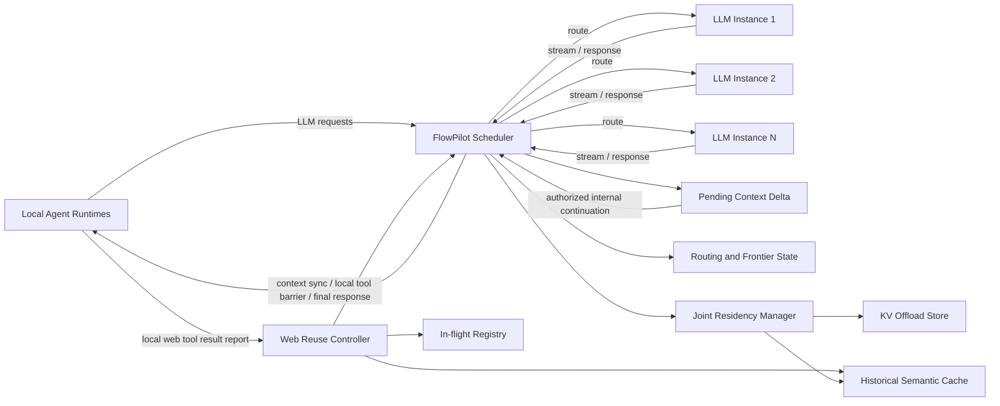
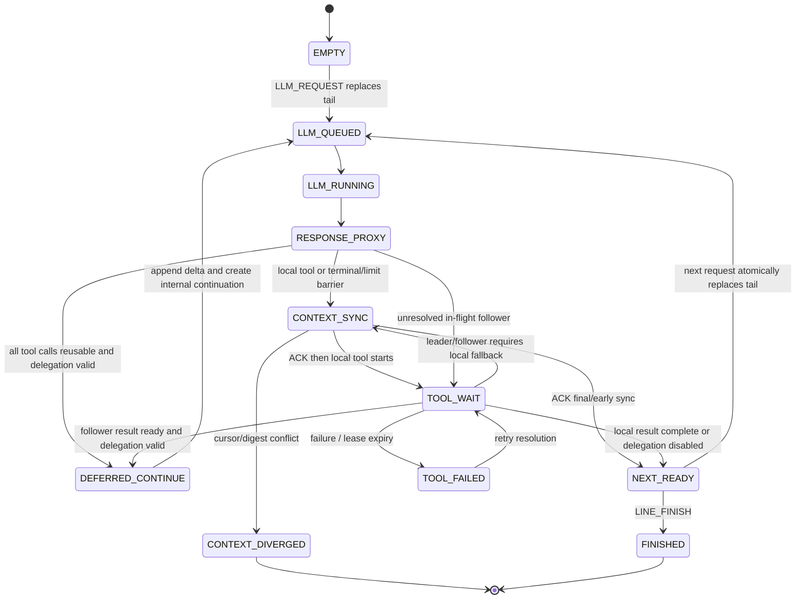

# FlowPilot：面向本地 Agent、LLM 实例与 Web Tool 复用的延迟上下文调度器

> 文档性质：系统研究设计草案  
> 核心目标：在固定的 LLM 与存储资源池中，通过请求路由、Web Search 历史缓存、在途语义合并、缓存命中后的延迟上下文同步，以及 KV Cache 与 Tool Cache 的联合调度，降低多 Agent 工作负载的端到端完成时间、上下文往返开销与重复工具开销。

## 0. 设计结论

FlowPilot 位于本地 Agent 与多个 LLM 推理实例之间，是所有 LLM 请求和回复的双向中间调度器：

```text
Local Agent -> FlowPilot Scheduler -> selected LLM instance
Local Agent <- FlowPilot Scheduler <- selected LLM instance
```

本地 Agent 负责执行线路编排、所有 Tool 的实际执行以及可恢复的权威对话状态。FlowPilot 不远程执行 Tool；但在 Agent 显式授权的只读 Web Tool 范围内，它可以接管一段有界的 continuation：识别完整 Tool Call，完成历史语义复用或在途语义合并，把新增的 assistant/tool 消息暂存在该线路的 `PendingContextDelta`，并直接构造下一次 LLM 请求。这个过程称为 **延迟上下文同步（Deferred Context Synchronization, DCS）**。

`PendingContextDelta` 不是另一份无限增长的 Agent 历史。它是从本地 Agent 已确认的 `base_context_cursor` 之后开始、按 provider 消息顺序保存、带摘要和过期时间的未确认上下文增量。本地 Agent 仍是最终权威所有者；FlowPilot 只有在持有该线路的有效 delegation lease 时才能继续推理，且必须在本地执行屏障、终止回复、容量上限、租约到期或故障降级时同步增量。

核心处理顺序必须固定为：

1. LLM 实例将完整回复返回 FlowPilot；
2. 若回复不含 Tool Call，FlowPilot 将其视为终止/交互屏障：若不存在未确认增量则原样转发；否则连同此前缺失的上下文一次性同步给本地 Agent；
3. 若回复含 Web Search 类 Tool Call，FlowPilot 先查找满足隔离域、时效性和语义阈值的历史缓存；
4. 历史缓存未命中时，再查找语义相似且仍在执行的 Web Search 调用；
5. 历史命中时，本地 Agent 跳过 Tool 执行；FlowPilot 不立即把缓存结果发回 Agent，而是把当前 assistant Tool Call 与经过长度控制的 Tool Result 追加到该线路的 `PendingContextDelta`，然后在同一授权范围内直接发起下一次 LLM Call；
6. 在途命中时，该调用作为 follower 等待 leader 在其本地 Agent 上完成 Tool；完成后，FlowPilot 截取 leader 结果并同样追加到 follower 的 `PendingContextDelta`，不立即回传 Agent，而是继续下一次 LLM Call；
7. 两者均未命中时，该调用成为 leader，并形成 **本地执行屏障**。FlowPilot 将从 `base_context_cursor` 起本地 Agent 尚未拥有的全部 provider-valid 消息、当前 Tool Call 和同步摘要一次性返回；Agent 原子应用并确认后，在本地执行 Tool，再将完成结果回报 FlowPilot，用于唤醒 follower 和写入历史缓存；
8. 非 Web Search 类、不可安全复用、需要逐次授权或与同一回复中的本地 Tool 并行的调用也形成本地执行屏障。其执行时间和输出长度由本地 Agent 侧模型分析，并作为后续请求的调度提示上报；
9. 若连续缓存命中后直接得到无 Tool 的最终回复，则不能无限等待一个永远不会出现的本地 Tool：FlowPilot 必须把全部未确认上下文和最终回复同步给 Agent，完成线路交接；
10. 上下文增量超过消息数/字节/token 上限、delegation lease 到期、摘要校验失败或 Scheduler 准备降级时，FlowPilot 提前触发同步屏障，不再继续隐藏轮次。

FlowPilot 不预测尚未出现在回复中的 Tool，也不预测未来 Tool 链。它只处理已经完整给出的 Tool Call：Web Search 类调用结合历史缓存和在途状态估计完成时间与输出长度，其他 Tool 由本地 Agent 基于明确的 Tool 名称、参数和本地负载估计。区别在于，缓存/在途命中后的下一次请求可能由 FlowPilot 在 delegation lease 内立即构造，而不是等待本地 Agent 先接收 Tool Result 再提交。

对每条活跃线路，FlowPilot 为“下一条可能提交的 LLM 请求”维护请求级 heavy profile。profile 来源于上一条完整 LLM 回复中的明确 Tool Call，并在 Tool 解析结果确定后更新。它不是对 Agent 控制流的状态建模，而是下一次请求的资源成本画像：

- **inference-heavy**：下一请求的有效 LLM 推理成本占主导；
- **tool-heavy**：形成下一请求所经历的前置 Tool 阶段有效总成本占主导。

`mixed` 不作为请求标签。一个请求可以同时有 Tool 和 LLM 成本，但调度动作需要知道哪一类成本占主导；因此保留连续的 `tool_share` 作为评分输入，不引入第三种 `mixed` 状态。一个 Job 的不同线路可以同时处于两种 heavy label，`mixed workload` 只作为 Job/集群级观测指标。缓存命中或 leader 完成会重算有效 Tool 成本；缓存命中可能把下一请求从 tool-heavy 改标为 inference-heavy，而 leader 完成只会令剩余等待归零，是否改标取决于该请求的实际 Tool 总成本与推理成本比较。

系统最值得主打的亮点是：

> **上一轮 LLM 回复中的明确 Tool Call 形成下一请求的成本画像，缓存与在途解析会把固有 Tool 成本修正为有效成本；该画像与 Tool readiness 共同改变 KV 的保护、下沉和恢复优先级。与此同时，Offloaded KV 与调度器管理的 Tool Cache 会竞争有限的 CPU 内存、NVMe 容量与 I/O 带宽。FlowPilot 以请求级 heavy profile、SLO 紧迫度、活跃 frontier 阻塞度和实测代价统一管理两类状态，而不是分别优化 KV 命中率和 Tool Cache 命中率。**

---

## 1. 系统边界与基本事实

### 1.1 三类核心实体

| 实体 | 负责内容 | 明确不负责的内容 |
|---|---|---|
| Local Agent Runtime | 线路编排、权威上下文及游标、delegation policy、所有 Tool 的本地执行、上下文增量原子应用与确认、实际上报 Tool 开始/完成/失败与结果 | 不直接选择 LLM 实例，不独立维护全局 Web Search 缓存 |
| FlowPilot Scheduler | 双向代理、LLM 实例路由、line-tail frontier、活跃线路依赖、Web Search 历史缓存、在途语义匹配、受限 continuation、未确认上下文增量、KV/Tool Cache 联合策略 | 不执行 Tool，不永久取代 Agent 的权威历史，不跨线路拼接上下文，不在授权外推进控制流 |
| LLM Instance | Prefill/Decode、KV 生成与驻留、KV 导出/恢复接口，以及其自身原生推理策略 | 不直接与本地 Agent 建立绕过调度器的回复路径，不负责 Tool 执行 |

这里的“Tool Cache 位于调度器”指逻辑所有权：索引、语义匹配、准入、版本、等待关系和命中决策均由 FlowPilot 控制。结果载荷可以存放在调度器本机，也可以放在由调度器控制的共享 CPU/NVMe 存储层，以便与 Offloaded KV 进行资源协调。

### 1.2 请求与回复都必须经过调度器

本地 Agent 对 FlowPilot 提交 OpenAI-compatible LLM 请求。FlowPilot 根据调度算法选择一个 LLM 实例，并保留以下映射：

```text
(tenant_id, job_id, line_id, llm_call_id)
    -> (instance_id, model_id, session_id, routing_epoch)
```

LLM 实例的流式 token、最终文本和结构化 Tool Call 同样先返回 FlowPilot。没有启用 DCS 时，回复原样转发给对应的本地 Agent；启用 DCS 后，只有完整、可解析且参数已经闭合的 Tool Call 才能进入缓存与在途匹配流程。缓存/在途命中的完成帧及其 Tool Result 先写入 `PendingContextDelta`，不逐轮回传；流式 token 在确认该轮可被延迟前只能缓冲或作为 provisional stream，不能先向 Agent 提交后又声称该轮尚未同步。

FlowPilot 构造内部 continuation 时必须复用 Agent 最近确认的请求快照，并严格追加同一线路的 provider-valid assistant/tool 消息；不得重写 system/developer 消息、tool schema、采样参数或本地状态。每个内部请求携带 `(context_epoch, base_context_cursor, delta_seq, delta_digest)`，以便之后与 Agent 的权威状态核对。

### 1.3 Tool 始终在 Agent 本地执行

FlowPilot 可以产生以下决策：

- `DEFER_WITH_CACHED_RESULT`：不执行本地 Tool；结果只追加到调度器的未确认上下文增量并继续 LLM；
- `DEFER_WAIT_FOR_INFLIGHT`：不重复执行；等待 leader 后把结果追加到未确认增量并继续 LLM；
- `SYNC_WITH_REUSED_RESULT`：DCS 未获授权或不可用时，立即同步当前缺失上下文并交付已验证的复用结果，不执行本地 Tool；
- `WAIT_AND_SYNC_REUSED_RESULT`：等待 leader 后立即同步当前缺失上下文并交付 follower 结果，不执行本地 Tool；
- `SYNC_AND_EXECUTE_AS_LEADER`：先同步 Agent 缺失的全部上下文，确认后由当前本地 Agent 执行并回报结果；
- `SYNC_AND_EXECUTE_LOCALLY`：先同步上下文，再执行非 Web Tool 或不允许复用的调用；
- `SYNC_AND_DELIVER_FINAL`：没有本地 Tool 但出现最终回复，或达到提前同步条件时，把全部未确认增量交还 Agent。

这些决策改变的是“是否需要重复执行”以及“上下文何时交还 Agent”，不是 Tool 的执行位置。FlowPilot 本身没有浏览器、Shell、搜索客户端或其他 Tool executor。任何本地执行必须发生在 `CONTEXT_SYNC_ACK` 之后；未确认增量不能与 Agent 新提交的分叉历史同时继续。

### 1.4 执行线路的来源对调度器透明

如何产生、承载和回收执行线路由具体 Agent Runtime 决定。FlowPilot 不建模这些过程，只要求 Runtime 为每条可独立推进的线路提供稳定的 `job_id/line_id/context_epoch`，为 DCS 提供当前上下文游标和有界 delegation policy，并在确有跨线路等待时上报依赖关系。

FlowPilot 不假设不同线路共享上下文或 KV。若底层推理引擎发现相同文本前缀，可以透明使用 Prefix Cache，但这不属于 DAG 语义。

### 1.5 非目标

- 不预测最后一条回复中尚未明确出现的 Tool 或后续 Tool 链；
- 不建模执行线路的创建、销毁和上下文分配过程；
- 不进行 Tool speculative execution；
- 不在缺少 Agent delegation lease 时自行生成 continuation；
- 不把 `PendingContextDelta` 当作跨 Job、跨 line 或无限期的完整会话存储；
- 不设计或控制 LLM 动态批处理，推理实例内部策略保持不变；
- 不把 LLM 的 Prefill、Decode、流式 token 或 KV I/O 分别建成 DAG 节点；
- 不改变 Web Search 以外 Tool 的结果复用语义；
- 不允许本地 Agent 绕过 FlowPilot 直接调用 LLM 实例；
- 不声称在线求解完整工作流的全局最优调度。

---

## 2. Autellix 风格的 Tail Frontier 与依赖 DAG

### 2.1 只维护每条线路的最后请求与有界增量

FlowPilot 不在调度热路径保存已经被 Agent 确认的完整 `LLM -> Tool -> LLM` 历史图。对 Job $j$ 的每条执行线路 $l$，只维护最后一个请求，以及从 Agent 最近确认游标开始的一段有界未确认上下文增量：

$$
F_j^t=\{Tail_j^t(l)\mid l\in ActiveLines_j^t\}
$$

完整请求历史仍写入 trace，用于调试、离线重放和实验，但不参与在线图遍历。新请求到达同一 `line_id` 时，原 tail 被新请求原子替换；同一路线的先后关系由 tail pointer 隐式表达。

因此控制状态复杂度仍是 $O(|ActiveLines|+|ActiveDependencies|)$，但数据状态还包含 $O(\sum_l |PendingContextDelta_l|)$。该增量必须受每线路消息数、token、字节和 TTL 限制，已获 Agent ACK 的部分立即释放或仅写审计 trace，不能把“只维护 tail”误写成无界持有对话历史。若 Runtime 没有上报任何跨线路等待，在线“DAG”自然退化为一张 `LineTail` 表，调度器无需维护图结构。

### 2.2 LineTail 状态

```text
LineTail {
  tenant_id, job_id, line_id
  tail_request_id, model_id, session_id
  state: EMPTY | LLM_QUEUED | LLM_RUNNING | RESPONSE_PROXY |
         DEFERRED_CONTINUE | CONTEXT_SYNC | TOOL_WAIT |
         TOOL_FAILED | CONTEXT_DIVERGED | NEXT_READY | FINISHED
  last_response_tool_calls[]
  tool_analyses[]
  context_epoch, base_context_cursor
  pending_delta_seq, pending_delta_digest, pending_delta_bytes
  delegation_lease_deadline
  heavy_label: INFERENCE_HEAVY | TOOL_HEAVY  # derived request label
  request_profile: RequestCostProfile?
  deadline, slo_class, slack
  kv_handle, kv_tier, kv_bytes
  blocked_by_line_ids[]
  blocking_line_count
  age, version
}
```

Tool Call 不再是 DAG 节点。它是 `tail_request` 最后回复上的结构化属性；缓存解析、执行预测和结果状态均记录在 `tool_analyses[]` 中。由 Agent 提交或由 DCS 合法构造的下一次 LLM 请求都会替换当前 tail；已同步的旧 Tool 分析只保留在 trace，未同步的 provider 消息则保留在 `PendingContextDelta` 直到 ACK。

### 2.3 只保留一种显式边

同一路线的顺序边无需存储。跨线路确有等待关系时，只使用一种通用边：

```text
waiter_line --DEPENDS_ON--> prerequisite_line
```

因此不需要按调用语义区分 `CONTINUE`、`EMIT`、`TOOL_RESULT`、`SPAWN`、`RETURN` 或 `JOIN_DEP`。具体控制流属于 Agent Runtime；FlowPilot 只接收“新线路已注册”和“线路 A 当前依赖线路 B/C”的事实。依赖满足后立即删除对应边。

一种边已经足够，因为在线调度只需要回答两个问题：某条线路是否被其他活跃线路阻塞，以及完成它能解除多少条线路的阻塞。若 Runtime 有 `ALL/ANY/quorum` 等就绪规则，应将规则作为 waiter line 的 readiness predicate 上报，或由 Runtime 消解后更新依赖集合，而不是把它们扩展成新的边类型。FlowPilot 对新增依赖做同 Job 校验、版本校验和环检测；发现环时拒绝该次更新并保留上一版本。

这种设计的好处是：

- 调度状态规模与活跃线路数相关，而不是与累计调用次数相关；
- Agent 框架可以自由实现并发线路、并行 Tool 或其他控制流；
- 调度算法只关心哪些 tail 可运行、哪些 tail 被阻塞；
- 边类型不会与具体 Agent 框架的语义耦合。

### 2.4 Tail 更新规则

```text
LINE_REGISTER:      创建空 LineTail，不解释线路如何产生
LLM_REQUEST:        Agent 请求或授权的内部 continuation 原子替换 tail，并以有效 profile 设置 heavy_label
LLM_RESPONSE:       更新 tail response；若含 Tool Call，进入分析流程
TOOL_RESOLUTION:    更新 tool_analyses 与 TOOL_WAIT/DEFERRED_CONTINUE/CONTEXT_SYNC
CONTEXT_DELTA:      追加未确认 assistant/tool 消息，或在同步 ACK 后推进 base cursor
LINE_DEPENDENCIES:  添加或原子替换 DEPENDS_ON 集合
LINE_FINISH:        标记完成；无等待者后回收在线状态
```

多个 Tool Call 可以同时附着在一个 tail response 上。只有当下一请求所需的 Tool Result 全部就绪时，tail 才进入 `DEFERRED_CONTINUE`（delegation 有效）或 `NEXT_READY`（需要 Agent 接管）。

### 2.5 Frontier 关键度

FlowPilot 不重建完整 critical path，而对当前 tail frontier 计算：

$$
\kappa_t(l)=
\alpha\log(1+BlockingLines(l))
+\beta Age(l)
+\gamma SLOUrgency(l)
$$

`BlockingLines` 是当前被该线路阻塞的其他 tail 数；`Age` 是实际等待时间；`SLOUrgency` 由第 5 节定义。历史缓存命中、在途绑定和 Tool 结果到达只更新当前 tail 的状态、request profile 与 slack，不需要回溯整张历史调用图。

---

## 3. 端到端架构



### 3.1 请求路由器

请求路由器维护每个 LLM 实例的：

- 模型与版本兼容性；
- Prefill/Decode 队列长度；
- 当前调用队列深度与实际吞吐；
- GPU KV 水位；
- CPU/NVMe offload 水位；
- 已有会话 KV affinity；
- 近期吞吐和尾延迟；
- 故障、过载和 draining 状态。

新 LLM Call 的路由得分可写为：

$$
Score(i,r)=
\hat Q_{i,r}+\hat S_{i,r}+\hat Restore_{i,r}
+\lambda_m MemoryPressure_i
-\lambda_a Affinity_{i,r}
$$

FlowPilot 选择满足模型、租户和容量约束且得分最低的实例。已有可恢复 KV 的会话优先保持实例亲和，但当原实例排队或内存压力过高时，可以迁移或重算，不能把 affinity 作为硬绑定。

### 3.2 双向响应代理

FlowPilot 为每个 LLM Call 保留 correlation id。流式文本可以低延迟透传，但最终完成帧必须经过结构化检查：

```text
LLMResponseEnvelope {
  tenant_id, job_id, line_id, llm_call_id
  instance_id, model_id, model_version
  finish_reason
  assistant_text
  tool_calls[]
  usage
}
```

不含 Tool Call 时，若线路没有未确认增量则完成帧直接转发；否则该帧作为终止屏障，与全部缺失上下文一起同步。含 Tool Call 时，FlowPilot 先对整组并行调用做决策：只有所有调用都可安全复用并处于同一 delegation policy 时，才把完整 assistant 消息及对应 Tool Result 追加到 `PendingContextDelta` 并继续推理；只要其中一个调用需要本地执行，就同步完整增量和该 assistant 消息，不能把同一并行 Tool Call 批次拆成彼此不可重放的两套历史。

```text
PendingContextDelta {
  tenant_id, job_id, line_id, context_epoch
  base_context_cursor
  first_seq, last_seq
  messages[]  # provider-valid assistant/tool messages in exact order
  tool_call_ids[]
  delta_digest, previous_digest
  created_at, expires_at, delegation_lease_id
  state: OPEN | SYNCING | ACKED | ABORTED
}
```

一个 line 同一 `context_epoch` 只允许一个 OPEN delta。摘要链用于检测重复、遗漏和乱序，不用于替代消息 schema 校验。

### 3.3 Web Reuse Controller

Web Reuse Controller 由四部分组成：

1. `Tool Classifier`：根据注册表判断 Tool 是否属于允许语义复用的 Web Search 类；
2. `Historical Cache`：存储历史请求、结果、embedding、约束字段、时效与 provenance；
3. `In-flight Registry`：登记尚未完成的 leader，并管理 follower；
4. `Result Adapter`：按调用预算、模型上下文和策略截取结果，生成可追加到内部 continuation、并最终可同步给 Agent 的 provider-valid Tool Result；
5. `Deferred Context Manager`：管理 base cursor、增量摘要链、delegation lease、内部 continuation 和同步/确认。

### 3.4 Local Agent Adapter

本地适配器至少提供：

- 执行 FlowPilot 标记为 leader 或普通本地调用的 Tool；
- 对最后回复中明确的非 Web Tool 估计执行时间和输出长度，并上报实际开始、完成、失败和结果；
- 上报 leader 的开始、成功、失败、取消与结果；
- 校验 `context_epoch/base_cursor/delta_digest`，把缺失的 assistant/tool 消息原子注入本地 Agent 的正常历史，并返回 `CONTEXT_SYNC_ACK`；
- 只在同步确认后执行屏障上的本地 Tool，避免 Tool 观察与 assistant Tool Call 脱节；
- 注册稳定 `line_id`，并仅在存在跨线路等待时上报通用依赖集合。

---

## 4. Web Search 历史缓存与在途合并

### 4.1 适用范围

语义缓存和在途合并默认只用于只读、可复用的 Web Search 类 Tool，例如搜索查询、网页检索和满足版本约束的公开信息抓取。涉及登录态、个性化页面、写操作、支付、发送、删除、本地 Shell、代码执行或数据库写入的 Tool 不进入这一流程。

“Web Search 类”必须由注册表显式配置，而不是通过 Tool 名称的模糊字符串匹配决定。

### 4.2 匹配约束

在计算语义相似度之前，先执行硬约束过滤：

```text
ReuseScope {
  canonical_tool_family
  tool_version
  tenant_or_public_scope
  auth_scope
  locale, language, region
  safe_search_policy
  time_sensitivity_class
  data_source_constraints
  freshness_deadline
  result_schema_version
}
```

只有硬约束兼容的候选才计算 embedding 相似度。对带“今天、当前、最新、价格、天气”等时间敏感语义的请求使用更短 TTL 或直接禁用历史语义命中。跨租户复用默认关闭；只有明确标记为公共、无隐私且授权域一致的结果才可共享。

### 4.3 固定查找顺序

对完整的 Web Tool Call $c$：

```text
resolve(c):
    descriptor = canonicalize(c.tool_name, c.arguments, c.scope)
    defer_allowed = delegation_policy.allows_deferred_reuse(c)

    historical = historical_cache.semantic_lookup(descriptor)
    if valid(historical):
        if defer_allowed:
            return DEFER_WITH_CACHED_RESULT(adapt(historical.result, c.output_budget))
        return SYNC_WITH_REUSED_RESULT(adapt(historical.result, c.output_budget))

    decision = inflight_registry.match_or_register(descriptor, c.owner_agent)
    if decision.is_follower:
        if defer_allowed:
            return DEFER_WAIT_FOR_INFLIGHT(decision.binding_id)
        return WAIT_AND_SYNC_REUSED_RESULT(decision.binding_id)

    return SYNC_AND_EXECUTE_AS_LEADER(decision.binding_id)
```

历史缓存必须先于在途表。这样可避免在已有有效答案时仍等待较慢的在途调用，也使 lookup 行为可解释和易于测试。

历史 miss 之后，“查找在途候选”和“注册新 leader”必须是一个原子操作。实现上可以在规范化 descriptor 的候选分区内加短锁，或使用带版本号的 compare-and-bind：锁内重新做一次在途匹配，确认仍无兼容 binding 后才能创建 leader。否则两个同时到达的相似请求可能都在第一次查询中看到 miss，并各自开始本地执行。

### 4.4 Leader/Follower 执行语义

Leader 只是一条“由哪个本地 Agent 执行”的绑定关系：

```text
InFlightBinding {
  binding_id
  canonical_descriptor
  leader_agent_id
  leader_tool_call_id
  followers[]
  start_time
  predicted_finish_time
  lease_deadline
  status
}
```

流程如下：

1. FlowPilot 把 `SYNC_AND_EXECUTE_AS_LEADER`、缺失上下文增量与原始 Tool Call 发给 leader 所在本地 Agent；
2. leader Agent 校验游标和摘要，原子应用增量并返回 ACK；
3. leader 本地执行 Web Search，并上报实际开始、完成或失败事件；
4. follower 在调度器内处于 `DEFER_WAIT_FOR_INFLIGHT`，本地 Agent 不重复执行，也不立即接收 Tool Result；
5. leader 完成后，本地 Agent 将未经 Agent 总结改写的 Tool 原始结果与 provenance 回报 FlowPilot；
6. FlowPilot 验证结果；若结果可长期复用，则原子地发布历史条目并完成 binding，否则只完成 binding；
7. FlowPilot 针对每个 follower 的输出预算分别截取结果，把 follower 自己的 assistant Tool Call 和 Tool Result 追加到各自 `PendingContextDelta`，并为每条线路分别发起内部 continuation；
8. 当某条 follower 线路之后遇到本地执行屏障或终止屏障时，FlowPilot 才把该线路累计缺失的上下文一次性同步给它的本地 Agent。

Follower 复用的是 leader 的 Tool Result，不复用 leader 的 LLM 回复、私有上下文或后续推理。每条 follower 线路保留自己的 assistant Tool Call ID、消息顺序、上下文游标与截取预算；同步时不得复制 leader 的事件 envelope。

### 4.5 结果截取

历史和在途命中都不能无上限复制结果。`Result Adapter` 根据以下信息确定追加到内部 continuation 并最终同步给 Agent 的长度：

- 当前 Tool Call 的显式 `max_results`、`top_k`、时间范围等参数；
- 本地 Agent 或模型请求声明的 Tool Result token/byte budget；
- 当前缓存结果的实际结构和实际大小；
- 下一次 LLM Call 的上下文余量；
- Tool schema 对结果条目完整性的要求。

截取必须按结构化结果条目或文档边界进行，不能在字节中间任意切断。调度器私有审计记录携带：

```text
ResultProvenance {
  reuse_type: HISTORICAL | INFLIGHT
  source_binding_or_entry_id  # control-plane only; not exposed to LLM
  source_query_digest
  created_at
  freshness_deadline
  original_size
  returned_size
  truncation_policy
  similarity_score            # audit only
}
```

进入 provider Tool Result 的 provenance 只能包含经过白名单允许的有界字段，例如 `reuse_type`、`observed_at` 和结果 schema 版本；不得把 binding id、leader input、tenant scope、相似度阈值或调度状态暴露给 LLM。完整审计 provenance 留在调度器控制面，并在上下文同步 ACK 中以 digest 引用。

历史缓存建议保存经过安全清洗的规范化结果，而不是只保存某一次截断版本，从而能为不同 follower 生成不同长度的合法输出。

### 4.6 失败、超时与取消

- leader 失败：默认唤醒 follower，并让它们各自重新进入匹配流程；必要时选举一个新 leader；
- leader lease 超时：binding 失效，避免 follower 无限等待；
- follower 取消：只移除该 follower，不取消仍被其他请求需要的 leader；
- leader 所在 Job 取消：若本地执行可安全继续且仍有 follower，可转为 detached leader；否则失败并重新选举；
- 结果校验失败：不写历史缓存；DCS follower 冻结并同步失败/回退信号，由 Agent 在 ACK 后重新执行，非 DCS follower 立即同步并按原策略回退本地执行；
- FlowPilot 重启：持久化的历史缓存可恢复，在途 binding 按失败处理，除非本地 Agent 能重新确认执行状态。
- `PendingContextDelta` 丢失或摘要不一致：禁止继续内部 continuation；若可从 WAL 完整恢复则重放同步，否则返回显式 `CONTEXT_DIVERGED`，由 Agent 从最后确认游标恢复，不能猜测缺失消息；
- 同步超时或 Agent 拒绝 ACK：冻结该 line 的内部 continuation，租约到期后释放资源；不能把未确认上下文标记为已交付；
- 终止回复、增量容量上限或 delegation lease 到期：触发提前同步，即使尚未出现需要本地执行的 Tool。

---

## 5. 请求级 Heavy Profile 与 SLO

### 5.1 Heavy 是下一请求的成本主导标签

`inference-heavy/tool-heavy` 应针对请求，而不是简单等同于 `LLM_RUNNING/TOOL_WAIT` 运行状态。对上一条 LLM 回复 $r$ 中已经明确的 Tool Call，FlowPilot 为其后继请求 $q$ 建立：

```text
RequestCostProfile {
  based_on_tail_request_id
  intrinsic_tool_ms_p50, intrinsic_tool_ms_p90
  effective_tool_ms_p50, effective_tool_ms_p90
  remaining_tool_ms_p50, remaining_tool_ms_p90
  inference_ms_p50, inference_ms_p90
  expected_tool_result_bytes
  deferred_context_bytes, internal_continuation_count
  tool_share, inference_share
  heavy_label: INFERENCE_HEAVY | TOOL_HEAVY
  tool_families[], resolution_modes[]
  confidence, version
}
```

其中：

- `intrinsic_tool_ms` 表示假设不复用缓存、由本地实际执行时的 Tool 关键路径成本，用于描述请求的固有 Tool 倾向；
- `effective_tool_ms` 表示经过历史缓存、在途绑定或本地执行决策后的前置 Tool 阶段总成本，用于请求级 heavy 分类；Tool 完成后以实测总时延覆盖，但不会归零；
- `remaining_tool_ms` 表示从当前时刻到 Tool Result ready 的剩余等待，用于 slack、KV offload/restore 和请求是否 ready 的判断；Tool 完成或缓存结果追加到 delta 后归零；
- `inference_ms` 表示下一请求的 LLM 排队、KV restore、Prefill 和 Decode 预期成本；请求由 Agent 到达或由 DCS 合法构造前使用兼容实例池的参考分位数，请求形成后再计算每个候选实例的成本；
- 多个 Tool 并行时按关键的最晚完成路径聚合，串行时按 Runtime 已明确给出的依赖聚合；
- Tool 类型、参数规模、可缓存性、freshness、当前 resolution、结果长度、并行关系和预测置信度均作为特征，而不是仅凭 Tool 名称贴标签。

定义有效 Tool 占比：

$$
ToolShare(q)=
\frac{\hat C^{effective}_{tool}(q)}
{\hat C^{effective}_{tool}(q)+\hat C_{infer}(q)+\epsilon}
$$

$$
Label(q)=
\begin{cases}
TOOL\_HEAVY, & ToolShare(q)\ge \theta_{tool}\\
INFERENCE\_HEAVY, & ToolShare(q)<\theta_{tool}
\end{cases}
$$

因此用户提出的“比较前置 Tool 执行时间与推理时间”是合理主线，但必须使用 cache-adjusted 的 Tool 阶段总成本，并将 Tool 类型等特征用于估计成本和置信度，而不能把 `Web Search` 直接等同于 tool-heavy。靠近阈值时保留连续 `tool_share` 并使用 hysteresis，避免标签抖动；仍不引入 `mixed`。`heavy_label` 回答请求端到端成本由谁主导，`remaining_tool_ms/state` 回答此刻应该执行什么动作，两者不可互相替代。

### 5.2 分类时间点与预测边界

Heavy profile 有三个更新点：

1. **LLM 回复完成后**：只根据已闭合的 Tool Call、历史 profile 和下一轮粗略推理成本生成初始画像；
2. **Tool resolution 确定后**：历史命中使用 lookup/验证/截取总成本，在途命中估计 leader 的最终总成本与当前剩余时间，本地执行使用本地预测，分别重算 `effective_tool_ms`、`remaining_tool_ms` 与 heavy label；
3. **下一请求实际形成后**：无论来自 Agent 提交还是 DCS 内部 continuation，都使用真实 input tokens、`max_tokens`、模型、实例队列和 KV 状态校正 `inference_ms`，再做最终路由。heavy label 使用兼容实例池的规范化参考成本保持稳定，实例选择则使用 per-instance inference cost，避免分类与路由互相循环依赖。

预测和调度只作用于上一回复之后的 continuation 和已经实际形成的下一轮请求，不回头改变已经完成的 LLM 调用，也不虚构尚未出现的 Tool。DCS 只能机械地使用 Agent 已确认请求快照追加 `PendingContextDelta`，不能自行创造新的用户消息、改变 tool schema 或调整采样语义。若 delegation 失效或 Agent 结束线路，profile 随 tail 结束而失效。

### 5.3 缓存命中的重分类

一个包含高开销 Web Search 的 continuation 可能具有很高的 `intrinsic_tool_ms`，但历史缓存命中后：

$$
\hat C^{effective}_{tool}
=C_{lookup}+C_{validate}+C_{adapt}+C_{delta\_append}
$$

它通常远小于本地搜索成本。FlowPilot 必须立即：

1. 保留 `intrinsic_tool_ms` 和 `saved_tool_ms` 作为缓存价值、实验与审计信息；
2. 用命中后的实际结果长度和增量追加成本覆盖 `effective_tool_ms/output_bytes`，追加完成后令 `remaining_tool_ms=0`，并累计 `deferred_context_bytes/internal_continuation_count`；
3. 重算 `ToolShare`、heavy label、SLO slack 和 KV restore deadline；
4. 若推理成本转为主导，则把下一请求改标为 inference-heavy，立即恢复或保护 KV，并对已经合法构造的内部 continuation 按 inference-heavy 策略路由；
5. 不重复准入同一缓存 payload，也不因为“原始 Web Search 很贵”继续把该 continuation 当作在线 tool-heavy。

在途命中则不同：`effective_tool_ms` 是 follower 实际经历的绑定、等待与结果追加总成本估计，`remaining_tool_ms` 才是 leader 的预计剩余时间。leader 完成后以 follower 的实际总等待覆盖前者，并令后者归零。分类描述的是请求的有效端到端成本构成，不是 Tool 的静态类别或瞬时运行状态。

### 5.4 SLO 是独立的紧迫度维度

Heavy label 描述“下一请求的有效端到端成本由哪一阶段主导”，SLO 描述“该请求有多急”。二者不合并成不断膨胀的枚举。对 continuation/request $q$：

$$
Slack_q(t)=d_q-t-
\left(\hat C^{remaining}_{tool}(q)+\hat C_{infer}(q)\right)
$$

其中只包含当前 tail 已知的剩余工作，不加入尚未出现的后继 Tool。紧迫度定义为：

```text
CRITICAL: slack <= 0
TIGHT:    0 < slack <= theta_slo * original_slo
NORMAL:   otherwise
```

也可使用连续权重：

$$
U_{slo}(q)=
1+\lambda_d\frac{\max(0,-Slack_q)}{SLO_q}
+\lambda_s\frac{SLO_q}{\max(Slack_q,0)+\epsilon SLO_q}
$$

实现时先由 Job/tenant 公平队列分配份额，再在份额内使用 `U_slo`、blocking degree、age、heavy profile 与资源成本。SLO 不放宽 cache freshness、tenant/auth scope 或语义相似度阈值。

### 5.5 Heavy/SLO 联动策略

| Profile 与 readiness | Normal | Tight | Critical |
|---|---|---|---|
| tool-heavy 且 `remaining_tool_ms>0` | 优先复用，等待型 KV 可逐级下沉 | 强化 binding 监控，按 ready-time 提前 restore | 强化 lease；策略允许时启用显式 hard-SLO fallback |
| inference-heavy 但 `remaining_tool_ms>0` | Tool 虽非主成本仍是硬前置条件，KV 保持较高 tier | 更早 restore，避免短 Tool 等待后又发生 KV stall | 保护 KV，并优先完成结果交付 |
| `remaining_tool_ms=0`，任意标签 | 按实际请求成本和 KV affinity 路由 | 提高 restore/queue priority | deadline-first 路由，限制低优先级迁移干扰 |

默认在途语义仍是 follower 等待 leader；是否允许 hard-SLO fallback 必须是显式策略。heavy label 提供成本构成，`remaining_tool_ms/state` 提供可执行性，SLO 提供紧迫度；三者共同决定 LLM 路由、KV 层级、Tool Cache 保护和 I/O 动作，任何一个都不能单独决定调度。

### 5.6 SLO 加权的有效资源压力

令 $s_I(q)=1-ToolShare(q)$、$s_T(q)=ToolShare(q)$，并使用成本份额与 Tool readiness，而非二元状态计数。定义 $ReadyWeight(q)=1/(1+\hat C^{remaining}_{tool}(q)/C^{ref}_{tool})$：

$$
P_I(t)=\sum_{q\in Frontier}U_{slo}(q)
\left[s_I(q)+\rho_r\mathbf{1}[\hat C^{remaining}_{tool}(q)=0]\right]ReadyWeight(q)
\frac{\hat C_{infer}(q)}{C^{ref}_{infer}}
\left(1+\rho_g\frac{KV^{gpu}_q}{C_{gpu}}
+\rho_h\frac{KV^{host}_q}{C_{host}}\right)
$$

$$
P_T^{web}(t)=\sum_{q\in FrontierWeb}U_{slo}(q)s_T(q)
\left[
\frac{\hat C^{remaining}_{tool}(q)}{C^{ref}_{tool}}
+\rho_o\frac{\hat B_{result}(q)}{B^{ref}_{tool}}
+\rho_f N_{follower}(q)
\right]
$$

`P_I/P_T^{web}` 描述活跃 continuation 的短期资源压力，并驱动 KV 与 Tool Cache 的软预算。缓存命中会降低 `effective_tool_ms`、令 `remaining_tool_ms=0`、提高 inference share 和 $P_I$，同时降低等待型 $P_T^{web}$。但命中所证明的高 `saved_tool_ms` 会进入第 7.5 节的 Tool Cache 对象价值，防止“请求已转为 inference-heavy”被误解为应该淘汰刚命中的高价值缓存。非 Web Tool 只影响对应 KV 的 keep/offload/restore 时机，不错误地扩大 Web Tool Cache 预算。

### 5.7 事件驱动的画像更新

| 事件 | 有效画像变化 | 调度动作 |
|---|---|---|
| 最后回复出现明确 Tool Call | 生成 intrinsic/effective 初始估计 | 建立下一请求 `ContinuationHint` |
| Web 历史缓存命中 | effective Tool 成本降为 lookup/验证/增量追加成本 | 重分类，追加上下文并直接路由内部 continuation |
| Web 在途命中 | effective Tool 成本取预计总等待，remaining 成本取 leader 剩余时间 | 继续等待或按 SLO 触发显式 fallback |
| 本地 Tool 进度更新 | 滚动修正 ready time/output length | 更新 KV tier 与 restore deadline |
| 所需 Tool 全部完成 | remaining Tool 成本归零，保留实际 Tool 总成本标签 | 有授权则内部 continue；否则同步 Agent 后进入 ready |
| 下一 LLM 请求形成 | 用实际 token、模型和队列校正推理成本 | 最终确定实例与请求优先级 |

---

## 6. Tail Tool 分析与下一请求调度

### 6.1 分析边界

只有 LLM 完成帧中的 Tool Call 名称和参数已经闭合后，FlowPilot 才创建分析；不从中间 token 猜 Tool，不推断最后回复之外的后续调用。

```text
ToolAnalysis {
  tool_call_id, tool_family
  resolution: HISTORICAL_HIT | INFLIGHT_FOLLOWER | LOCAL_LEADER | LOCAL_ONLY
  intrinsic_duration_p50, intrinsic_duration_p90
  effective_duration_p50, effective_duration_p90
  remaining_duration_p50, remaining_duration_p90
  output_bytes_p50, output_bytes_p90
  saved_duration_ms
  predicted_ready_at
  parallel_group, dependency_ids[]
  source: CACHE_FACT | INFLIGHT_STATE | WEB_HISTORY | LOCAL_MODEL
  confidence, updated_at
}
```

### 6.2 不同 Tool 的分析来源

- **历史 Web 命中**：保留未命中时的固有执行成本，结果与大小已知；有效 ready time 只取 lookup、验证、截取和增量追加成本；
- **在途 Web 命中**：使用 leader 已运行时间、进度和同类历史记录估计剩余时间；
- **新的 Web leader**：使用调度器保存的相似历史调用估计执行时间和输出长度；
- **非 Web Tool**：本地 Agent 使用明确名称、参数、输入规模、本地队列和历史 profile 估计并上报；
- **低置信度**：使用保守分位数，仅影响 SLO/KV 优先级，不改变 Tool 执行语义。

### 6.3 ContinuationHint

Tool 分析不会创建虚构的下一请求。FlowPilot 只为该 line 保存调度提示：

```text
ContinuationHint {
  job_id, line_id, based_on_tail_request_id
  context_epoch, base_context_cursor, pending_delta_digest
  request_owner: AGENT | SCHEDULER_DELEGATED
  heavy_label, tool_share, inference_share
  intrinsic_tool_ms, effective_tool_ms, remaining_tool_ms
  estimated_inference_ms
  tool_families[], resolution_modes[]
  slo_urgency, confidence
  predicted_tools_ready_at
  predicted_tool_result_bytes
  kv_restore_latest_start
  preferred_instance
  priority_boost
  version
}
```

当 Agent Runtime 提交下一请求，或 FlowPilot 在有效 delegation lease 内构造内部 continuation 时，只有 `based_on_tail_request_id/context_epoch/base_context_cursor/pending_delta_digest` 和版本都匹配的 hint 才能使用。FlowPilot 此时用真实 input tokens、`max_tokens`、模型和实例状态覆盖 `estimated_inference_ms`，重算 `tool_share/heavy_label` 后再路由。若 Agent 结束线路、改变控制流、撤销 delegation，或请求内容与提示不兼容，hint 直接失效并触发同步/终止。

KV restore 最迟开始时间可以写为：

$$
t^{latest}_{restore}=Q_q(T_{tools\_ready})-C^{measured}_{restore}-SafetyMargin
$$

预测结果长度用于估算下一请求的 Prefill 和 Tool Cache 空间压力，但真实请求到达后必须以实际 token 数覆盖预测值。

### 6.4 LLM 请求路由边界

FlowPilot 的跨实例调度单位仍是完整 LLM 请求。请求有两种合法来源：Agent 提交的完整请求，或由“最近确认的完整请求快照 + 同线路未确认消息增量”机械构造的 delegated continuation。它根据 request SLO、input tokens、显式 `max_tokens`、实例队列、KV affinity 和已校正的 `RequestCostProfile` 选择实例，但不重排 token iteration、不组织 Stable/Burst lane，也不修改推理实例内部动态批处理。

请求优先级可写为：

$$
Priority(r)=
U_{slo}(r)\left[
\alpha\log(1+BlockingLines(r))
+\beta Age(r)
+\gamma\frac{\hat C_{infer}(r)}{C^{ref}_{infer}}
\right]
-CurrentResourceCost(r)
$$

在 Tool 尚未完成时还不存在可运行的下一 LLM 请求，heavy profile 只用于 KV/Tool Cache 状态、I/O 与 continuation hint。Tool Result ready 后，若 DCS 授权有效，FlowPilot 立即构造并把内部 continuation 放入 ready queue；否则必须先同步给 Agent，等待 Agent 的下一请求。无论请求来源为何，LLM 队列都根据已校正的推理成本、SLO、阻塞度和公平份额排序，内部 continuation 与 Agent 请求使用同一 tenant/Job 记账，不能绕过公平准入。

### 6.5 线路公平性

所有 line 使用同一路由器，公平份额按 Job/tenant 记账。一个 Agent 实现即使创建大量线路，也不会成比例放大 GPU 份额。FlowPilot 只看到 line id 和依赖，不解释线路来源。

---

## 7. 核心亮点：KV Cache 与 Tool Cache 联合调度

### 7.1 两类状态为何耦合

LLM 会话等待 Tool 时，GPU 上的 KV 有四种去向：继续保留、下沉 CPU、下沉 NVMe，或删除并在恢复时重算。Web Tool 结果则需要在 CPU/NVMe 层保存，供历史语义命中和 follower 使用。

二者存在双向影响：

1. 历史命中或在途绑定改变等待状态，使保留或下沉 KV 的价值发生变化；
2. Tool miss 后有效 Tool 总成本与剩余等待上升，使等待 KV 的 offload 更有价值；
3. 更大的 Tool 输出会增加下一次 Prefill 与 KV 增量，改变恢复成本；
4. Offloaded KV 与 Tool Cache payload 可能竞争同一 CPU DRAM、NVMe 容量和 I/O 带宽；
5. 若为了保存 Tool Cache 挤掉高价值 KV，缓存命中节省的搜索时间可能被 KV 重算抵消；
6. 若只保留 KV 而淘汰高价值 Web 结果，大量 Agent 会重复执行语义相同的搜索。
7. 连续复用命中会让 `PendingContextDelta` 增长，并直接增加下一次内部 continuation 的 Prefill、同步字节和故障恢复责任；延迟回传减少 Agent 往返，但不等于上下文成本消失。

所以优化目标不是两个独立命中率，而是二者对端到端 JCT/SLO 的净收益。联合调度既包括容量准入与淘汰，也包括 KV 的迁移时机、Tool Result 的分层驻留，以及 ToolAnalysis/resolution 触发的请求成本画像、slack 和下一请求优先级更新。

### 7.2 物理资源域

为避免把分布式资源错误地当成同一块内存，FlowPilot 明确区分：

| 层级 | KV | Tool Cache | 是否直接竞争 |
|---|---|---|---|
| LLM GPU HBM | 活跃 KV、待恢复 KV | 默认不存 Tool payload | 否；Tool 状态只通过时间影响 KV 策略 |
| LLM Host DRAM | Offloaded KV | 可选的调度器控制热结果副本 | 同机部署时直接竞争 |
| Shared CPU Memory | 可迁移 KV | 热 Tool 结果 | 是 |
| Shared NVMe/Object Store | 冷 KV/checkpoint | 冷 Tool 结果 | 容量、带宽和 IOPS 竞争 |
| 分离的 Scheduler Host | 无本地 KV 时 | Tool Cache 索引与 payload | 不按字节直接竞争，但仍竞争网络和全局预算 |

联合调度是逻辑统一、物理域感知的。只有处于同一资源域的对象才按容量直接比较；资源分离时，通过网络、恢复延迟和全局成本协调，不能虚构 DRAM 冲突。

### 7.3 统一状态对象

```text
ResidencyObject {
  object_id
  kind: KV_STATE | WEB_TOOL_RESULT
  owner_scope
  current_tier
  size_bytes
  heavy_label: INFERENCE_HEAVY | TOOL_HEAVY
  tool_share, inference_share
  intrinsic_tool_ms, effective_tool_ms, estimated_inference_ms
  remaining_tool_ms
  resolution_modes[]
  line_id, tail_request_id
  slo_urgency, blocking_line_count
  observed_wait_age
  observed_access_count
  current_follower_count
  restore_or_fetch_cost_measured
  recompute_or_reexecute_cost_measured
  freshness_deadline
  frontier_priority
  resource_domain
}
```

KV 的 owner 是独立 Agent session，不包含跨线路共享引用。Tool Result 的 owner 是 cache scope，可以有多个当前 follower 或已经发生的历史使用者。

`PendingContextDelta` 不进入可按价值任意淘汰的 `ResidencyObject` 集合。它是正确性关键的 pinned state：使用独立保留配额和 WAL；达到水位时触发 `SYNC_AND_DELIVER`，而不是像 KV 或 Tool Cache 一样丢弃。联合控制器只计算它带来的 Prefill、CPU/NVMe 和网络压力，不能用低 `Density` 作为删除未确认上下文的理由。

### 7.4 KV 状态价值

对会话状态 $s$，保留相对于删除重算的价值只使用已测成本和当前状态：

$$
V_{KV}(s)=
w_s U_{slo}(s)\kappa_s\left(C^{measured}_{remat}-C^{measured}_{restore}\right)
+\eta_i InferenceShare(s)
+\eta_r U_{slo}(s)\mathbf{1}[RemainingTool(s)=0]
+\eta_a Age_{ready}(s)
-\eta_c Churn(s)
-\mu_{tier}Size(s)-\mu_{io}Bytes(s)
$$

`InferenceShare` 越高且下一请求越接近 ready，KV 的保护与恢复价值越高；即使请求的总成本标签仍是 tool-heavy，只要 `RemainingTool=0`，ready bonus 也会立即保护其 KV。缓存命中会把有效 Tool 成本压低并提高 `InferenceShare`，因此应立即提高对应 KV 的恢复优先级。`Age_ready` 防止长期等待会话被永久牺牲，`Churn` 抑制画像更新造成的迁移抖动。所有 restore/rematerialize 成本来自已经完成的迁移和重算测量。

### 7.5 Tool Cache 驻留价值

对 Web Tool Cache 条目 $o$，使用已经发生的命中、当前 follower 和实际执行成本：

$$
V_{Tool}(o)=
\left[
\eta_f N^{current}_{follower}(o)
+\eta_r Hits_{recent}(o)
+\eta_q Hits_{frequent}(o)
\right]
\cdot C^{measured}_{saved}(o)
\cdot Freshness(o)\cdot ScopeSafety(o)
-\mu_{tier}Size(o)-StalenessRisk(o)
$$

`N_follower` 是当前已经绑定的真实 follower；`Hits_recent/frequent` 是已经发生的历史命中计数；`C_saved` 来自过去实际完成的 Web Search 与 lookup 时延差。该公式是回顾式缓存统计，不预测某个尚未出现的 Tool Call。

因此缓存命中可以同时产生两个方向不同但并不矛盾的更新：对当前请求，低命中延迟使 `ToolShare` 下降并提升 KV/LLM 准备优先级；对被命中的 Tool Cache 条目，高 `C_saved` 和真实命中计数使其驻留价值上升。

### 7.6 联合准入与淘汰

同一资源域内以单位资源净收益比较两类对象；对象价值已经包含 tail 的 SLO urgency 与 blocking degree：

$$
Density(o)=\frac{V(o)}{Size(o)+\alpha IOBytes(o)}
$$

内存或存储不足时，FlowPilot 在满足以下保护约束后淘汰密度最低的对象：

- 正在运行 LLM 所需的 GPU KV 不参与普通淘汰；
- 已绑定 follower 且 leader 已完成的 Tool Result 在交付前受保护；
- 尚未 ACK 的 `PendingContextDelta` 不可淘汰；其资源不足时必须同步、限流或拒绝新的 delegation；
- 已有 continuation ready 或正在阻塞其他 line 的高优先级 KV 受短期保护；
- 已过 freshness deadline 的 Tool Cache 优先失效；
- 隔离域、合规或删除要求优先于价值函数。

这一机制应作为论文的主要交叉消融：动态联合分配必须与“KV/Tool Cache 固定分区”和“两套独立 LRU”对比，并报告缓存命中后是否仍因 KV 恢复发生 stall。

### 7.7 联合动作空间

FlowPilot 在统一控制循环中考虑两组动作：

| 对象 | 动作 |
|---|---|
| KV Cache | `KEEP_GPU`、`OFFLOAD_CPU`、`SPILL_NVME`、`RESTORE`、`DROP_REMATERIALIZE` |
| Tool Cache | `ADMIT`、`KEEP_HOT`、`DEMOTE`、`PROMOTE`、`EVICT` |

每个动作按当前可观测收益评分：

$$
NetValue(a)=
\sum_j w_jU_{slo}(j)\kappa_j UnblockNow(j,a)
+FollowersReleased(a)
+ProfileBalanceGain(a)
-\sum_r\mu_r\Delta r_{a,r}
-MeasuredMigrationCost(a)
-StalenessRisk(a)
$$

`UnblockNow` 只在动作能立刻恢复 ready continuation、解除当前 `DEPENDS_ON` 或交付现有 follower 时取正值；`ProfileBalanceGain` 使用连续的 inference/tool share 与 readiness 衡量动作是否缓解当前资源失衡；$\mu_r$ 由当前水位更新；迁移成本来自实际 profile。Tool ETA 只来自最后回复中明确 Tool Call 的分析，不包含未来调用链。

Heavy profile 与调度算法按三层耦合，而不是让二元标签直接决定全部动作：

1. **请求层**：下一 LLM 请求到达后，`inference_ms/tool_share`、SLO、blocking degree、KV affinity 和实例队列共同决定路由与优先级；
2. **状态层**：KV 动作主要读取 `remaining_tool_ms`、ready bonus、restore cost 和 SLO；Tool Cache 动作主要读取 `saved_tool_ms`、真实 hit/follower、结果大小与 freshness；
3. **联合资源层**：`P_I/P_T^{web}`、单位字节 `Density` 和资源影子价格在共享 CPU/NVMe 上比较两类对象的边际 JCT/SLO 收益。

这意味着 heavy label 是可解释的请求特征，连续 cost share 是优化权重，readiness 是动作约束。三者分工后，缓存命中、长 Tool 完成和下一请求到达都能产生正确但不同的更新。

以下算法可以单独实现，也可以组合成一个分层调度器。

### 7.8 算法 A：Profile-Conditioned Joint Residency（推荐主算法）

PC-JR 使用慢时间尺度的有效需求预算和快时间尺度的对象选择。

**外层有效需求预算。** 对共享 CPU/NVMe 可用容量 $B$，令 $B^{flex}=B-B^{min}_{KV}-B^{min}_{Tool}$，保留两类最小预算后按第 5.6 节的有效成本压力分配弹性空间：

$$
B_{KV}=B^{min}_{KV}+B^{flex}\frac{P_I+\epsilon}{P_I+P_T^{web}+2\epsilon}
$$

$$
B_{Tool}=B^{min}_{Tool}+B^{flex}\frac{P_T^{web}+\epsilon}{P_I+P_T^{web}+2\epsilon}
$$

预算是软边界，不是硬分区。高 SLO urgency 或高 blocking degree 对象可跨界借用；边界只有在 `P_I/P_T^{web}` 穿越阈值并持续若干 epoch 后才移动，避免成本预测变化导致频繁迁移。历史命中会立即降低 $P_T^{web}$，但预算回收仍受 hysteresis 约束；对应 continuation 的 KV restore 不应等待下一个预算 epoch。

**内层对象选择。** 在每个资源域内，先保护运行中 KV、tight/critical continuation KV 和尚未交付 follower 的 Tool Result，再按 `Density(o)` 选择保留对象。Tool Cache 命中会把 tail 改为 `DEFERRED_CONTINUE`（或在 delegation 失效时进入 `CONTEXT_SYNC`），以命中成本重算 heavy profile/slack，并让相应 KV 进入保护/恢复队列；原始高 Tool 成本只进入 `saved_tool_ms` 和 Tool Cache 价值，不再支配在线标签。

该算法最贴合论文主线：连续的 inference/tool share 决定宏观资源倾向，二元 heavy label 提供可解释的调度类别，SLO urgency 与 tail blocking degree 决定具体对象优先级，Tool resolution 与真实事件持续修正画像。

### 7.9 算法 B：Coupled ARC with Typed Ghost Lists

维护四个实际驻留队列和两个 ghost 队列：

```text
KV_R:    recent KV states       KV_F:    frequent KV states
Tool_R:  recent Tool results    Tool_F:  frequent Tool results
G_KV:    recently evicted KV ids whose sessions later rematerialized
G_Tool:  recently evicted Tool ids whose queries later missed
```

- 命中 `G_KV` 说明 KV 预算过小，扩大 KV 软预算；
- 命中 `G_Tool` 说明 Tool Cache 预算过小，扩大 Tool 软预算；
- 当前 follower、tight/critical continuation 和 blocking-line 对象可临时越过 ARC 顺序；
- ghost 只记录元数据，不保留 payload。

该算法完全由已经发生的 rematerialization 和 cache miss 自适应，不需要预测下一个 Tool。它适合作为低开销实现，也可作为 PC-JR 外层预算公式的替代方案。

### 7.10 算法 C：Marginal Slowdown Equalization

当共享资源域需要释放空间时，分别计算淘汰一个 KV 或 Tool Result 已经可度量的边际损失：

$$
Loss_{KV}(s)=
\frac{U_{slo}(s)\kappa_s(C^{measured}_{remat}-C^{measured}_{restore})
+Age_{wait}(s)}{Size(s)}
$$

$$
Loss_{Tool}(o)=
\frac{\left(N^{current}_{follower}+Hits_{window}\right)
C^{measured}_{saved}\cdot Freshness(o)}{Size(o)}
$$

每次淘汰 `Loss` 最小的对象，直到满足容量约束。为避免大对象被系统性偏爱或小对象被反复搬迁，可加入 object-size class 和 migration cooldown。

这一算法直接回答“多保留 1 GB KV 还是 1 GB Tool Result 更有价值”，适合突出联合状态管理相对固定分区的优势。

### 7.11 算法 D：Prediction-Independent Wait-Age Tiering（降级策略）

对 `remaining_tool_ms>0` 的暂停 KV 使用只依赖实际等待年龄和水位的状态机：

```text
GPU --(HBM high watermark)--> CPU
CPU --(wait age > A1 and DRAM pressure)--> NVMe
NVMe --(wait age > A2 and storage pressure)--> DROP

Tool cache hit / Tool finish:
DROP or NVMe or CPU --> RESTORE_QUEUE --> GPU
```

阈值 $A_1,A_2$ 随当前 $P_I/P_T^{web}$ 和 I/O 压力调整，但不根据 Tool 完成时刻调整。迁移设置 cooldown；等待越久的 continuation 在恢复队列中 aging 越高，以防止饥饿。

该算法适合没有可靠 Tool 分析或进度接口的环境，是主策略的 prediction-independent fallback，且可以与上述任一缓存淘汰算法组合。正常路径仍使用最后回复中明确 Tool Call 的 ready-time/output-length 分析来计算 slack 与 restore deadline。

### 7.12 算法 E：Dependency-Frontier Guard

Dependency-Frontier Guard 不解释依赖由何种 Agent 控制流产生，只读取通用 `DEPENDS_ON`：

- `blocking_line_count` 越高，相关 KV、在途 follower binding 和 Tool Result 获得越高 boost；
- prerequisite line 完成后立即删除边并撤销 boost；
- 已完成但 waiter 尚未消费的结果只保护必要载荷，不无限保护整个历史；
- 多个 tail 同时 ready 时仍按 Job/tenant 公平份额恢复和路由。

这使联合状态管理与 tail frontier 发生联系，但不要求 FlowPilot 理解线路如何被 Agent 拉起。

### 7.13 算法 F：Primal-Dual Pressure Controller

每个真实资源域维护价格：

$$
\mu_r(t+1)=\left[\mu_r(t)+\eta(U_r(t)-C_r)\right]^+
$$

其中 $U_r(t)$ 是当前实际占用或 I/O 队列长度，$C_r$ 是目标水位。高价格会抑制占用该资源的 KV keep、Tool admission 或跨层迁移；价格下降后允许对象回升。它适合多 LLM 实例共享 CPU/NVMe 的场景，可作为 PC-JR 的跨域协调层。

### 7.14 推荐组合

论文主算法建议采用：

```text
PC-JR effective-demand budget
    + SLO/blocking-weighted Density selection
    + Wait-Age KV tiering
    + Dependency-Frontier boost
    + primal-dual resource prices
```

Coupled ARC 和 Marginal Slowdown Equalization 作为两个强基线：前者强调低开销自适应，后者强调端到端代价可解释性。这样实验不仅比较“联合与不联合”，还能回答哪一种联合策略真正贡献收益。

### 7.15 实际事件后的原子闭环

联合控制器在以下实际事件上滚动重算，而不是只在内存耗尽时被动淘汰：

- Web 历史命中、在途绑定、leader 完成或失败；
- 上下文增量追加、内部 continuation、同步开始/ACK/超时；
- 本地 Tool 开始、完成、失败或结果实际大小确定；
- tail request 被替换、ToolAnalysis/resolution 更新或 `DEPENDS_ON` 集合变化；
- Tool Cache 条目准入、过期或命中统计跨阈值；
- KV 层级变化、GPU/CPU/NVMe 水位或 I/O 队列跨阈值；
- LLM 实例队列、request heavy profile/SLO urgency 或 ready continuation 集合变化。

历史命中、在途绑定或实际 Tool 完成后，FlowPilot 原子完成：

1. 更新 tail 上的 ToolAnalysis、resolution、预测 ready time 和结果长度；
2. 对复用结果追加 provider-valid assistant/tool 消息，推进 delta seq/digest；对本地屏障冻结 delta 并发起同步；
3. 分别更新 intrinsic/effective Tool 成本、推理成本、`tool_share/heavy_label` 与 SLO slack；
4. 根据有效画像将对应 KV 放入保护、offload 或恢复队列；
5. 用实际结果大小、saved Tool cost 和当前 follower 更新 Tool Result 的准入/保护状态；
6. 更新软预算、资源价格、KV affinity 与 continuation 优先级，并在授权有效时排入内部 continuation。

这六步构成 Tool 复用、延迟上下文、line-tail frontier、LLM 路由与 KV 管理之间真正的闭环。例如：

- **历史命中**：保留高 `intrinsic_tool_ms` 作为 saved cost，把 `effective_tool_ms` 降为 lookup/增量追加成本；若 `ToolShare` 低于阈值则改标 inference-heavy，用实际结果长度重算 slack 并立即恢复/保护 KV，然后直接调度内部 continuation；
- **在途命中**：以 follower 的预计总等待作为 `effective_tool_ms`，以 leader 剩余时间作为 `remaining_tool_ms`；完成后用实际总等待校正分类并令剩余时间归零；
- **新 leader 开始**：以 Web history 或本地模型估计实际执行成本，滚动更新 ToolAnalysis 和 heavy profile；
- **leader 完成**：以实际结果大小修正预测、执行 Tool Cache admission，唤醒 follower，将结果写入各 follower delta，并触发其 KV 恢复/内部 continuation；
- **缓存准入造成内存压力**：通过 PC-JR、ARC 或 slowdown loss 在 Tool Result 与 Offloaded KV 之间选择，而不是固定偏向一种状态。

---

## 8. Line-Tail 事件协议与状态机

### 8.1 最小事件集合

```text
JOB_SUBMIT(job_id, tenant_id, default_slo)
LINE_REGISTER(job_id, line_id, deadline?, weight?)
LINE_DEPENDENCIES(job_id, line_id, prerequisite_line_ids[], version)
LINE_FINISH(job_id, line_id, tail_request_id)

LLM_REQUEST(job_id, line_id, llm_call_id, model, messages_meta,
            token_counts, deadline?, origin: AGENT | SCHEDULER_DELEGATED,
            context_epoch, base_context_cursor, delta_digest?)
LLM_ROUTED(llm_call_id, instance_id)
LLM_RESPONSE(job_id, line_id, llm_call_id, finish_reason, tool_calls, usage)

TOOL_ANALYSIS_UPDATE(tool_call_id, intrinsic_duration_dist,
                     effective_duration_dist, remaining_duration_dist,
                     output_length_dist,
                     predicted_ready_at, source, confidence,
                     tool_share?, heavy_label?)
TOOL_RESOLUTION(tool_call_id, mode, binding_id?, cache_entry_id?)
CONTEXT_DELTA_APPEND(line_id, context_epoch, delta_seq,
                     assistant_message, tool_messages[], delta_digest)
INTERNAL_CONTINUATION(line_id, parent_llm_call_id, delta_digest)
CONTEXT_SYNC_REQUEST(line_id, context_epoch, base_context_cursor,
                     first_seq, last_seq, messages[], delta_digest,
                     barrier_reason, pending_local_tool_calls[])
CONTEXT_SYNC_ACK(line_id, context_epoch, last_seq, delta_digest,
                 new_context_cursor, new_context_digest)
CONTEXT_SYNC_FAIL(line_id, context_epoch, delta_digest, reason)
LOCAL_TOOL_START(tool_call_id, binding_id?)
LOCAL_TOOL_UPDATE(tool_call_id, progress?, revised_analysis?)
LOCAL_TOOL_FINISH(tool_call_id, binding_id?, result, result_size,
                  provenance, measured_latency)
LOCAL_TOOL_FAIL(tool_call_id, binding_id?, error_class)

KV_STATE(session_id, instance_id, tier, bytes, restore_cost)
KV_ACTION(session_id, keep|offload|restore|drop, source, target)
```

事件使用 `(tenant_id, job_id, line_id, context_epoch, id)` 做幂等去重。Agent Runtime 可以任意创建线路，但不得复用仍活跃的 `line_id/context_epoch`；`LINE_DEPENDENCIES` 用 version 原子替换依赖集合。`CONTEXT_SYNC_ACK` 只有在 seq、WAL delta digest 和 base cursor 全部匹配时才能推进权威游标；`new_context_digest` 是 Agent 原子应用后的权威历史摘要，不能用 WAL delta digest 代替。重复 ACK 幂等，冲突 ACK 使线路进入 `CONTEXT_DIVERGED`，禁止继续推理或执行 Tool。

最终 ACK 清空全部 pending 消息并撤销 Scheduler writer 后，线路控制权已经回到 Agent；同一 epoch 内随后新增的本地 Tool Observation、普通 LLM 请求或最终回复属于合法的 Agent-ahead 状态，reconciliation 应要求以该权威 cursor/digest 签发新 delegation，而不能把它误判为 Scheduler 分叉。只有在 OPEN/SYNCING writer 或未确认 delta 仍存在时，从同一 base cursor 出现冲突历史才进入 `CONTEXT_DIVERGED`。

### 8.2 Tail 状态机



状态机不包含线路创建或回收语义。`DEPENDS_ON` 只表达一个 ready tail 的当前阻塞事实。下一次 LLM 请求可由 Agent Runtime 构造并提交，也可在 `DEFERRED_CONTINUE` 中由 FlowPilot 根据已授权快照机械构造；后者必须在同一 `context_epoch` 内串行推进，不能与 Agent 侧分叉并发。

### 8.3 事件驱动主循环

```text
on LINE_REGISTER(e):
    frontier.create_empty_tail(e.job_id, e.line_id, e.deadline, e.weight)

on LINE_DEPENDENCIES(e):
    frontier.replace_dependencies(e.line_id, e.prerequisite_line_ids, e.version)
    recompute_blocking_counts(e.job_id)

on LLM_REQUEST(req):
    validate_context_epoch_and_origin(req)
    if req.origin == SCHEDULER_DELEGATED:
        require_valid_delegation_lease_and_delta_digest(req)
    else:
        require_no_unacknowledged_scheduler_fork(req.line_id)
    hint = continuation_hints.consume_if_valid(req.line_id, req.parent_tail_id)
    profile = correct_inference_cost(hint, req, live_instance_state, kv_affinity)
    tail = frontier.atomic_replace_tail(req.line_id, req)
    tail.request_profile = profile
    tail.heavy_label = profile.heavy_label
    tail.slack = compute_request_slack(req, profile)
    instance = route(req, tail, profile, live_instance_state, kv_affinity)
    proxy_to_instance(req, instance)

on LLM_RESPONSE(resp):
    tail = frontier.require_current(resp.line_id, resp.llm_call_id)
    tail.attach_response(resp)
    if resp.complete_tool_calls is empty:
        tail.request_profile = build_no_tool_continuation_profile(resp)
        tail.heavy_label = INFERENCE_HEAVY
        if deferred_context.has_open_delta(resp.line_id):
            deferred_context.begin_sync(resp.line_id, terminal_message=resp,
                                        reason=TERMINAL_RESPONSE)
            tail.state = CONTEXT_SYNC
        else:
            forward(resp)
            tail.state = NEXT_READY
        return

    decisions = []
    for call in resp.complete_tool_calls:
        if registry.is_reusable_web_tool(call):
            resolution = web_reuse.resolve(call)  # history, then in-flight
            analysis = web_tool_analyzer.analyze(call, resolution)
        else:
            resolution = SYNC_AND_EXECUTE_LOCALLY
            analysis = request_local_tool_analysis(call)
        tail.attach_tool_analysis(call, resolution, analysis)
        decisions.append(resolution)

    tail.request_profile = build_cache_adjusted_request_profile(tail.tool_analyses)
    tail.heavy_label = tail.request_profile.heavy_label
    refresh_tail_ready_time_slack_and_hint(tail, tail.request_profile)

    # Keep the whole parallel tool-call batch in one provider-valid history.
    deferred_context.append_assistant_and_ready_reuse_results(resp, decisions)
    if any(d.requires_local_execution for d in decisions):
        deferred_context.begin_sync(
            resp.line_id, reason=LOCAL_TOOL_BARRIER,
            pending_local_tool_calls=local_calls(decisions))
        tail.state = CONTEXT_SYNC
    elif any(d.waits_for_inflight for d in decisions):
        tail.state = TOOL_WAIT
    elif delegation_valid_and_delta_within_limits(tail):
        next_req = build_delegated_continuation_from_snapshot_and_delta(tail)
        tail.state = DEFERRED_CONTINUE
        enqueue(next_req)
    else:
        tail.state = CONTEXT_SYNC
        deferred_context.begin_sync(tail.line_id, reason=EARLY_SYNC)

    roll_joint_scheduler(resp.job_id, reason=TOOL_ANALYSIS_UPDATE)

on INFLIGHT_RESULT_READY(e):
    tail = frontier.find_by_tool_call(e.follower_tool_call_id)
    deferred_context.append_follower_local_tool_result(tail, e.validated_payload)
    if tail.all_required_tool_results_ready:
        if delegation_valid_and_delta_within_limits(tail):
            tail.state = DEFERRED_CONTINUE
            enqueue(build_delegated_continuation_from_snapshot_and_delta(tail))
        else:
            tail.state = CONTEXT_SYNC
            deferred_context.begin_sync(tail.line_id, reason=EARLY_SYNC)

on CONTEXT_SYNC_ACK(ack):
    tail = frontier.require_matching_sync(ack.line_id, ack.context_epoch,
                                          ack.delta_digest)
    deferred_context.commit_ack_and_advance_cursor(ack)
    if tail.has_pending_local_tool_calls:
        release_local_tool_resolutions_to_agent(tail)
        tail.state = TOOL_WAIT
    else:
        tail.state = NEXT_READY

on CONTEXT_SYNC_FAIL(failure):
    tail = frontier.require_current_epoch(failure.line_id, failure.context_epoch)
    tail.state = CONTEXT_DIVERGED if failure.reason in {DIGEST_CONFLICT,
                                                        CURSOR_CONFLICT,
                                                        FORK_DETECTED} \
                 else TOOL_FAILED
    revoke_delegation_and_freeze_line(tail, failure.reason)

on TOOL_ANALYSIS_UPDATE(e):
    tail = frontier.find_by_tool_call(e.tool_call_id)
    tail.update_analysis(e)
    tail.request_profile = rebuild_effective_request_profile(tail)
    tail.heavy_label = tail.request_profile.heavy_label
    refresh_tail_ready_time_slack_and_hint(tail, tail.request_profile)
    roll_joint_scheduler(tail.job_id, reason=TOOL_ANALYSIS_UPDATE)

on LOCAL_TOOL_FINISH(report):
    tail = frontier.find_by_tool_call(report.tool_call_id)
    complete_binding_and_cache_if_web(report)
    tail.replace_prediction_with_actual(report)
    if tail.all_required_tool_results_ready:
        tail.state = NEXT_READY
    tail.request_profile = rebuild_effective_request_profile(tail)
    tail.heavy_label = tail.request_profile.heavy_label
    refresh_tail_ready_time_slack_and_hint(tail, tail.request_profile)
    roll_joint_scheduler(tail.job_id, reason=TOOL_FINISH)

on RESOURCE_PRESSURE(domain):
    candidates = residency_objects_in(domain)
    actions = joint_kv_tool_policy(candidates, domain.capacity)
    issue(actions)
```

`roll_joint_scheduler` 只遍历 active `LineTail`，不遍历历史请求。它使用 cache-adjusted `RequestCostProfile`、SLO urgency、blocking count、ToolAnalysis 和资源价格生成 KV/Tool Cache 动作。

---

## 9. 调度策略

### 9.1 优化目标

设 Job $j$ 的到达与完成时间为 $a_j,C_j$，FlowPilot 的主目标为：

$$
\min \sum_j w_j(C_j-a_j)
+\lambda_p P_{99}(JCT)
+\lambda_d\sum_j\mathbf{1}[C_j>d_j]
+\lambda_x DuplicateWebExec
+\lambda_i StateIO
$$

其中 `DuplicateWebExec` 是本可通过历史或在途复用避免的重复 Web Search，`StateIO` 包括 KV 与 Tool Result 的迁移成本。GPU 利用率和缓存命中率是诊断指标，不单独作为最终目标；FlowPilot 不优化或控制 LLM batch composition。

### 9.2 Tail 两级调度

调度分成两层：

1. **Job/tenant 层**：weighted deficit 或 virtual time 分配公平份额，防止一个 Job 通过增加 line 数量扩大份额；
2. **LineTail 层**：在份额内按 `U_slo * blocking_degree + age` 排序，并用连续的 inference/tool share 调整具体资源动作。

只有已经由 Agent 提交或由有效 DCS delegation 构造、且满足依赖的完整 LLM 请求进入 ready queue。尚在等待 Tool 的 continuation 不占 LLM queue，其 heavy profile 用于 cache lookup、binding 监控、KV tier、restore deadline 和 Tool Cache 准入；请求形成后用真实推理成本校正 profile，再进行实例路由。内部 continuation 与普通请求共用 Job/tenant deficit，不能因为减少 Agent 往返而获得额外 GPU 份额。已确认的完整历史请求不参与排序。

### 9.3 在途绑定与 SLO

历史 miss 后，只要在途调用通过语义阈值以及 scope、freshness、结果 schema 等硬约束，默认就成为 follower。FlowPilot 分析 leader 的剩余时间并更新 follower slack，但预测不改变默认复用语义。

等待由 leader 完成、leader 失败、lease 到期或 follower 取消结束。若产品策略允许 hard-SLO fallback，只有 `CRITICAL` follower 在 lease guard 触发后才能脱离 binding 并本地执行；默认关闭该能力，避免预测误差制造重复 Tool。

### 9.4 Backpressure

FlowPilot 不执行 Tool，因而不能像集中式 Tool Dispatcher 那样控制所有本地 worker，但可以：

- 对 LLM 请求做准入与实例排队控制；
- 限制单个 Job 同时进入 LLM ready queue 的 line 数；
- 对大量相似 Web Search 使用 follower 合并，减少本地 Tool 压力；
- 根据本地 Agent 上报的 Tool 分析与进度更新对应 tail 的 slack、KV 与优先级；
- 对调度器缓存、在途表和结果交付实施容量上限。
- 对每条 line 的未确认轮数、消息数、token、字节、TTL 和内部 continuation 深度设硬上限；达到任一上限立即同步或停止 delegation；
- 对同一 Agent 的并发 `CONTEXT_SYNC` 数量与同步字节限流，防止大量隐藏轮次在本地 Tool 到来时形成突发回补。

不能声称 FlowPilot 直接调度或抢占本地 Tool worker。

---

## 10. 正确性、安全与可观测性

### 10.1 复用正确性

语义复用的风险高于 exact-key cache。系统必须提供：

- 硬约束过滤后才进行向量检索；
- 针对 Tool family 的独立相似度阈值；
- exact match、semantic match 和 in-flight match 的分层统计；
- freshness、版本、locale、授权域和 tenant 隔离；
- 原始 query、规范化 descriptor、相似度和结果来源审计；
- 按 Tool/tenant 快速关闭语义复用的 kill switch；
- 对低置信度候选回退本地执行。
- Agent 在请求入口签发的 delegation policy 必须精确限定 tool family、只读/幂等属性、tenant/auth scope、adapter/schema 版本、最大隐藏轮数和过期时间；未授权调用一律形成本地执行屏障；
- 被复用的 Tool Result 必须使用当前线路自己的 `tool_call_id` 构造 provider-valid tool 消息，不能复用来源记录或 leader 的消息 identity；
- assistant Tool Call、对应 Tool Result 与后续 assistant 回复的顺序必须在增量中完整保留，并通过 cursor/digest/ACK 实现幂等 exactly-once apply；
- Scheduler 不得在 `CONTEXT_SYNC` 未确认时继续该线路，也不得接受从同一 base cursor 分叉的 Agent 请求。

缓存命中不应伪装成本地新执行。Tool Result 必须携带 provenance，供 Agent、日志和实验区分来源。

### 10.2 隐私与隔离

- query、搜索结果和 embedding 均按数据分级保存；
- 私有 query 默认只在 tenant/auth scope 内匹配；
- 写缓存前执行 secret/PII policy；
- 删除请求需要同时清除 payload、embedding、索引和派生副本；
- 结果日志避免记录完整敏感正文，只记录 digest 与受控摘要；
- follower 不得获知 leader 的 Agent id、Prompt 或其他上下文。
- `PendingContextDelta` 按 tenant/job/line/context_epoch 隔离并加密存储；日志只记录 cursor、digest、大小和状态，不记录完整隐藏上下文；
- delegation token 只能由受信 Agent Adapter 签发，不能信任普通客户端自报的 tenant、scope 或可复用标志；
- 同步 payload 只包含当前 Agent 自己缺失的消息；不得以“上下文补齐”为由附带 leader input、binding handle、缓存 key 或跨线路内容。

### 10.3 可观测性

每次 LLM Call 与 Tool Call 都应形成统一 trace：

```text
agent -> scheduler ingress -> route decision -> llm queue/run
      -> scheduler response proxy -> tool resolution
      -> local execution barrier or reuse wait/delta append
      -> internal continuation* -> context sync/ack
      -> local tool execution or final delivery -> next llm request
```

关键指标包括：

- LLM request routing latency、实例排队、Prefill/Decode 时延；
- scheduler proxy 首 token 与完成帧开销；
- Web history exact/semantic hit、in-flight join、false reuse、重复执行率；
- leader/follower 数量、等待时间、leader 失败与重新选举；
- Tool Result 原始/截取长度和下一轮 Prefill tokens；
- 每次 DCS 的隐藏轮数、delta 消息/token/字节、内部 continuation 延迟、避免的 Agent 往返、同步批大小与同步耗时；
- context cursor/digest 冲突、重复 ACK、提前同步、lease 到期、WAL 恢复和 `CONTEXT_DIVERGED` 数量；
- KV keep/offload/restore/drop、恢复 stall、迁移字节；
- Tool Cache 与 Offloaded KV 在各资源域的容量和 I/O；
- 端到端 Job JCT、P95/P99、deadline miss 与 tenant fairness。

---

## 11. 降级与故障处理

### 11.1 Scheduler 故障

FlowPilot 是请求与回复必经路径，需要多副本部署或明确降级：

- 路由状态和历史缓存元数据使用可恢复存储；
- correlation、binding 和幂等键避免重试造成重复交付；
- 未确认上下文增量使用独立 WAL/复制状态；恢复后必须先与 Agent 协商 cursor/digest，再决定继续、重发同步或显式失败；
- 控制面不可用但代理面可用时，退化为最小负载路由并关闭语义复用；
- Web Reuse Controller 不可用时，所有 Tool Call 标记 `EXECUTE_LOCALLY`；
- Joint Residency Manager 不可用时，各 LLM 实例使用本地 KV offload 策略，Tool Cache 使用独立容量上限；
- 不能在不经过 FlowPilot 的情况下悄悄建立 Agent—LLM 直连，否则双向观测和一致性会失效。
- 代理面准备降级或滚动升级前必须 drain delegated continuation，并把所有 OPEN delta 同步/确认；不能把未确认增量留给不兼容版本接管。

### 11.2 分析误差、事件缺失与状态抖动

- Tool duration/output 分析误差：使用保守分位数和在线残差校准，真实结果到达后立即覆盖；
- Tool start/finish 事件延迟：使用幂等心跳、进度更新和状态重同步；
- follower 等待超过 binding lease：使 binding 失败并重新进入匹配流程；
- 实际 Tool Result 过大：先保护当前 follower 所需部分，其余按 Tool Cache admission 分层或拒绝；
- inference-heavy/tool-heavy 标签频繁切换：分类与预算调整使用 hysteresis，迁移使用 cooldown；
- Tool 完成时 KV 尚未恢复：按 tail blocking degree、SLO urgency 和等待年龄进入恢复队列；
- 调度状态不完整：退化为 KV 水位状态机与 Tool Cache 独立 LRU，不引入预测补全；
- Agent 暂时离线：停止该 line 的内部 continuation，保留增量直到短 TTL；TTL 到期后标记 `ABORTED` 并保留可审计失败，不能继续扩大未同步历史；
- Agent 与 Scheduler 同时从同一 cursor 继续：以 context epoch 和单写 lease 拒绝其中一支，不做自动 merge；
- 同步 payload 过大：按完整消息边界分片传输，但只有全部分片校验完成后才原子 ACK，禁止部分消息可见。

---

## 12. 实现模块

```text
flowpilot/
  gateway/
    openai_compatible_api
    bidirectional_stream_proxy
    correlation_registry
  routing/
    instance_registry
    llm_router
    admission_fairness
  frontier/
    line_tail_frontier
    dependency_index
    tail_priority
  deferred_context/
    delegation_policy
    context_delta_wal
    continuation_builder
    context_sync_protocol
  web_reuse/
    tool_family_registry
    descriptor_normalizer
    historical_semantic_cache
    inflight_registry
    result_adapter
    provenance_validator
  analysis/
    web_tool_analyzer
    local_tool_analysis_api
    continuation_hint
    slo_slack_model
  measurement/
    request_cost_profiler
    measured_cost_registry
    pressure_monitor
  state/
    kv_directory
    tool_payload_directory
    resource_domain_manager
    joint_residency_policy
    io_scheduler
  adapters/
    llm_instance_adapter
    local_agent_adapter
  observability/
    tracing
    metrics
    audit
```

### 12.1 最小接口

本地 Agent Adapter：

```text
submit_llm(request, context_cursor, delegation_policy?) -> stream/response
receive_context_sync(context_epoch, base_cursor, messages,
                     delta_digest, barrier, pending_tool_calls) -> ack
receive_tool_resolution_after_sync(tool_call_id, resolution)
report_local_tool_analysis(tool_call_id, duration_dist,
                           output_length_dist, confidence)
report_local_tool_start(tool_call_id, binding_id?)
report_local_tool_finish(tool_call_id, binding_id?, result,
                         result_size, measured_latency, provenance)
report_local_tool_fail(tool_call_id, binding_id?, error)
reconcile_context(line_id, context_epoch, context_cursor, delta_digest?)
```

LLM Instance Adapter：

```text
infer(request, correlation_id) -> stream/response
get_load_profile()
get_kv_state(session_id)
offload_kv(session_id, tier)
restore_kv(session_id, tier)
drop_kv(session_id)
```

Tool 仍不出现在 LLM Instance Adapter 或 Scheduler executor 接口中。

### 12.2 存储建议

历史缓存拆为：

- metadata/index：descriptor、embedding、scope、freshness、provenance、大小与统计；
- payload：清洗后的结构化搜索结果；
- in-flight：短生命周期 binding 与 follower 列表；
- analysis profile：按 Tool family、明确参数特征和本地环境聚合的实际时延、结果长度与残差，用于分析最后回复中的 Tool Call；
- measured stats：已经完成的 cache lookup、KV 迁移与 rematerialization 实测成本，用于联合状态价值和实验分析；
- pending context delta：短生命周期、按 line/epoch 隔离的 provider-valid 消息 WAL、摘要链、delegation lease 与同步状态；ACK 后删除 payload，仅保留审计元数据。

在途表、历史缓存和 pending context delta 是三种不同状态：在途表保证 lease 与通知时序，历史缓存保证检索、时效和容量管理，pending delta 保证同一线路的消息顺序与可恢复交接。三者必须使用不同 schema、TTL、指标和故障语义。

---

## 13. 分阶段实现路线

### Phase 0：协议与可观测性

先实现完整双向代理和 trace，不改变工具行为：

- 所有 Agent LLM 请求经 FlowPilot 路由；
- 所有 LLM 流与回复经 FlowPilot 返回；
- 建立 job/line/tail_request/tool_call correlation；
- 建立 context epoch/cursor/digest trace，但所有回复仍立即交付；
- 采集 LLM、Web Tool、非 Web Tool、实际结果大小与 KV 状态；
- 验证 tail 原子替换和通用 `DEPENDS_ON` 更新。

### Phase 1：精确缓存与在途绑定

- Web Tool 注册表和硬约束 key；
- exact historical cache；
- exact in-flight leader/follower；
- 本地 leader 回报与 follower 结果立即注入（作为 DCS 前的正确性基线）；
- 结构化截取、provenance、失败与 lease。

先证明调度器不执行 Tool 也能正确消除重复本地搜索。

### Phase 2：精确复用下的延迟上下文同步

- 仅对 exact historical hit 和 exact in-flight follower 启用 DCS；
- versioned delegation policy 与单写 lease；
- `PendingContextDelta` WAL、cursor/digest、原子 sync/ACK 与重连 reconciliation；
- 连续 exact hit 的内部 continuation；
- 本地 Tool、终止回复、容量、TTL 与故障提前同步屏障；
- 并行 Tool Call、重复 ACK、分片同步、Agent/Scheduler 分叉和滚动升级测试；
- 与“每次命中立即回传 Agent”比较往返节省、额外 Prefill、存储与恢复成本。

先证明延迟同步不会改变 provider-visible 消息序列、Tool Call identity 和本地 Agent 最终权威历史，再扩大到语义复用。

### Phase 3：保守语义复用

- 硬约束过滤后的 semantic historical lookup；
- semantic in-flight lookup；
- 按 Tool family 校准阈值；
- freshness、tenant/auth scope 与 false-reuse 审计；
- leader/follower lease、进度更新、分析校准、失败与重试语义。

### Phase 4：Tail ToolAnalysis、Request Profile 与 SLO 闭环

- 只分析最后回复中明确 Tool Call 的 duration/output 模型；
- Web history/in-flight 与本地 Tool 两类分析适配器；
- `ContinuationHint` 版本校验与失效；
- 内部 continuation 与 Agent 请求的统一 profile、公平记账和深度上限；
- intrinsic/effective/remaining Tool 成本与推理成本画像；
- request-level inference-heavy/tool-heavy label 与连续 `tool_share`；
- SLO slack、urgency 和 blocking degree 调度；
- Tool Cache 命中驱动的有效成本重算与必要重分类；
- heavy label 与 Tool readiness 解耦；
- Tool ready time 驱动的 KV keep/offload/restore；
- Tool Result 实际到达后的联合 admission；
- PC-JR 软预算与 SLO/blocking 加权 Density 选择。

### Phase 5：跨层滚动联合调度

- 资源域感知的统一状态对象；
- 单位字节端到端价值；
- KV 与 Tool Cache 的统一动作空间和动态影子价格；
- GPU/CPU/NVMe 的动态边界；
- tail blocking degree、SLO urgency 与等待年龄驱动的 I/O 优先级；
- 缓存命中、ToolAnalysis、Tool start/finish 和 tail/dependency 事件触发的滚动重算；
- Coupled ARC、Slowdown Equalization 与 PC-JR 的策略对比；
- 独立策略故障降级。

联合调度不是 Phase 5 才出现的附加功能：Phase 4 必须先形成“tail response ToolAnalysis -> cache-adjusted request profile/SLO -> delta append/sync -> KV 动作 -> Tool Cache 准入 -> next request priority”的最小闭环，Phase 5 再加入跨层资源价格和更完整的滚动优化。

---

## 14. 实验设计

### 14.1 研究问题

**RQ1：** FlowPilot 的跨实例路由能否降低多 Agent LLM 请求的平均与 P99 排队时间和 Job JCT？  
**RQ2：** Web Search 历史语义缓存能消除多少重复本地执行，错误复用率与时效风险是多少？  
**RQ3：** 历史 miss 后的在途语义合并能否在并发相似查询下减少重复搜索，并优于仅有历史缓存？  
**RQ4：** 只分析最后回复中明确 Tool Call 的 intrinsic/effective/remaining duration、output 与下一轮推理成本，能否准确区分请求级 heavy label 并改善 SLO、路由与 KV keep/offload/restore？  
**RQ5：** PC-JR、Coupled ARC 和 Marginal Slowdown Equalization 是否优于固定分区、独立 LRU 和只做联合容量分配的策略？  
**RQ6：** 在线只保存 line-tail frontier 和通用 `DEPENDS_ON`，能否以更低状态开销实现 blocking-aware 调度并维持 Job/tenant 公平性？  
**RQ7：** 缓存/在途命中后由 Scheduler 继续 LLM、直到本地 Tool 或终止屏障才批量同步上下文，能否在保持消息序列与恢复正确性的前提下减少 Agent 往返、JCT 和 KV 抖动？其额外 Prefill、WAL、同步突发和故障恢复成本是多少？

### 14.2 工作负载

| 工作负载 | 特征 | 主要验证点 |
|---|---|---|
| Multi-line Web Research | 多条独立执行线路并发进行相关查询 | history/in-flight 语义复用、DCS 隔离、依赖阻塞 |
| Search-heavy Assistant | 高频搜索、查询改写、时效差异 | semantic precision、连续隐藏轮次、终止同步 |
| Code Agent | 长上下文、本地 Shell/测试 Tool | 实际 Tool 事件、等待年龄分层、KV offload |
| Mixed Multi-tenant | Search、Code、Data Agent 混合 | LLM 路由、公平性、内存与 I/O 竞争 |

Trace 只需保留真实 line_id、tail request 和依赖事件；不记录或假设 Agent Runtime 内部的线路创建过程。

### 14.3 基线

1. Agent 直接绑定 LLM 实例，无中间调度；
2. FlowPilot 路由，但无 Tool Cache；
3. 路由 + exact historical cache；
4. 路由 + semantic historical cache，无在途合并；
5. 路由 + history + exact in-flight；
6. 路由 + history + semantic in-flight；
7. 独立 KV offload 与 Tool Cache LRU；
8. KV/Tool Cache 固定容量分区；
9. FlowPilot 联合容量策略，但不联动 tail priority、恢复和路由；
10. FlowPilot 完整滚动联合调度，但缓存命中后每轮立即回传 Agent；
11. FlowPilot 完整滚动联合调度 + DCS；
12. Coupled ARC with Typed Ghost Lists；
13. Marginal Slowdown Equalization；
14. 离线 trace oracle：知道完整已发生 trace 的真实 Tool duration/output 和最优驻留，仅作上界。

不设置基于中间 token 的 Tool Predictor、未来 Tool 链或 LLM 动态批处理基线；只消融最后回复 ToolAnalysis。

### 14.4 主要指标

端到端指标：

- Job Completion Time 的平均、P50、P95、P99；
- deadline miss ratio 与 goodput；
- 每租户 slowdown 与 Jain fairness。

LLM 指标：

- 路由排队时间、TTFT、TPOT、Prefill/Decode latency；
- 实例队列深度、负载方差；
- KV GPU/CPU/NVMe 驻留、迁移量、恢复 stall、重算 token。

Tool 复用指标：

- historical exact/semantic hit ratio；
- in-flight join ratio 与每 leader follower 数；
- 避免的本地 Web Search 次数和时间；
- follower 等待相对独立执行的净收益；
- false reuse、stale reuse、scope rejection；
- 原始与截取结果长度、下一轮 Prefill token 数。

延迟上下文指标：

- 每次 delegation 的内部 continuation 轮数与避免的 Agent 往返数；
- delta 消息/token/字节、WAL 写放大、批量同步字节与 P95/P99 同步延迟；
- DCS 相对逐轮回传的 JCT、TTFT、Prefill token、KV restore 和网络收益；
- local-tool/terminal/limit/failure 各类同步屏障占比；
- cursor/digest 冲突、重复/漏应用、分叉拒绝、恢复成功率与不可恢复线路数。

ToolAnalysis 与 SLO 指标：

- duration P50/P90 绝对/相对误差；
- output bytes/tokens 误差；
- `ToolShare` 误差、heavy label precision/recall 与阈值敏感性；
- intrinsic -> effective 重分类率，按 historical hit/in-flight/local 分解；
- Tool 完成后标签保持不变但 readiness 正确切换的比例；
- `ContinuationHint` 有效率、失效率和过期使用拦截数；
- inference-heavy/tool-heavy 各自的 deadline miss 与 slowdown；
- KV restore deadline 命中率及 Tool ready 后残余 stall。

联合调度指标：

- KV 与 Tool Cache 各层容量随时间变化；
- 每 GB 保存的 JCT；
- Tool 命中后因 KV restore 产生的残余延迟；
- KV 保留导致的 Tool Cache eviction 损失；
- CPU/NVMe I/O 排队与峰值带宽。

### 14.5 核心消融

| 消融 | 验证内容 |
|---|---|
| history only，移除 in-flight | 在途合并的独立收益 |
| exact only，移除 semantic match | 语义复用的收益与风险 |
| 先查 in-flight 再查 history | 固定查找顺序的重要性 |
| 移除最后回复 ToolAnalysis | duration/output 分析对下一请求调度的价值 |
| 仅分析 duration，不分析 output | Prefill、Tool Cache 容量与 SLO 估计中的输出长度价值 |
| 只按 Tool 类型分类，不比较成本 | request cost ratio 的价值 |
| 使用 intrinsic 而非 cache-adjusted effective cost | 缓存命中后重分类的价值 |
| 移除连续 `tool_share`，只保留二元标签 | 连续成本份额对联合预算的价值 |
| 将 heavy label 错当作 readiness | 标签/运行状态解耦的必要性 |
| heavy profile 不与 SLO urgency 结合 | request profile/SLO 二维调度的价值 |
| 移除 hysteresis/cooldown | 预算与迁移抖动控制的价值 |
| Tool hit 后不重算 profile 或不触发 KV restore | cache-hit fast path 的收益 |
| KV/Tool Cache 固定分区 | 动态联合容量分配收益 |
| KV 与 Tool Cache 独立 LRU | 端到端价值函数的收益 |
| PC-JR 替换为 Coupled ARC | 有效需求预算与 ghost feedback 的差异 |
| PC-JR 替换为 slowdown equalization | 状态分类与边际代价策略的差异 |
| 移除 Wait-Age Tiering | 无 ETA KV 分层的价值 |
| 移除 Dependency-Frontier Guard | 通用依赖阻塞保护的价值 |
| 仅联合容量，不更新 tail priority 与恢复队列 | 事件驱动闭环的独立收益 |
| tail priority 不读取 Tool Cache/in-flight 状态 | 缓存事件改变下一请求优先级的必要性 |
| 用完整历史 DAG 替换 line-tail table | 热路径状态规模与调度开销的差异 |
| 关闭 DCS，复用结果每轮立即回传 Agent | 延迟上下文同步的独立收益与成本 |
| DCS 不设隐藏轮数/token/TTL 上限 | 有界 delegation 对尾延迟和故障半径的必要性 |
| DCS 不使用 cursor/digest/ACK | exactly-once 上下文交接协议的必要性 |
| local Tool 屏障只回传最后一轮 | 累积缺失上下文完整回补的正确性 |

### 14.6 鲁棒性实验

- 语义阈值扫描与人工/模型辅助相关性标注；
- freshness 从秒级到天级，测试时效查询；
- leader 实际执行时间从毫秒级到长尾分钟级；
- Tool duration 预测误差从 0% 到 200%；
- Tool output length 预测误差和重尾结果分布；
- `ContinuationHint` 生成后线路结束或控制流改变的比例；
- follower 数量、binding lease 与 leader 失败率扫描；
- inference-heavy/tool-heavy 重分类频率、阈值 hysteresis 和不同 SLO 混合比例；
- Tool Result 实际大小与 KV 大小分布扫描；
- ghost-list 命中率与 effective-demand budget 调整速度；
- CPU DRAM/NVMe 从宽松到严重受限；
- Scheduler、Web Cache、LLM 实例和本地 Agent 分别故障；
- 单 Job 大规模 line fan-out；
- tenant/auth scope 冲突和缓存删除；
- 工作负载从 Web-heavy 突变为长上下文 Code-heavy。
- 连续缓存命中深度从 0 到上限、随后分别触发本地 Tool 与终止回复；
- Agent 在 delta append、内部 LLM 运行、同步分片和 ACK 前后崩溃/重连；
- Scheduler 单副本/多副本切换、WAL 丢失/重复重放、context epoch 冲突与网络分区。

---

## 15. 论文叙事与创新边界

### 15.1 两句话 Pitch

多 Agent 系统中的 LLM 请求和回复都经过中间调度器，但 Tool 实际运行在各自本地 Agent；即使搜索结果可以复用，传统路径仍要把每个 Tool Result 逐轮送回 Agent，再由 Agent 原样构造下一次请求，造成额外控制往返，并让暂停会话的 KV 与 Web Tool Result 被两套策略割裂管理。FlowPilot 在有界 delegation 下把连续复用轮次保留为可验证的上下文增量并直接推进 LLM，直到本地 Tool 或终止屏障再一次性同步；同时以 cache-adjusted profile、Tool readiness、SLO 和真实缓存事件联合调度 KV Cache 与 Tool Cache。

### 15.2 建议主打的贡献

1. **双向中间调度架构**：所有本地 Agent 的 LLM 请求与回复统一经过 FlowPilot，支持跨实例路由和完整 Tool Call 拦截，同时保持 Tool 本地执行；
2. **历史优先的两级 Web Tool 复用**：先查历史语义缓存，miss 后再绑定语义相似的在途 leader，并把同一结果按 follower 预算安全截取；
3. **延迟上下文同步**：对连续复用命中不逐轮回传 Tool Result，而以 context epoch/cursor、摘要链、单写 lease 和原子 ACK 管理未确认增量；到本地 Tool、终止或限制屏障时一次性补齐 Agent 缺失上下文；
4. **请求级 Heavy Profile 与 SLO 联动**：比较 cache-adjusted 前置 Tool 总成本与下一轮推理成本，产生连续 `tool_share` 和二元 heavy label；再以独立的 Tool readiness、SLO urgency、阻塞线路数和等待年龄决定动作，`mixed` 只作为聚合观测；
5. **KV Cache 与 Tool Cache 联合状态调度**：通过 PC-JR、typed ARC、slowdown equalization、wait-age tiering 和 dependency-frontier guard，在真实资源域内联合决定 KV 迁移、Tool Result 准入淘汰与 continuation 优先级；
6. **Autellix 风格的 line-tail frontier**：在线只保留每条线路最后请求、ToolAnalysis 和有界未确认 delta，已确认历史进入 trace，跨线路只保留通用 `DEPENDS_ON`。

### 15.3 不应宣称的能力

- 预测未来 Tool 或完整 Tool 链；
- 从中间 token、未闭合参数或未出现的调用预测 Tool 参数、时延或输出长度；
- 设计 LLM 动态批处理或 batch composition；
- 在调度器执行本地 Tool；
- 将 Prefill/Decode/KV I/O 分别作为 Agent DAG 节点；
- 自动共享不同线路的上下文或 KV；
- 让 Scheduler 永久拥有完整 Agent 历史、任意生成用户消息或在 delegation 外接管 Agent 循环；
- 在缺少本地 Tool 时永不回传；终止回复、限制或故障同样必须触发同步屏障；
- 对所有 Tool 做语义缓存；
- 在物理资源完全分离时声称 KV 与 Tool Cache 竞争同一块 DRAM；
- 仅凭提高 GPU utilization 或缓存命中率证明端到端收益。

### 15.4 最大研究风险

**语义复用错误。** 相似查询可能因时间、地域、授权或细微约束而需要不同结果。必须以硬约束、时效策略、Tool-family 阈值和审计控制风险。  

**在途等待可能很长。** 设计语义要求相似 follower 等待 leader，因此必须用 lease、失败重试、等待年龄和尾延迟指标约束风险，而不是依赖 ETA 选择性合并。  

**集中调度器成为瓶颈。** 数据代理、向量检索、结果交付和控制策略需分层扩展，并测量首 token 与完成帧额外开销。  

**上下文分叉或丢失。** Scheduler 在 Agent 不知情时推进多个轮次，使故障半径从单个缓存结果扩大到一段对话。必须用单写 delegation lease、context epoch/cursor、WAL、摘要链、原子 ACK 和 fail-closed reconciliation 证明不会重复、漏掉或乱序应用消息。  

**延迟同步可能没有净收益。** DCS 省去的是 Agent 控制往返，不省 LLM 推理；内部 continuation 仍需完整上下文 Prefill，批量同步还会产生突发流量。如果 Agent 与 Scheduler 同机或 Agent 往返本来很低，复杂协议的成本可能超过收益。  

**Agent 语义被旁路。** 许多 Agent 会在每轮 Tool 后运行 hook、压缩、审批、记忆更新或动态改写 prompt。只有当这些行为可由 delegation policy 明确冻结、延后并在同步时等价重放时，DCS 才保持语义；否则必须立即形成屏障。

**联合缓存收益不成立。** 若 Tool payload 与 Offloaded KV 物理上完全隔离，亮点应落在时间耦合和全局成本，而不能夸大容量竞争；实验应分别覆盖同资源域与分离资源域。  

**Tool 命中收益被 KV 恢复抵消。** 这正是联合设计需要证明的问题，必须报告命中后的 residual stall，而不仅是 Tool Cache hit ratio。

---

## 16. 最终系统主线

```text
Local Agent 提交完整 LLM 请求
              ↓
FlowPilot 根据实例负载、KV affinity 与公平性路由
              ↓
LLM 实例生成回复，回复先返回 FlowPilot
              ↓
完整 Web Tool Call：历史语义缓存 -> 在途语义调用 -> 本地 leader 决策
非 Web Tool Call：请求 Agent 本地 duration/output 分析
              ↓
仅对最后回复中已明确的 Tool Call 分析 ready time 与 output length
Web 类使用缓存/在途/历史信息，其他 Tool 使用 Agent 本地分析
              ↓
比较 cache-adjusted Tool 总成本与下一轮推理成本
生成 tool_share、heavy_label 与 remaining_tool_ms
              ↓
缓存命中结果进入结构化适配；未复用 Tool 在 Agent 本地执行
本地 Tool 上报实际 start/finish/result size，并持续校正画像
              ↓
缓存结果或 leader 结果经结构化截取后追加到 PendingContextDelta
在 delegation lease 内直接构造并路由下一次 LLM 请求
              ↓
连续复用：继续追加 assistant/tool 消息并内部推进
本地 Tool：冻结 delta，回补 Agent 缺失的全部上下文并等待 ACK
最终回复/超限/故障：即使没有本地 Tool 也提前回补
              ↓
缓存命中降低有效 Tool 成本；Tool ready 令剩余时间归零
heavy label、readiness 与 SLO 分别更新
              ↓
成本份额、readiness、SLO urgency 和 blocking degree 驱动 KV 分层与恢复
              ↓
PC-JR / Coupled ARC / Slowdown 策略联合管理 KV 与 Tool Cache
              ↓
本地 Agent 在 ACK 后执行本地 Tool，或接收最终回复
实际事件继续反馈；已确认 delta 从调度热路径释放
```

FlowPilot 的设计原则可以归纳为五点：

1. **请求和回复都经过调度器，但 Tool 永远在本地执行；**
2. **复用命中后结果不逐轮回传，而在有界 delegation 内形成可验证增量；本地 Tool、终止、限制或故障屏障必须一次性补齐 Agent 缺失上下文；**
3. **只分析已经明确的 Tool Call 的时延与输出长度，不预测未出现的 Tool 或未来 Tool 链，并以真实事件持续校正；**
4. **DAG 只保留每条线路的最后请求，线路顺序由 tail 替换隐式表达，跨线路只使用 `DEPENDS_ON`；未确认 delta 另受硬上限约束；**
5. **以请求级 inference-heavy/tool-heavy 成本画像、Tool readiness、SLO urgency、blocking degree 和实测代价联合调度 KV Cache 与 Tool Cache。**

所有模块、算法和实验都应围绕这五条原则展开。任何需要假设调度器理解线路产生机制、执行 Tool、提前知道最后回复之外的 Tool，或在没有 cursor/lease/ACK 的情况下静默持有 Agent 历史的机制，都不属于 FlowPilot 的目标系统。

---

## 17. 可行性与创新性审视

### 17.1 可行性结论

该方案 **在受限范围内可行，但不是一个对现有 OpenAI-compatible gateway 透明的小改动**。一旦 Scheduler 在缓存命中后自行发起下一次 LLM Call，它就临时承担了 delegated agent continuation，而不再只是请求代理和 Tool binding broker。现有 Agent 必须新增上下文游标、delegation policy、原子 delta apply/ACK、重连 reconciliation 和本地 Tool 屏障接口；只修改 Scheduler 无法保证语义正确。

最适合先实现的最小闭环是：单 Scheduler worker、单 line 串行执行、一个公开只读 Web Search Tool、exact cache、非流式完成帧、最多 1--2 个隐藏轮次。这个范围内，请求快照与 provider 消息可以机械重放，原型可行性较高。加入 semantic reuse、并行 Tool Call、多 worker、流式 provisional output、Agent 崩溃恢复和长期隐藏轮次后，生产可行性明显下降，必须逐项通过状态机和故障注入验证。

决定方案能否成立的首要条件不是缓存命中率，而是 **Agent 每轮边界是否具有可延迟性**。如果 Agent 在每次 Tool Result 后必须运行审批、hook、记忆写入、上下文压缩、prompt 改写、预算控制或用户交互，那么 Scheduler 不能等价地越过该边界，该轮必须立即同步。DCS 只应覆盖 Agent 明确声明为“可机械续接”的工具和轮次。

性能收益也有明确条件。DCS 能节省 Agent/Scheduler 控制往返、Agent 事件持久化等待和重复的调度交接，并可能更连续地利用 KV affinity；它不减少 LLM decode，也未必减少 Prefill。若 Agent 与 Scheduler 同机、命中后通常只有一轮、或推理时间远大于控制往返，净收益可能很小甚至为负。因此必须以“立即回传”作为直接基线，分别报告节省的往返和新增的 WAL、Prefill、批量同步及恢复成本。

### 17.2 与目标 OpenHands 架构的关系

目标 OpenHands 架构通常由 OpenHands 持有 agent loop、provider-valid conversation history、Action/Observation identity 和本地 PreToolUse/PostToolUse，Scheduler 只负责 LLM gateway 与当前 in-flight binding。本文 DCS 让 Scheduler 暂存未确认对话并发起内部 continuation，属于 **新的 delegated-agent 协议/不同拓扑**，不能描述成原有 Scheduler 的无缝扩展。

若要与 OpenHands 集成，至少要保证：OpenHands 显式签发逐 line delegation；所有复用结果仍以当前本地 `tool_call_id` 构造；同步后由 OpenHands 原子补建自己的事件；只有真实本地执行写历史 origin；replacement 和隐藏 continuation 不得变成新 origin；任何安全策略不确定性都立即回到本地边界。若这些条件无法落地，应退回“缓存结果立即作为本地 replacement 注入”的架构。

### 17.3 创新性结论

单独看各组件，LLM gateway、Tool cache、semantic singleflight、上下文 cursor/delta、远端 continuation 和 KV/Tool Cache 管理都有相近先例，不能分别宣称为全新。较有辨识度的是它们之间的组合：**以本地 Tool 为同步屏障，把连续复用轮次变成 Scheduler 侧可验证的隐藏上下文区间，并让这一状态与 KV/Tool Cache、SLO 和 tail frontier 联动**。

因此当前创新性可评价为：机制组合具有中等偏上的系统创新潜力，但论文级说服力尚未由草稿本身建立。最强的贡献不应是罗列六个模块，而应收敛为以下主张：

1. 屏障约束下的延迟上下文同步协议，证明与逐轮本地注入具有 provider-visible 消息序列等价性；
2. 面向崩溃、重复、并行和分叉的 cursor/lease/digest/ACK 状态机；
3. DCS 与 KV/Tool reuse 联合调度在真实多 Agent trace 上带来的端到端收益，而不是只提高缓存命中率。

如果缺少协议等价性证明、直接基线和真实故障实验，审稿人很容易把 DCS 视为“把一小段 agent loop 移到代理里”的工程重构。反之，若能证明在严格安全边界内减少跨进程轮次，同时量化何时应该提前同步，创新性会明显强于单纯的 Tool cache 或 LLM 路由工作。

### 17.4 建议收敛范围

首篇实现和实验建议只主打 exact read-only reuse + DCS + KV affinity，不同时把 semantic equivalence、完整 PC-JR 算法族、多 worker 和任意 Agent framework 都作为已解决问题。先用逐消息 hash 对比证明 DCS 与立即回传产生完全相同的 LLM 输入序列，再测试 12 个关键崩溃点和真实往返收益；semantic binding 与更复杂联合缓存可以作为后续阶段。这样可行性边界更清楚，创新主线也更集中。
