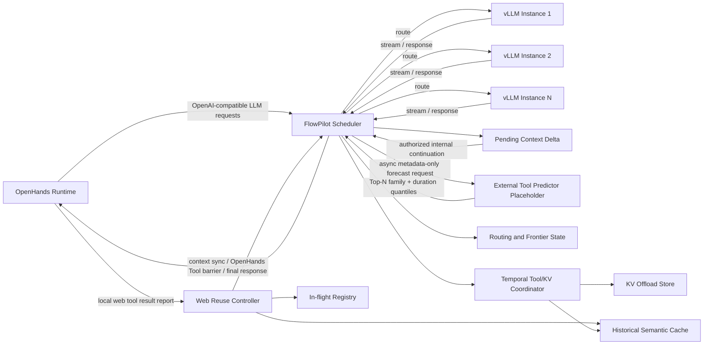
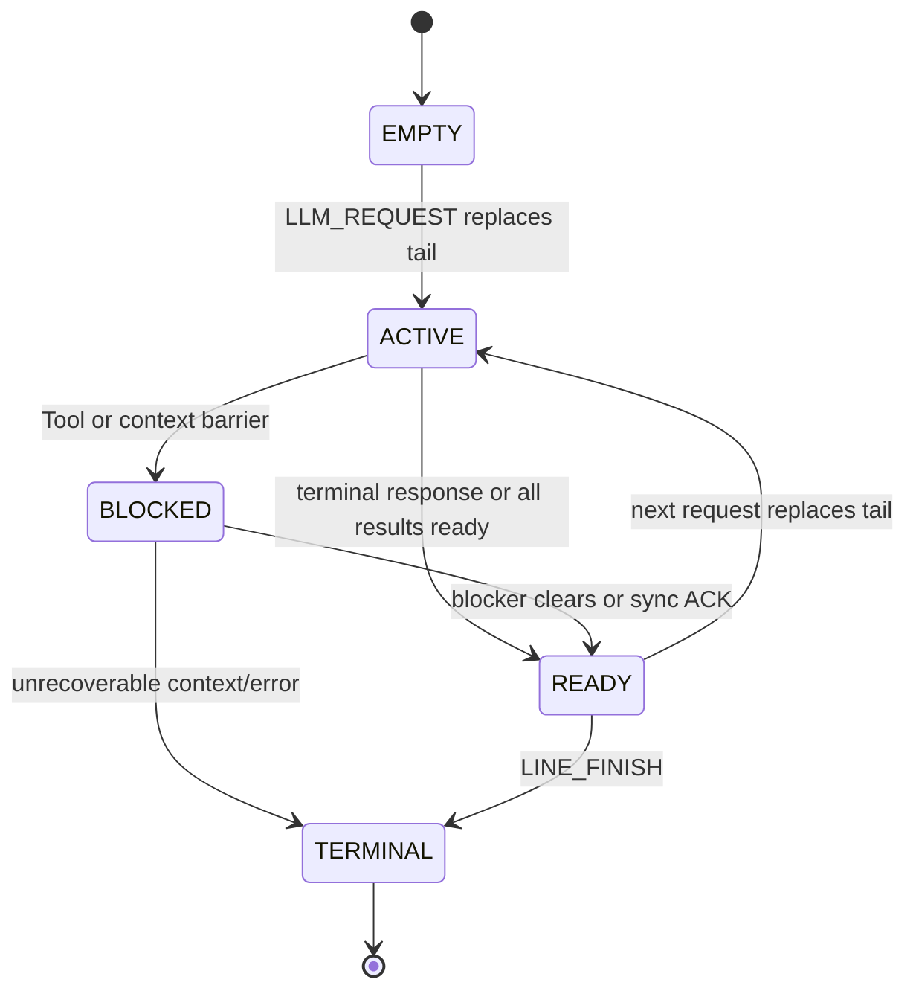

# FlowPilot：面向 OpenHands、vLLM 与 Web Tool 复用的延迟上下文调度器

> 文档性质：系统研究设计草案  
> 核心目标：在固定的 vLLM 与存储资源池中，通过请求路由、Web Search 历史缓存、在途语义合并、缓存命中后的延迟上下文同步，以及 capability-gated 的 KV/Tool 时序调度，降低 OpenHands 工作负载的端到端完成时间、上下文往返开销与重复工具开销。

## 0. 设计结论

本文的目标部署由三部分组成：**OpenHands** 是本地 Agent Runtime，**FlowPilot** 是双向 OpenAI-compatible 网关与调度控制面，**vLLM** 提供一个或多个推理实例：

```text
OpenHands -> FlowPilot Scheduler -> selected vLLM instance
OpenHands <- FlowPilot Scheduler <- selected vLLM instance
```

OpenHands 拥有 agent loop、权威对话历史、Action/Observation 顺序、安全策略和所有真实 Tool 执行。vLLM 拥有推理及其内部 KV Cache。FlowPilot 负责请求/回复代理、实例路由、line-tail frontier、Web Tool 复用和时序调度，但不执行 Tool，也不控制 vLLM 内部动态批处理。

在 OpenHands 显式授权的只读 Web Tool 范围内，FlowPilot 可以接管一段有界 continuation：把新增的 provider-valid assistant/tool 消息暂存在 `PendingContextDelta`，并机械构造下一次 LLM 请求。该过程称为 **延迟上下文同步（Deferred Context Synchronization, DCS）**。OpenHands 始终是上下文的最终权威所有者；FlowPilot 必须在本地执行、终止回复、容量上限、租约到期或故障时同步未确认增量。

核心处理顺序固定为：

1. **请求 1 进入。** OpenHands 将完整 OpenAI-compatible 请求提交给 FlowPilot。FlowPilot 校验 `tenant/job/line/llm_call/context` 身份，原子更新当前 tail，并立即把请求路由到兼容的 vLLM 实例；请求转发不能等待预测结果。
2. **预测与推理并行。** 请求 1 发往 vLLM 后，FlowPilot 可以异步调用外部 `ForecastRequest` 占位接口。返回值只包含版本化、带 TTL/置信度的 Top-N Tool family 与 duration quantiles，用于 Tool Cache 索引/元数据预热；超时、错误、低置信度、版本不兼容或晚到时直接丢弃。预测不创建 DAG 节点、不执行 Tool、不生成 Tool Result，也不改变 OpenHands 控制流。
3. **vLLM 回复先回到 FlowPilot。** vLLM 的流式 chunk、完成帧、usage 和 Tool Call fragments 均经 FlowPilot 代理；只有完整闭合的 Tool Call 才进入 resolution。若最终回复不含 Tool Call，则形成终止屏障：没有未确认增量时原样返回 OpenHands，否则把全部缺失上下文与最终回复一次性同步。
4. **事实 Tool Call 覆盖预测。** 对完整 assistant Tool Call 批次，实际 Tool 名称、参数、scope、freshness 和 schema 是权威事实。FlowPilot 先按这些事实查询历史 Tool Cache；预测候选不能断言命中，同一 assistant 回复中的多个 Tool Call 也不能被拆成两套不可重放的历史。
5. **历史命中。** FlowPilot 验证隔离域和时效性并按当前调用预算截取结果。DCS 有效时，把完整 assistant Tool Call 与当前 `tool_call_id` 对应的 Tool Result 追加到 `PendingContextDelta`；否则立即同步给 OpenHands。两种路径都跳过真实 Tool 执行。
6. **历史 miss 后检查在途调用。** FlowPilot 原子执行“匹配兼容 leader 或注册新 leader”。兼容在途调用存在时，当前调用成为 follower；预测 duration 只可作为等待初值，leader 的实际状态与结果随后覆盖它。
7. **Follower 完成。** leader 在其 OpenHands Runtime 中完成真实 Tool 后，FlowPilot 验证并按 follower 自身预算截取结果，保留 follower 自己的 `tool_call_id`。DCS 有效时追加到该 line 的 `PendingContextDelta` 并继续；否则同步给 OpenHands。Follower 不复用 leader 的 LLM 回复、私有上下文或消息 identity。
8. **需要真实执行时回到 OpenHands。** 若历史和在途均未命中，当前调用成为 leader；非 Web Tool、不可安全复用、需逐次授权或混合 Tool Call 批次同样形成执行屏障。FlowPilot 先同步全部缺失消息并等待 ACK，随后由 OpenHands 按 provider 顺序在本地执行每个 Tool，产生匹配的 Observation，并上报 START/FINISH/FAIL/CANCEL、实际时延和结果大小。真实事件覆盖 forecast 和 ready-time 估计。
9. **对齐请求 2 的可用时间。** Tool Cache 命中、follower 完成或本地 Tool 事件确定 `T_need`。若 vLLM 部署提供真实、版本兼容的逐会话 KV tier/bytes/restore/rematerialization 遥测，FlowPilot 才计算 `T_KV` 并发出 KEEP/OFFLOAD/RESTORE/DROP 建议，使请求 2 在 `max(T_need,T_KV)` 尽早启动；标准 vLLM 接口不提供这些事实时标记 `kv_telemetry=unsupported`，禁止虚构 KV handle/bytes/cost，并退化为普通请求路由。
10. **继续、同步或结束。** 所需 Tool Result 全部 ready 后，有效 delegation 允许 FlowPilot 从 OpenHands 最近确认的请求快照和 `PendingContextDelta` 机械构造请求 2，并重新进入步骤 1；否则先把增量交还 OpenHands。最终回复、delta 消息/token/字节上限、隐藏轮数上限、lease 到期、摘要冲突、OpenHands 离线或 FlowPilot 降级都会终止隐藏 continuation 并触发同步或显式失败。

每条线路的 `LineTail` 只保存当前请求、粗粒度阶段、版本和外部状态引用；Tool resolution、依赖、上下文事务与 vLLM KV 事实由各自模块唯一持有。调度时按需计算 `T_need`、请求权重和可用时的 KV restore laxity。

系统最值得主打的亮点是：

> **请求 1 的预测与 Tool Cache 预热隐藏在 vLLM 推理之后；事实 Tool Call 和真实 Tool 事件确定 `T_need`；只有 vLLM 暴露可信 KV 能力时才计算 `T_KV`。FlowPilot 以 DAG 重要性、SLO 紧迫度和真实 ready-time 事实优化请求 2 的启动时间，同时保持 OpenHands 对 agent loop、上下文和 Tool 执行的权威所有权。**
## 1. 系统边界与基本事实

### 1.1 三类核心实体

| 实体 | 负责内容 | 明确不负责的内容 |
|---|---|---|
| OpenHands Runtime | agent loop、线路编排、权威上下文及游标、delegation policy、Action/Observation 顺序、安全策略、所有 Tool 的本地执行、上下文增量原子应用与确认、实际上报 Tool 生命周期与结果 | 不绕过 FlowPilot 选择 vLLM 实例，不独立维护全局 Web Search 缓存 |
| FlowPilot Scheduler | 双向 OpenAI-compatible 代理、vLLM 实例路由、line-tail frontier、活跃线路依赖、Web Search 历史缓存、在途语义匹配、受限 continuation、未确认上下文增量、capability-gated KV/Tool 时序策略 | 不执行 Tool，不永久取代 OpenHands 的权威历史，不跨线路拼接上下文，不在授权外推进 agent loop |
| vLLM Instance | Prefill/Decode、内部调度和 KV Cache；可选扩展提供真实 KV tier/bytes/恢复与重算事实 | 不直接与 OpenHands 建立绕过 FlowPilot 的回复路径，不负责 Tool 执行、Agent 状态或 `DEPENDS_ON` |

这里的“Tool Cache 位于调度器”指逻辑所有权：索引、语义匹配、准入、版本、等待关系和命中决策均由 FlowPilot 控制。Tool Cache 的载荷存储与 KV 的驻留/迁移由各自资源系统负责；本设计不假设二者共享物理容量。即使部署在不同主机上，二者仍通过 Tool ready、KV ready 和请求 2 启动时间发生时序耦合。

### 1.2 请求与回复都必须经过调度器

OpenHands 通过静态 `LLM.base_url` 指向 FlowPilot，并提交 OpenAI-compatible 请求。FlowPilot 根据调度算法选择一个兼容的 vLLM 实例，并保留以下映射：

```text
(tenant_id, job_id, line_id, llm_call_id)
    -> (instance_id, model_id, session_id, routing_epoch)
```

vLLM 的流式 token、最终文本和结构化 Tool Call 同样先返回 FlowPilot。没有启用 DCS 时，回复原样转发给对应的 OpenHands conversation；启用 DCS 后，只有完整、可解析且参数已经闭合的 Tool Call 才能进入缓存与在途匹配流程。缓存/在途命中的完成帧及其 Tool Result 先写入 `PendingContextDelta`，不逐轮回传；流式 token 在确认该轮可被延迟前只能缓冲或作为 provisional stream，不能先向 OpenHands 提交后又声称该轮尚未同步。

FlowPilot 构造内部 continuation 时必须复用 Agent 最近确认的请求快照，并严格追加同一线路的 provider-valid assistant/tool 消息；不得重写 system/developer 消息、tool schema、采样参数或本地状态。每个内部请求携带 `(context_epoch, base_context_cursor, delta_seq, delta_digest)`，以便之后与 Agent 的权威状态核对。

### 1.3 Tool 始终由 OpenHands 本地执行

FlowPilot 可以产生以下决策：

- `DEFER_WITH_CACHED_RESULT`：不执行本地 Tool；结果只追加到调度器的未确认上下文增量并继续 LLM；
- `DEFER_WAIT_FOR_INFLIGHT`：不重复执行；等待 leader 后把结果追加到未确认增量并继续 LLM；
- `SYNC_WITH_REUSED_RESULT`：DCS 未获授权或不可用时，立即同步当前缺失上下文并交付已验证的复用结果，不执行本地 Tool；
- `WAIT_AND_SYNC_REUSED_RESULT`：等待 leader 后立即同步当前缺失上下文并交付 follower 结果，不执行本地 Tool；
- `SYNC_AND_EXECUTE_AS_LEADER`：先同步 Agent 缺失的全部上下文，确认后由当前本地 Agent 执行并回报结果；
- `SYNC_AND_EXECUTE_LOCALLY`：先同步上下文，再执行非 Web Tool 或不允许复用的调用；
- `SYNC_AND_DELIVER_FINAL`：没有本地 Tool 但出现最终回复，或达到提前同步条件时，把全部未确认增量交还 Agent。

这些决策改变的是“是否需要重复执行”以及“上下文何时交还 OpenHands”，不是 Tool 的执行位置。FlowPilot 本身没有浏览器、Shell、搜索客户端或其他 Tool executor。任何本地执行必须发生在 `CONTEXT_SYNC_ACK` 之后；未确认增量不能与 OpenHands 新提交的分叉历史同时继续。

### 1.4 执行线路的来源对调度器透明

如何产生、承载和回收执行线路由 OpenHands 决定。FlowPilot 不建模这些过程；默认关闭的 OpenHands adapter 只负责为每条可独立推进的线路提供稳定 `job_id/line_id/context_epoch`、当前上下文游标和有界 delegation policy，并在确有跨线路等待时上报依赖关系。若一个 conversation 没有并发分支，adapter 可将其映射为单 line；不能假设 OpenHands 核心天然暴露 FlowPilot 的 DAG 语义。

FlowPilot 不假设不同线路共享上下文或 KV。若底层推理引擎发现相同文本前缀，可以透明使用 Prefix Cache，但这不属于 DAG 语义。

### 1.5 非目标

- 不把预测模块的候选 Tool 当作事实 DAG 节点，不依据预测结果执行 Tool、生成 Tool Result 或绕过 Agent 授权；预测只作为预热和后续时序调度提示，实际接口与模型实现由独立模块提供；
- 不建模执行线路的创建、销毁和上下文分配过程；
- 不进行 Tool speculative execution；
- 不在缺少 Agent delegation lease 时自行生成 continuation；
- 不把 `PendingContextDelta` 当作跨 Job、跨 line 或无限期的完整会话存储；
- 不设计或控制 vLLM 动态批处理，推理实例内部策略保持不变；
- 不把 LLM 的 Prefill、Decode、流式 token 或 KV I/O 分别建成 DAG 节点；
- 不改变 Web Search 以外 Tool 的结果复用语义；
- 不允许 OpenHands 绕过 FlowPilot 直接调用 vLLM 实例；
- 不声称在线求解完整工作流的全局最优调度。

---

## 2. Autellix 风格的 Tail Frontier 与依赖 DAG

### 2.1 只维护每条线路的最后请求与有界增量

FlowPilot 不在调度热路径保存已经被 Agent 确认的完整 `LLM -> Tool -> LLM` 历史图。对 Job $j$ 的每条执行线路 $l$，只维护最后一个请求，以及从 Agent 最近确认游标开始的一段有界未确认上下文增量：

$$
F_j^t=\{Tail_j^t(l)\mid l\in ActiveLines_j^t\}
$$

完整请求历史仍写入 trace，用于调试、离线重放和实验，但不参与在线图遍历。新请求到达同一 `line_id` 时，原 tail 被新请求原子替换；同一路线的先后关系由 tail pointer 隐式表达。

因此控制状态复杂度仍是 $O(|ActiveLines|+|ActiveDependencies|)$，但数据状态还包含 $O(\sum_l |PendingContextDelta_l|)$。该增量必须受每线路消息数、token、字节和 TTL 限制，已获 Agent ACK 的部分立即释放或仅写审计 trace，不能把“只维护 tail”误写成无界持有对话历史。若 Runtime 没有上报任何跨线路等待，在线“DAG”自然退化为一张 `LineTail` 表，调度器无需维护图结构。

### 2.2 LineTail 状态

`LineTail` 只承担线路热状态、版本校验和上下文交接指针，不承担所有模块的事实存储或派生计算：

```text
LineTail {
  tenant_id, job_id, line_id
  tail_request_id?
  phase: EMPTY | ACTIVE | BLOCKED | READY | TERMINAL
  context_epoch, base_context_cursor
  delta_ref?, delegation_ref?
  version
}
```

请求记录、Tool resolution、预测结果、KV 事实、依赖集合和 delta/lease 内容分别由对应模块按稳定引用保存。`phase` 只回答“是否有请求在运行、是否被外部条件阻塞、是否可继续或是否终止”；Tool 等待、context sync、错误原因和终止结果通过外部记录查询。SLO/DAG 权重、ready time、KV 层级和 blocking count 都是按需计算的投影，不写回 `LineTail`。

Tool Call 仍是 tail request 回复上的结构化属性，而不是 DAG 节点。由 Agent 提交或由 DCS 合法构造的下一次 LLM 请求会原子替换 `tail_request_id`；未确认的 provider 消息只由 `PendingContextDelta` WAL 持有，ACK 后释放。

### 2.3 只保留一种显式边

同一路线的顺序边无需存储。跨线路确有等待关系时，只使用一种通用边：

```text
waiter_line --DEPENDS_ON--> prerequisite_line
```

因此不需要按调用语义区分 `CONTINUE`、`EMIT`、`TOOL_RESULT`、`SPAWN`、`RETURN` 或 `JOIN_DEP`。具体控制流属于 Agent Runtime；FlowPilot 只接收“新线路已注册”和“线路 A 当前依赖线路 B/C”的事实。依赖满足后立即删除对应边。

一种边已经足够，因为在线调度只需要回答两个问题：某条线路是否被其他活跃线路阻塞，以及完成它能解除多少条线路的阻塞。若 Runtime 有 `ALL/ANY/quorum` 等就绪规则，应将规则作为 waiter line 的 readiness predicate 上报，或由 Runtime 消解后更新依赖集合，而不是把它们扩展成新的边类型。FlowPilot 对新增依赖做同 Job 校验、版本校验和环检测；发现环时拒绝该次更新并保留上一版本。

这种设计的好处是：

- 调度状态规模与活跃线路数相关，而不是与累计调用次数相关；
- Agent 框架可以自由实现并发线路、并行 Tool 或其他控制流；
- 调度算法只关心哪些 tail 可运行、哪些 tail 被阻塞；
- 边类型不会与具体 Agent 框架的语义耦合。

### 2.4 Tail 更新规则

```text
LINE_REGISTER:      创建空 LineTail
LLM_REQUEST:        校验来源/上下文后原子替换 tail_request_id，phase=ACTIVE
LLM_RESPONSE:       记录 response 引用；按 Tool resolution 进入 BLOCKED 或 READY
TOOL_RESOLUTION_UPDATE:
                    更新 Tool 外部记录，并重新计算线路可执行时间
CONTEXT_DELTA:      由 WAL 追加消息；ACK 后推进 base_context_cursor 并清理已确认增量
LINE_DEPENDENCIES:  在 DependencyIndex 中原子替换 DEPENDS_ON 集合
LINE_FINISH:        标记 TERMINAL；无等待者后回收在线状态
```

多个 Tool Call 可以同时附着在一个 tail response 上。只有当下一请求所需的 Tool Result 全部就绪时，线路才进入 `READY`；是否由 Scheduler 继续由 delegation 记录决定。Tool 未就绪或正在同步时保持 `BLOCKED`，具体 blocker 由 Tool Resolution Store 或 Deferred Context 给出。

### 2.5 Frontier 关键度

FlowPilot 不重建完整 critical path，也不把 Tool 类型/时间预测加入 DAG。它只根据已经上报的 `DEPENDS_ON` 计算请求的结构重要性：

$$
\kappa_t(l)=
1+\alpha\log(1+BlockingLines(l))
+\beta\frac{DownstreamDepth(l)}{H_{max}}
+\gamma\frac{Age(l)}{A_{ref}}
$$

`BlockingLines`、`DownstreamDepth` 和 `Age` 由 `DependencyIndex` 与调度器即时计算，不复制到 `LineTail`。SLO 紧迫度也独立计算，最终请求权重为 $W_q(t)=w_j\kappa_q(t)U_j(t)$。Tool Cache 命中、Tool 预测和 KV 状态不会改写 $\kappa$，只改变请求的可执行时间和恢复动作。

---

## 3. 端到端架构



### 3.1 请求路由器

请求路由器维护每个 LLM 实例的：

- 模型与版本兼容性；
- Prefill/Decode 队列长度；
- 当前调用队列深度与实际吞吐；
- GPU KV 水位；
- CPU/NVMe offload 水位；
- 已有会话 KV affinity；
- 近期吞吐和尾延迟；
- 故障、过载和 draining 状态。

新 LLM Call 的路由得分可写为：

$$
Score(i,r)=
\hat Q_{i,r}+\hat S_{i,r}+\hat Restore_{i,r}
+\lambda_m MemoryPressure_i
-\lambda_a Affinity_{i,r}
$$

FlowPilot 选择满足模型、租户和容量约束且得分最低的实例。已有可恢复 KV 的会话优先保持实例亲和，但当原实例排队或内存压力过高时，可以迁移或重算，不能把 affinity 作为硬绑定。

### 3.2 双向响应代理

FlowPilot 为每个 LLM Call 保留 correlation id。流式文本可以低延迟透传，但最终完成帧必须经过结构化检查：

```text
LLMResponseEnvelope {
  tenant_id, job_id, line_id, llm_call_id
  instance_id, model_id, model_version
  finish_reason
  assistant_text
  tool_calls[]
  usage
}
```

不含 Tool Call 时，若线路没有未确认增量则完成帧直接转发；否则该帧作为终止屏障，与全部缺失上下文一起同步。含 Tool Call 时，FlowPilot 先对整组并行调用做决策：只有所有调用都可安全复用并处于同一 delegation policy 时，才把完整 assistant 消息及对应 Tool Result 追加到 `PendingContextDelta` 并继续推理；只要其中一个调用需要本地执行，就同步完整增量和该 assistant 消息，不能把同一并行 Tool Call 批次拆成彼此不可重放的两套历史。

```text
PendingContextDelta {
  tenant_id, job_id, line_id, context_epoch
  base_context_cursor
  first_seq, last_seq
  messages[]  # provider-valid assistant/tool messages in exact order
  tool_call_ids[]
  delta_digest, previous_digest
  created_at, expires_at, delegation_lease_id
  state: OPEN | SYNCING | ACKED | ABORTED
}
```

一个 line 同一 `context_epoch` 只允许一个 OPEN delta。摘要链用于检测重复、遗漏和乱序，不用于替代消息 schema 校验。

### 3.3 Web Reuse Controller

Web Reuse Controller 由五部分组成：

1. `Tool Classifier`：根据注册表判断 Tool 是否属于允许语义复用的 Web Search 类；
2. `Historical Cache`：存储历史请求、结果、embedding、约束字段、时效与 provenance；
3. `In-flight Registry`：登记尚未完成的 leader，并管理 follower；
4. `Result Adapter`：按调用预算、模型上下文和策略截取结果，生成可追加到内部 continuation、并最终可同步给 Agent 的 provider-valid Tool Result；
5. `Deferred Context Manager`：管理 base cursor、增量摘要链、delegation lease、内部 continuation 和同步/确认。

### 3.4 Local Agent Adapter

OpenHands adapter 至少提供：

- 让 OpenHands 执行 FlowPilot 标记为 leader 或普通本地调用的 Tool；
- 对最后回复中明确的非 Web Tool 可选估计 ready time，并上报实际开始、完成、失败和结果；
- 上报 leader 的开始、成功、失败、取消与结果；
- 校验 `context_epoch/base_cursor/delta_digest`，把缺失的 assistant/tool 消息原子注入本地 Agent 的正常历史，并返回 `CONTEXT_SYNC_ACK`；
- 只在同步确认后执行屏障上的本地 Tool，避免 Tool 观察与 assistant Tool Call 脱节；
- 注册稳定 `line_id`，并仅在存在跨线路等待时上报通用依赖集合。

---

## 4. Web Search 历史缓存与在途合并

### 4.1 适用范围

语义缓存和在途合并默认只用于只读、可复用的 Web Search 类 Tool，例如搜索查询、网页检索和满足版本约束的公开信息抓取。涉及登录态、个性化页面、写操作、支付、发送、删除、本地 Shell、代码执行或数据库写入的 Tool 不进入这一流程。

“Web Search 类”必须由注册表显式配置，而不是通过 Tool 名称的模糊字符串匹配决定。

### 4.2 匹配约束

在计算语义相似度之前，先执行硬约束过滤：

```text
ReuseScope {
  canonical_tool_family
  tool_version
  tenant_or_public_scope
  auth_scope
  locale, language, region
  safe_search_policy
  time_sensitivity_class
  data_source_constraints
  freshness_deadline
  result_schema_version
}
```

只有硬约束兼容的候选才计算 embedding 相似度。对带“今天、当前、最新、价格、天气”等时间敏感语义的请求使用更短 TTL 或直接禁用历史语义命中。跨租户复用默认关闭；只有明确标记为公共、无隐私且授权域一致的结果才可共享。

### 4.3 固定查找顺序

对完整的 Web Tool Call $c$：

```text
resolve(c):
    descriptor = canonicalize(c.tool_name, c.arguments, c.scope)
    defer_allowed = delegation_policy.allows_deferred_reuse(c)

    historical = historical_cache.semantic_lookup(descriptor)
    if valid(historical):
        if defer_allowed:
            return DEFER_WITH_CACHED_RESULT(adapt(historical.result, c.output_budget))
        return SYNC_WITH_REUSED_RESULT(adapt(historical.result, c.output_budget))

    decision = inflight_registry.match_or_register(descriptor, c.owner_agent)
    if decision.is_follower:
        if defer_allowed:
            return DEFER_WAIT_FOR_INFLIGHT(decision.binding_id)
        return WAIT_AND_SYNC_REUSED_RESULT(decision.binding_id)

    return SYNC_AND_EXECUTE_AS_LEADER(decision.binding_id)
```

历史缓存必须先于在途表。这样可避免在已有有效答案时仍等待较慢的在途调用，也使 lookup 行为可解释和易于测试。

历史 miss 之后，“查找在途候选”和“注册新 leader”必须是一个原子操作。实现上可以在规范化 descriptor 的候选分区内加短锁，或使用带版本号的 compare-and-bind：锁内重新做一次在途匹配，确认仍无兼容 binding 后才能创建 leader。否则两个同时到达的相似请求可能都在第一次查询中看到 miss，并各自开始本地执行。

### 4.4 Leader/Follower 执行语义

Leader 只是一条“由哪个本地 Agent 执行”的绑定关系：

```text
InFlightBinding {
  binding_id
  canonical_descriptor
  leader_agent_id
  leader_tool_call_id
  followers[]
  start_time
  predicted_finish_time
  lease_deadline
  status
}
```

流程如下：

1. FlowPilot 把 `SYNC_AND_EXECUTE_AS_LEADER`、缺失上下文增量与原始 Tool Call 发给 leader 所在本地 Agent；
2. leader Agent 校验游标和摘要，原子应用增量并返回 ACK；
3. leader 本地执行 Web Search，并上报实际开始、完成或失败事件；
4. follower 在调度器内处于 `DEFER_WAIT_FOR_INFLIGHT`，本地 Agent 不重复执行，也不立即接收 Tool Result；
5. leader 完成后，本地 Agent 将未经 Agent 总结改写的 Tool 原始结果与 provenance 回报 FlowPilot；
6. FlowPilot 验证结果；若结果可长期复用，则原子地发布历史条目并完成 binding，否则只完成 binding；
7. FlowPilot 针对每个 follower 的输出预算分别截取结果，把 follower 自己的 assistant Tool Call 和 Tool Result 追加到各自 `PendingContextDelta`，并为每条线路分别发起内部 continuation；
8. 当某条 follower 线路之后遇到本地执行屏障或终止屏障时，FlowPilot 才把该线路累计缺失的上下文一次性同步给它的本地 Agent。

Follower 复用的是 leader 的 Tool Result，不复用 leader 的 LLM 回复、私有上下文或后续推理。每条 follower 线路保留自己的 assistant Tool Call ID、消息顺序、上下文游标与截取预算；同步时不得复制 leader 的事件 envelope。

### 4.5 结果截取

历史和在途命中都不能无上限复制结果。`Result Adapter` 根据以下信息确定追加到内部 continuation 并最终同步给 Agent 的长度：

- 当前 Tool Call 的显式 `max_results`、`top_k`、时间范围等参数；
- 本地 Agent 或模型请求声明的 Tool Result token/byte budget；
- 当前缓存结果的实际结构和实际大小；
- 下一次 LLM Call 的上下文余量；
- Tool schema 对结果条目完整性的要求。

截取必须按结构化结果条目或文档边界进行，不能在字节中间任意切断。调度器私有审计记录携带：

```text
ResultProvenance {
  reuse_type: HISTORICAL | INFLIGHT
  source_binding_or_entry_id  # control-plane only; not exposed to LLM
  source_query_digest
  created_at
  freshness_deadline
  original_size
  returned_size
  truncation_policy
  similarity_score            # audit only
}
```

进入 provider Tool Result 的 provenance 只能包含经过白名单允许的有界字段，例如 `reuse_type`、`observed_at` 和结果 schema 版本；不得把 binding id、leader input、tenant scope、相似度阈值或调度状态暴露给 LLM。完整审计 provenance 留在调度器控制面，并在上下文同步 ACK 中以 digest 引用。

历史缓存建议保存经过安全清洗的规范化结果，而不是只保存某一次截断版本，从而能为不同 follower 生成不同长度的合法输出。

### 4.6 失败、超时与取消

- leader 失败：默认唤醒 follower，并让它们各自重新进入匹配流程；必要时选举一个新 leader；
- leader lease 超时：binding 失效，避免 follower 无限等待；
- follower 取消：只移除该 follower，不取消仍被其他请求需要的 leader；
- leader 所在 Job 取消：若本地执行可安全继续且仍有 follower，可转为 detached leader；否则失败并重新选举；
- 结果校验失败：不写历史缓存；DCS follower 冻结并同步失败/回退信号，由 Agent 在 ACK 后重新执行，非 DCS follower 立即同步并按原策略回退本地执行；
- FlowPilot 重启：持久化的历史缓存可恢复，在途 binding 按失败处理，除非本地 Agent 能重新确认执行状态。
- `PendingContextDelta` 丢失或摘要不一致：禁止继续内部 continuation；若可从 WAL 完整恢复则重放同步，否则返回显式 `CONTEXT_DIVERGED` 并将 line phase 设为 `TERMINAL`，由 Agent 从最后确认游标恢复，不能猜测缺失消息；
- 同步超时或 Agent 拒绝 ACK：冻结该 line 的内部 continuation，租约到期后释放资源；不能把未确认上下文标记为已交付；
- 终止回复、增量容量上限或 delegation lease 到期：触发提前同步，即使尚未出现需要本地执行的 Tool。

---

## 5. 请求成本与 SLO

### 5.1 只保存事实，按需生成调度投影

在线控制不保存请求画像、跨阶段 hint 或多套压力值。FlowPilot 只保存各所有者产生的事实：

| 事实 | 所有者 |
|---|---|
| 当前完整请求、token 数、模型、deadline | Request Store |
| 已闭合 Tool Call、resolution、状态、ready-time 估计/实测值 | Tool Resolution Store |
| 活跃 `DEPENDS_ON` | Dependency Index |
| context cursor、delta digest、delegation lease | Deferred Context |
| KV tier、bytes、恢复/重算成本 | 推理引擎 KV Directory |

调度时为当前 tail 临时生成：

```text
SchedulingProjection {
  line_id, tail_request_id, tail_version
  ready: true | false
  t_need
  estimated_inference_ms?
  request_weight
  kv_restore_laxity?
}
```

投影不写回 `LineTail`，也不作为恢复时的权威状态。任何动作执行前都重新校验 `tail_request_id/tail_version`，因此 Tool 命中、Agent 提交新请求或上下文同步不会留下陈旧投影。

请求尚未形成时，`estimated_inference_ms` 可以为空；系统只需要 `T_need` 来安排 KV。请求形成后，再用真实 token、模型、候选实例队列和 KV 事实计算路由成本。Tool/LLM 成本占比只在离线实验中计算，不进入在线状态。

### 5.2 SLO 与 DAG 权重

SLO 描述 workflow 当前有多急，不依赖对完整未来 critical path 的预测。对 workflow $j$，令到达时间为 $A_j$、deadline 为 $D_j$、原始 SLO 为 $S_j=D_j-A_j$，直接从剩余 deadline budget 计算：

$$
U_j(t)=\min\left(
U_{max},
\frac{S_j}{\max(D_j-t,0)+\epsilon S_j}
+\lambda_o\frac{[t-D_j]^+}{S_j}
\right)
$$

请求 $q$ 的联合调度权重为：

$$
W_q(t)=w_j\kappa_q(t)U_j(t)
$$

其中 $\kappa_q$ 只来自已知 DAG 结构和等待年龄。若已经存在明确 Tool Call，可以根据 `T_need` 计算 KV restore laxity，但不能把它称为完整 workflow slack，也不能用预测 Tool 改写 DAG。

紧迫度可以离散为：

```text
CRITICAL: t >= deadline
TIGHT:    0 < deadline - t <= theta_slo * original_slo
NORMAL:   otherwise
```

实现时先由 Job/tenant 公平队列分配份额，再在份额内使用 $W_q(t)$、readiness 与实测资源成本。SLO 不放宽 cache freshness、tenant/auth scope 或语义相似度阈值。默认在途 follower 仍等待 leader；hard-SLO fallback 必须是显式、默认关闭的产品策略。

### 5.3 重算触发点

只在会改变 `ready`、`T_need`、`W_q` 或 KV 事实的事件上重算投影：

- 新 LLM 请求替换 tail；
- 完整 Tool Call 到达及历史/在途/本地 resolution 确定；
- Tool 完成、失败、取消或 ready-time 估计显著变化；
- `DEPENDS_ON`、deadline 或公平份额变化；
- KV tier、恢复成本或资源水位变化；
- context sync ACK、delegation 撤销或线路结束。

Forecast 返回只影响可选预热和 miss 时的 ready-time 初值，不改变 DAG、请求可执行性或线路 phase。

---

## 6. Tool Resolution 与下一请求调度

### 6.1 预测占位与事实分析边界

请求到达时允许调用独立预测模块，但预测结果只进入 `ForecastResult`，用于 Tool Cache 预热和 Tool miss 后的初始时长估计。只有 LLM 完成帧中的 Tool Call 名称和参数已经闭合后，FlowPilot 才创建事实 `ToolResolutionRecord`。预测候选不是 Tool Call、不是 DAG 节点，也不改变执行语义。

```text
ForecastRequest {
  schema_version, request_id, tenant_id, job_id, line_id
  model_id, history_features_ref, tool_catalog_version
  deadline, requested_top_n
}

ForecastResult {
  schema_version, based_on_request_id
  candidates: [{tool_family, probability, duration_p50, duration_p90}]
  confidence, predictor_version, expires_at
}
```

占位接口必须是异步、可取消和非阻塞的；超时、错误、低置信度、版本不兼容或晚于 Tool Call 到达的结果直接丢弃。占位 envelope 只允许 metadata/features reference，不允许把完整 prompt、Tool 参数、凭据或缓存 payload 写入 trace。预测模块的训练、模型结构、推理部署和准确率优化不属于本设计，由负责该模块的实现方提供。

```text
ToolResolutionRecord {
  tool_call_id, tool_family
  resolution: HISTORICAL_HIT | INFLIGHT_FOLLOWER | LOCAL_LEADER | LOCAL_ONLY
  status: RESOLVING | WAITING | READY | FAILED | CANCELLED
  ready_at_estimate?
  actual_latency_ms?, actual_result_bytes?
  source: CACHE_FACT | INFLIGHT_STATE | WEB_HISTORY | LOCAL_MODEL
  confidence, version, updated_at
}
```

### 6.2 不同 Tool 的 ready-time 来源

- **历史 Web 命中**：结果 ready；记录实际 lookup、验证和截取成本；
- **在途 Web 命中**：根据 leader 状态估计 `ready_at_estimate`；
- **新的 Web leader**：使用调度器保存的相似历史调用估计执行时间和输出长度；
- **非 Web Tool**：本地 Agent 使用明确名称、参数、输入规模和本地队列估计并上报；
- **低置信度**：使用保守分位数，仅影响 SLO/KV 优先级，不改变 Tool 执行语义。

### 6.3 版本化动作，不保存中间提示

Scheduler 不保存跨阶段的 continuation hint 或请求画像。需要安排 KV 或路由请求时，直接从当前 tail 版本、Tool resolution、deadline、依赖和 KV 事实生成第 5 节的临时投影。

KV restore 最迟开始时间可直接由投影计算：

$$
t^{latest}_{restore}=T_{need}-C^{measured}_{restore}-SafetyMargin
$$

KV 动作只携带 `line_id/tail_request_id/tail_version`。执行前若版本不再匹配则丢弃并重算，避免再维护一套 hint 失效协议。

### 6.4 LLM 请求路由边界

FlowPilot 的跨实例调度单位仍是完整 LLM 请求。请求有两种合法来源：Agent 提交的完整请求，或由“最近确认的完整请求快照 + 同线路未确认消息增量”机械构造的 delegated continuation。它根据 $W_q(t)$、真实 input tokens、显式 `max_tokens`、实例队列和 KV affinity 选择实例，但不重排 token iteration，也不修改推理实例内部动态批处理。

在 Tool 尚未完成时还不存在可运行的下一 LLM 请求。Tool Result ready 后，若 delegation 有效，FlowPilot 立即构造内部 continuation；否则先同步给 Agent。两种来源使用同一 tenant/Job 公平记账和同一 ready queue。

### 6.5 线路公平性

所有 line 使用同一路由器，公平份额按 Job/tenant 记账。一个 Agent 实现即使创建大量线路，也不会成比例放大 GPU 份额。FlowPilot 只看到 line id 和依赖，不解释线路来源。

---

## 7. 核心亮点：以请求 2 启动时间为中心的 KV/Tool Cache 联合调度

### 7.1 两类状态为何耦合

Tool Cache 与 KV Cache 不共享物理容量，也不在同一容量约束中进行二选一。它们的耦合来自请求 1 到请求 2 的时序：

```text
请求 1 到达
  ├─ 请求 1 发送到 LLM 推理
  └─ 异步 Tool 类型/时间预测与 Tool Cache 预热
LLM 返回 Tool Call 1
  ├─ Tool Cache 命中：Tool Result 快速 ready
  └─ Tool Cache miss：Agent 本地执行，使用预测区间估计 ready time
Tool Result ready + KV ready
  └─ Agent 构造请求 2，或有效 DCS 机械构造 continuation，进入 LLM 调度
```

设 Tool Result 可用时间为 `T_tool_ready(q)`，Agent 形成请求 2 的时间为 `T_need(q)`，KV 动作 `a` 产生的可用时间为 `T_KV(q,a)`，则：

$$
T_{need}(q)=T_{tool\_ready}(q)+C_{continue}(q)
$$

$$
T_2(q,a)=\max(T_{need}(q),T_{KV}(q,a))
$$

Tool Cache 改变 `T_tool_ready`，KV 动作改变 `T_KV`，联合调度的直接目标是最小化 `T_2`，并用 DAG 重要性和 SLO 紧迫度加权。缓存命中后仍发生长 KV restore，或者 Tool 长时间未完成却长期 KEEP KV，都是需要避免的残余等待。

整体目标优先最大化 SLO goodput，而非单独最大化 Tool Cache hit ratio、KV hit ratio 或原始 LLM throughput：

$$
\min J=\lambda_m\,SLOMiss+\lambda_f\,WeightedJCT
+\lambda_T\,DuplicateToolCost
+\lambda_K\,(RestoreCost+RematerializeCost)
+\lambda_W\,WastedPrewarm
$$

其中 `lambda_m` 应显著大于 `lambda_f`；缓存指标是解释变量和约束，不是最高层目标。

### 7.2 物理资源域

为避免把分布式资源错误地当成同一块内存，FlowPilot 明确区分：

| 层级 | KV | Tool Cache | 是否直接竞争 |
|---|---|---|---|
| LLM GPU HBM | 活跃 KV、待恢复 KV | 默认不存 Tool payload | 否；Tool 状态只通过时间影响 KV 策略 |
| LLM Host DRAM | Offloaded KV | Tool Cache 由独立存储控制 | 不竞争；只通过 ready time 耦合 |
| Shared CPU Memory | 可迁移 KV | Tool Cache 结果（若部署在同机） | 仍视为独立配额；不建立 KV/Tool 二选一容量模型 |
| Shared NVMe/Object Store | 冷 KV/checkpoint | 冷 Tool 结果 | 各自容量和 I/O 计费；联合决策只比较端到端时间收益 |
| 分离的 Scheduler Host | 无本地 KV 时 | Tool Cache 索引与 payload | 不按字节竞争；通过网络/恢复延迟协调 |

联合调度是逻辑统一、物理资源解耦的。除非未来遥测明确证明某部署存在需要独立治理的共享瓶颈，否则 FlowPilot 不把 KV 和 Tool Cache 放入同一容量约束，也不使用跨类型 density 做驱逐决定。

### 7.3 统一协调视图

```text
SchedulingView {
  line_id, tail_request_id, tail_version
  request_weight
  tool_ready_at, request_need_at, kv_ready_at?
  resource_domain
}
```

`SchedulingView` 是一次调度计算的短生命周期输入，不是存储对象。Tool Cache、KV Directory 和 Dependency Index 分别提供自己的事实；联合控制器只读取 ready time、请求权重和资源域，计算请求 2 的启动时间。KV 的 owner、Tool Result 的 scope、大小、freshness、follower 数和 I/O 成本仍由各自控制器管理。

`PendingContextDelta` 不进入 `SchedulingView`。它是正确性关键的 pinned state，达到水位时触发同步，不能被联合控制器淘汰。

### 7.4 KV 动作价值与请求 2 启动时间

设 Tool Call 到达时间为 $t_c$，Tool Result ready 时间估计为 $T_{tool\_ready}(q)$，形成请求 2 的 continuation/handoff 时间为 $C_{continue}$：Agent-owned 路径取实际回传和 Agent 构造成本，合法 DCS 路径取 Scheduler 机械构造成本。因此：

$$
T_{need}(q)=T_{tool\_ready}(q)+C_{continue}(q)
$$

对 KV 动作 $a$，推理引擎提供真实的 $T_{KV}(q,a)$、restore cost 和 rematerialization cost。请求 2 的预计启动时间为：

$$
T_2(q,a)=\max(T_{need}(q),T_{KV}(q,a))
$$

KV 动作选择最小化 SLO/DAG 加权的残余等待：

$$
a_q^*=\arg\min_a\left[
W_q(t)\,[T_{KV}(q,a)-T_{need}(q)]^+
+C_{action}(q,a)
\right]
$$

其中 $W_q(t)=w_j\kappa_q(t)U_j(t)$，分别包含 workflow 权重、DAG 重要性和 SLO 紧迫度。Tool 很快 ready 时，KV 更倾向 KEEP 或提前 RESTORE；Tool 预计长时间等待时，KV 可 OFFLOAD；若重算成本低于恢复成本，可 DROP/REMATERIALIZE。Tool Cache 命中会提前 $T_{need}$，因此应立即提高相应 KV 的 restore 优先级。

### 7.5 Tool Cache 的预热与驻留价值

请求 1 到达 Scheduler 时，预测模块占位接口可以异步返回：

```text
ForecastResult {
  based_on_request_id
  candidates: [{tool_family, probability, duration_p50, duration_p90}]
  confidence, model_version, expires_at
}
```

FlowPilot 只使用该结果进行 Tool Cache 索引/元数据预热和候选排序。设条目 $o$ 的预测使用概率为 $P_{use}(q,o)$，Tool hit/miss 对请求 2 启动时间的预计节省为 $\Delta T_{q,o}$，则预热价值为：

$$
V_{warm}(o)=\sum_q W_q(t)P_{use}(q,o)\Delta T_{q,o}-C_{warm}(o)
$$

Tool Call 到达后，实际参数、scope、freshness 和语义阈值决定是否命中；实际命中结果覆盖预测。预测不能直接触发 Tool 执行或产生 Tool Result。

Tool Cache 的驻留价值使用已经发生的 hit、follower 和实际节省时间：

$$
V_{tool}(o)=\sum_q W_q(t)P_{hit}(q,o)
\left(T^{miss}_{2,q}-T^{hit}_{2,q}\right)^+
Fresh(o)-C_{store}(o)
$$

该价值只用于 Tool Cache 自身的准入、保留和驱逐，不与 KV 做跨类型 density 比较。

### 7.6 独立容量约束与保护规则

Tool Cache 使用自身的容量和 freshness 约束；KV 使用推理引擎提供的 GPU/CPU/NVMe 容量和迁移约束。二者不放入同一个容量预算。必须优先保护：

- 正在运行 LLM 所需的 KV；
- 已命中且等待交付的 Tool Result；
- 尚未 ACK 的 `PendingContextDelta`；
- SLO critical 或阻塞多个 line 的对象。

容量不足时，各自的资源控制器独立执行 admission/eviction；联合控制器只根据 $T_2$ 的端到端影响调整优先级，不把 Tool Result 与 KV 当成同一种可互相替代的对象。

### 7.7 Request-2 Alignment 主策略

Tool Cache、KV Cache 和 LLM 请求各自保留动作空间与容量控制，不组成一个共享优化器。联合控制器只在以下事件上计算请求 2 的预计启动时间：

1. 请求 1 到达：异步消费预测结果，只做可取消的索引预热，不阻塞 LLM。
2. 完整 Tool Call 到达：真实 resolution 覆盖预测，得到 `T_tool_ready` 和 `T_need`。
3. Tool 等待期间：按 `T_need`、KV 实测恢复成本、`W_q` 和资源水位选择 KEEP/OFFLOAD/RESTORE/DROP。
4. Tool ready 或请求 2 到达：重新计算 `T_2=max(T_need,T_KV)`，把 ready 请求放入公平队列。

多个 KV 同时等待恢复时，定义 restore laxity：

$$
L_q^{KV}(t)=T_{need}(q)-t-C^{measured}_{restore}(q)
$$

恢复优先级为：

$$
Priority_{restore}(q)=
\frac{W_q(t)}{\max(L_q^{KV}(t),0)+\epsilon}
$$

当 $L_q^{KV}\le 0$ 时进入 overdue restore 队列。该公式使 Tool Cache 命中、SLO 逼近和高 DAG 阻塞度都能立即提升对应 KV 的恢复优先级。

### 7.8 无预测降级

对尚未 ready 的暂停 KV 使用只依赖实际等待年龄和水位的状态机：

```text
GPU --(HBM high watermark)--> CPU
CPU --(wait age > A1 and DRAM pressure)--> NVMe
NVMe --(wait age > A2 and storage pressure)--> DROP

Tool cache hit / Tool finish:
DROP or NVMe or CPU --> RESTORE_QUEUE --> GPU
```

阈值 $A_1,A_2$ 只根据 KV 自身水位和 I/O 压力调整，不读取 Tool Cache 容量。迁移设置 cooldown；等待越久的 continuation 在恢复队列中 aging 越高，以防止饥饿。

该算法适合预测模块不可用、超时、低置信度或实际 Tool 不在 Top-N 的环境。预测失败必须非致命，不能改变 Tool Cache 的真实匹配和 Tool 的本地执行语义。

### 7.9 依赖保护

依赖保护只读取通用 `DEPENDS_ON`：

- `blocking_line_count` 越高，相关 KV、在途 follower binding 和 Tool Result 获得越高 boost；
- prerequisite line 完成后立即删除边并撤销 boost；
- 已完成但 waiter 尚未消费的结果只保护必要载荷，不无限保护整个历史；
- 多个 tail 同时 ready 时仍按 Job/tenant 公平份额恢复和路由。

这使联合状态管理与 tail frontier 发生联系，但不要求 FlowPilot 理解线路如何被 Agent 拉起。

### 7.10 实际事件后的原子闭环

联合控制器在以下实际事件上滚动重算，而不是只在内存耗尽时被动淘汰：

- Web 历史命中、在途绑定、leader 完成或失败；
- 上下文增量追加、内部 continuation、同步开始/ACK/超时；
- 本地 Tool 开始、完成、失败或结果实际大小确定；
- tail request 被替换、Tool resolution 更新或 `DEPENDS_ON` 集合变化；
- Tool Cache 条目准入、过期或命中统计跨阈值；
- KV 层级变化、GPU/CPU/NVMe 水位或 I/O 队列跨阈值；
- LLM 实例队列、deadline、依赖或 ready continuation 集合变化。

历史命中、在途绑定或实际 Tool 完成后，FlowPilot 原子完成：

1. 更新 Tool Resolution Store 中的 resolution、ready time 和结果大小；
2. 对复用结果追加 provider-valid assistant/tool 消息，推进 delta seq/digest；对本地屏障冻结 delta 并发起同步；
3. 从当前事实重算 `SchedulingView`；若 `T_need` 或 `W_q` 改变，调整 KV/请求队列；
4. 在 delegation 有效且 delta 未超限时排入内部 continuation，否则保持同步屏障。

Tool Cache 和 KV 各自在自己的容量约束内准入/驱逐；联合控制器只通过 $T_2$ 和 $W_q$ 协调时序，不维护第三套资源价格或画像状态。

---

## 8. Line-Tail 事件协议与状态机

### 8.1 最小事件集合

```text
JOB_SUBMIT(job_id, tenant_id, default_slo)
LINE_REGISTER(job_id, line_id, deadline?, weight?)
LINE_DEPENDENCIES(job_id, line_id, prerequisite_line_ids[], version)
LINE_FINISH(job_id, line_id, tail_request_id)

LLM_REQUEST(job_id, line_id, llm_call_id, model, messages_meta,
            token_counts, deadline?, origin: AGENT | SCHEDULER_DELEGATED,
            context_epoch, base_context_cursor, delta_digest?)
LLM_ROUTED(llm_call_id, instance_id)
LLM_RESPONSE(job_id, line_id, llm_call_id, finish_reason, tool_calls, usage)

FORECAST_REQUEST(request_id, predictor_schema, requested_top_n,
                 deadline, tool_catalog_version)
FORECAST_RESULT(request_id, candidates_meta[], confidence,
                predictor_version, expires_at)
FORECAST_DISCARDED(request_id, reason)

TOOL_RESOLUTION_UPDATE(tool_call_id, resolution, status,
                       ready_at_estimate?, actual_latency_ms?,
                       actual_result_bytes?, source, confidence, version)
CONTEXT_DELTA_APPEND(line_id, context_epoch, delta_seq,
                     assistant_message, tool_messages[], delta_digest)
INTERNAL_CONTINUATION(line_id, parent_llm_call_id, delta_digest)
CONTEXT_SYNC_REQUEST(line_id, context_epoch, base_context_cursor,
                     first_seq, last_seq, messages[], delta_digest,
                     barrier_reason, pending_local_tool_calls[])
CONTEXT_SYNC_ACK(line_id, context_epoch, last_seq, delta_digest,
                 new_context_cursor, new_context_digest)
CONTEXT_SYNC_FAIL(line_id, context_epoch, delta_digest, reason)
LOCAL_TOOL_START(tool_call_id, binding_id?)
LOCAL_TOOL_UPDATE(tool_call_id, progress?, ready_at_estimate?)
LOCAL_TOOL_FINISH(tool_call_id, binding_id?, result, result_size,
                  provenance, measured_latency)
LOCAL_TOOL_FAIL(tool_call_id, binding_id?, error_class)

KV_STATE(session_id, instance_id, tier, bytes, restore_cost)
KV_ACTION(session_id, keep|offload|restore|drop, source, target)
```

事件使用 `(tenant_id, job_id, line_id, context_epoch, id)` 做幂等去重。Agent Runtime 可以任意创建线路，但不得复用仍活跃的 `line_id/context_epoch`；`LINE_DEPENDENCIES` 用 version 原子替换依赖集合。`CONTEXT_SYNC_ACK` 只有在 seq、WAL delta digest 和 base cursor 全部匹配时才能推进权威游标；`new_context_digest` 是 Agent 原子应用后的权威历史摘要，不能用 WAL delta digest 代替。重复 ACK 幂等，冲突 ACK 使线路进入 `TERMINAL`，禁止继续推理或执行 Tool。

最终 ACK 清空全部 pending 消息并撤销 Scheduler writer 后，线路控制权已经回到 Agent；同一 epoch 内随后新增的本地 Tool Observation、普通 LLM 请求或最终回复属于合法的 Agent-ahead 状态，reconciliation 应要求以该权威 cursor/digest 签发新 delegation，而不能把它误判为 Scheduler 分叉。只有在 OPEN/SYNCING writer 或未确认 delta 仍存在时，从同一 base cursor 出现冲突历史才进入 `CONTEXT_DIVERGED`。

### 8.2 Tail 状态机



状态机不包含线路创建或回收语义。`DEPENDS_ON` 只表达当前 ready tail 的阻塞事实。下一次 LLM 请求可由 Agent Runtime 构造并提交，也可由 FlowPilot 根据有效 delegation 机械构造；后者必须在同一 `context_epoch` 内串行推进，不能与 Agent 侧分叉并发。

### 8.3 事件处理边界

事件处理器只做“校验、写入所属模块、更新 LineTail phase、触发重算”四件事，不把完整策略展开成一个中心化主循环：

```text
LLM_REQUEST:
    validate identity/context/delegation
    atomically replace tail_request_id; phase = ACTIVE
    route complete request; start optional non-blocking forecast

LLM_RESPONSE:
    validate current llm_call_id and complete Tool fragments
    write response/Tool facts to Request Store and Tool Resolution Store
    choose phase = BLOCKED | READY
    trigger scheduling projection recompute

TOOL_RESOLUTION_UPDATE / LOCAL_TOOL_*:
    validate lifecycle and current tail identity
    update Tool Resolution Store / reuse binding
    if all required results ready: phase = READY
    trigger scheduling projection recompute

CONTEXT_SYNC_ACK:
    validate cursor, seq and digest; commit WAL
    phase = BLOCKED when local execution follows, otherwise READY

DEPENDENCY_OR_KV_EVENT:
    update the owning index
    recompute only affected lines
```

网关流式读取、上游关闭、重试和取消由每个 `llm_call_id` 的 GatewayCall 状态机负责；DCS 的 OPEN/SYNCING/ACKED/ABORTED 由 `PendingContextDelta` 负责；Tool lifecycle 由 Tool Resolution Store 负责。它们都不再扩充 `LineTail.phase`。

重算器只遍历受事件影响的 active line，并从各模块读取事实生成临时 `SchedulingProjection`。动作在执行前校验 `tail_version`；过期动作直接丢弃，不执行跨模块回滚。

---

## 9. 调度策略

### 9.1 优化目标

设 Job $j$ 的到达与完成时间为 $A_j,C_j$，deadline 为 $D_j$，SLO 长度为 $S_j=D_j-A_j$。FlowPilot 首先最大化 SLO goodput：

$$
Goodput_{SLO}=\frac{1}{H}\sum_jw_j\mathbf{1}[C_j\le D_j]
$$

在线近似最小化：

$$
J=\lambda_m\sum_jw_j\mathbf{1}[C_j>D_j]
+\lambda_l\sum_jw_j\frac{[C_j-D_j]^+}{S_j}
+\lambda_f\sum_jw_j\frac{C_j-A_j}{S_j}
+\lambda_T DuplicateWebExec
+\lambda_K(RestoreCost+RematerializeCost)
+\lambda_W WastedPrewarm
$$

其中 $\lambda_m\gg\lambda_l\gg\lambda_f$。GPU 利用率、原始吞吐率和缓存命中率是诊断指标，不单独作为最终目标；FlowPilot 不优化或控制 LLM batch composition。

### 9.2 Tail 两级调度

调度分成两层：

1. **Job/tenant 层**：weighted deficit 或 virtual time 分配公平份额，防止一个 Job 通过增加 line 数量扩大份额；
2. **LineTail 层**：在份额内按 $W_q(t)=w_j\kappa_q(t)U_j(t)$ 排序；DAG 结构重要性和 deadline-budget urgency 不读取未来 Tool 预测。

只有已经由 Agent 提交或由有效 DCS delegation 构造、且满足依赖的完整 LLM 请求进入 ready queue。尚在等待 Tool 的 continuation 不占 LLM queue，只通过 `T_need` 影响 KV 时机；请求形成后再用真实 token、模型和实例状态路由。内部 continuation 与普通请求共用 Job/tenant deficit，不能因为减少 Agent 往返而获得额外 GPU 份额。已确认的完整历史请求不参与排序。

### 9.3 在途绑定与 SLO

历史 miss 后，只要在途调用通过语义阈值以及 scope、freshness、结果 schema 等硬约束，默认就成为 follower。FlowPilot 根据 leader 状态更新 follower 的 `ready_at_estimate`，但预测不改变默认复用语义。

等待由 leader 完成、leader 失败、lease 到期或 follower 取消结束。若产品策略允许 hard-SLO fallback，只有 `CRITICAL` follower 在 lease guard 触发后才能脱离 binding 并本地执行；默认关闭该能力，避免预测误差制造重复 Tool。

### 9.4 Backpressure

FlowPilot 不执行 Tool，因而不能像集中式 Tool Dispatcher 那样控制所有本地 worker，但可以：

- 对 LLM 请求做准入与实例排队控制；
- 限制单个 Job 同时进入 LLM ready queue 的 line 数；
- 对大量相似 Web Search 使用 follower 合并，减少本地 Tool 压力；
- 根据本地 Agent 上报的 Tool 状态与进度更新对应 `T_need`、KV 与优先级；
- 对调度器缓存、在途表和结果交付实施容量上限。
- 对每条 line 的未确认轮数、消息数、token、字节、TTL 和内部 continuation 深度设硬上限；达到任一上限立即同步或停止 delegation；
- 对同一 Agent 的并发 `CONTEXT_SYNC` 数量与同步字节限流，防止大量隐藏轮次在本地 Tool 到来时形成突发回补。

不能声称 FlowPilot 直接调度或抢占本地 Tool worker。

---

## 10. 正确性、安全与可观测性

### 10.1 复用正确性

语义复用的风险高于 exact-key cache。系统必须提供：

- 硬约束过滤后才进行向量检索；
- 针对 Tool family 的独立相似度阈值；
- exact match、semantic match 和 in-flight match 的分层统计；
- freshness、版本、locale、授权域和 tenant 隔离；
- 原始 query、规范化 descriptor、相似度和结果来源审计；
- 按 Tool/tenant 快速关闭语义复用的 kill switch；
- 对低置信度候选回退本地执行。
- Agent 在请求入口签发的 delegation policy 必须精确限定 tool family、只读/幂等属性、tenant/auth scope、adapter/schema 版本、最大隐藏轮数和过期时间；未授权调用一律形成本地执行屏障；
- 被复用的 Tool Result 必须使用当前线路自己的 `tool_call_id` 构造 provider-valid tool 消息，不能复用来源记录或 leader 的消息 identity；
- assistant Tool Call、对应 Tool Result 与后续 assistant 回复的顺序必须在增量中完整保留，并通过 cursor/digest/ACK 实现幂等 exactly-once apply；
- Scheduler 不得在 `CONTEXT_SYNC` 未确认时继续该线路，也不得接受从同一 base cursor 分叉的 Agent 请求。

缓存命中不应伪装成本地新执行。Tool Result 必须携带 provenance，供 Agent、日志和实验区分来源。

### 10.2 隐私与隔离

- query、搜索结果和 embedding 均按数据分级保存；
- 私有 query 默认只在 tenant/auth scope 内匹配；
- 写缓存前执行 secret/PII policy；
- 删除请求需要同时清除 payload、embedding、索引和派生副本；
- 结果日志避免记录完整敏感正文，只记录 digest 与受控摘要；
- follower 不得获知 leader 的 Agent id、Prompt 或其他上下文。
- `PendingContextDelta` 按 tenant/job/line/context_epoch 隔离并加密存储；日志只记录 cursor、digest、大小和状态，不记录完整隐藏上下文；
- delegation token 只能由受信 Agent Adapter 签发，不能信任普通客户端自报的 tenant、scope 或可复用标志；
- 同步 payload 只包含当前 Agent 自己缺失的消息；不得以“上下文补齐”为由附带 leader input、binding handle、缓存 key 或跨线路内容。

### 10.3 可观测性

每次 LLM Call 与 Tool Call 都应形成统一 trace：

```text
agent -> scheduler ingress -> route decision -> llm queue/run
      -> async forecast request/result -> optional Tool Cache prewarm
      -> scheduler response proxy -> tool resolution
      -> local execution barrier or reuse wait/delta append
      -> internal continuation* -> context sync/ack
      -> local tool execution or final delivery -> next llm request
```

关键指标包括：

- LLM request routing latency、实例排队、Prefill/Decode 时延；
- scheduler proxy 首 token 与完成帧开销；
- forecast latency、与请求 1 推理重叠比例、Top-N coverage、过期/晚到/低置信度丢弃、有效与浪费预热；
- Web history exact/semantic hit、in-flight join、false reuse、重复执行率；
- leader/follower 数量、等待时间、leader 失败与重新选举；
- Tool Result 原始/截取长度和下一轮 Prefill tokens；
- 每次 DCS 的隐藏轮数、delta 消息/token/字节、内部 continuation 延迟、避免的 Agent 往返、同步批大小与同步耗时；
- context cursor/digest 冲突、重复 ACK、提前同步、lease 到期、WAL 恢复和 `CONTEXT_DIVERGED` 数量；
- KV keep/offload/restore/drop、恢复 stall、迁移字节；
- $T_{tool\_ready}$、$T_{need}$、$T_{KV}$、$|T_{need}-T_{KV}|$、restore laxity miss 和请求 2 启动延迟；
- Tool Cache 与 KV 各自的容量、队列和 I/O，不汇总为共享容量；
- 端到端 Job JCT、P95/P99、deadline miss 与 tenant fairness。

---

## 11. 降级与故障处理

### 11.1 Scheduler 故障

FlowPilot 是请求与回复必经路径，需要多副本部署或明确降级：

- 路由状态和历史缓存元数据使用可恢复存储；
- correlation、binding 和幂等键避免重试造成重复交付；
- 未确认上下文增量使用独立 WAL/复制状态；恢复后必须先与 Agent 协商 cursor/digest，再决定继续、重发同步或显式失败；
- 控制面不可用但代理面可用时，退化为最小负载路由并关闭语义复用；
- Web Reuse Controller 不可用时，所有 Tool Call 标记 `EXECUTE_LOCALLY`；
- Tool Predictor 不可用、超时、低置信度或返回过晚时，丢弃预测并使用 prediction-independent 策略；不得阻塞 LLM 请求或 Tool 执行；
- Temporal Tool/KV Coordinator 不可用时，各 LLM 实例使用本地 KV offload 策略，Tool Cache 使用自身的独立容量策略；
- 不能在不经过 FlowPilot 的情况下悄悄建立 Agent—LLM 直连，否则双向观测和一致性会失效。
- 代理面准备降级或滚动升级前必须 drain delegated continuation，并把所有 OPEN delta 同步/确认；不能把未确认增量留给不兼容版本接管。

### 11.2 分析误差、事件缺失与状态抖动

- Tool duration/output 分析误差：使用保守分位数和在线残差校准，真实结果到达后立即覆盖；
- 请求 1 阶段预测错误或过期：真实 Tool Call 类型、参数和 cache resolution 原子覆盖预测；预热状态按 TTL 回收；
- Tool start/finish 事件延迟：使用幂等心跳、进度更新和状态重同步；
- follower 等待超过 binding lease：使 binding 失败并重新进入匹配流程；
- 实际 Tool Result 过大：先保护当前 follower 所需部分，其余按 Tool Cache admission 分层或拒绝；
- inference-heavy/tool-heavy 标签频繁切换：分类使用 hysteresis，KV 迁移使用 cooldown；
- Tool 完成时 KV 尚未恢复：按 tail blocking degree、SLO urgency 和等待年龄进入恢复队列；
- 调度状态不完整：退化为 KV 水位状态机与 Tool Cache 独立 LRU，不引入预测补全；
- Agent 暂时离线：停止该 line 的内部 continuation，保留增量直到短 TTL；TTL 到期后标记 `ABORTED` 并保留可审计失败，不能继续扩大未同步历史；
- Agent 与 Scheduler 同时从同一 cursor 继续：以 context epoch 和单写 lease 拒绝其中一支，不做自动 merge；
- 同步 payload 过大：按完整消息边界分片传输，但只有全部分片校验完成后才原子 ACK，禁止部分消息可见。

---

## 12. 实现模块

```text
flowpilot/
  gateway/
    api, stream_proxy, gateway_call_state, correlation
  control/
    request_store, line_tail_frontier, dependency_index
    instance_registry, fair_queue, llm_router
  reuse/
    tool_registry, historical_cache, inflight_registry
    tool_resolution_store, result_adapter
  context/
    delegation_policy, delta_wal, continuation_builder, sync_protocol
  scheduling/
    forecast_adapter, kv_directory, scheduling_projection
    request2_alignment, resource_specific_policies
  adapters/
    llm_instance_adapter
    local_agent_adapter
  observability/
    trace, metrics, audit
```

模块边界遵守一条规则：事实由唯一模块持有，其他模块只保存稳定引用。`LineTail` 不复制 Tool/KV/DAG/forecast 字段；`SchedulingProjection` 不落盘；GatewayCall、Tool lifecycle 和 context sync 各自有独立状态机。

### 12.1 最小接口

本地 Agent Adapter：

```text
submit_llm(request, context_cursor, delegation_policy?) -> stream/response
receive_context_sync(context_epoch, base_cursor, messages,
                     delta_digest, barrier, pending_tool_calls) -> ack
receive_tool_resolution_after_sync(tool_call_id, resolution)
report_local_tool_estimate(tool_call_id, ready_at_estimate, confidence)
report_local_tool_start(tool_call_id, binding_id?)
report_local_tool_finish(tool_call_id, binding_id?, result,
                         result_size, measured_latency, provenance)
report_local_tool_fail(tool_call_id, binding_id?, error)
reconcile_context(line_id, context_epoch, context_cursor, delta_digest?)
```

vLLM Instance Adapter：

```text
infer(request, correlation_id) -> stream/response
get_load_profile()
get_kv_state(session_id) -> facts | unsupported
offload_kv(session_id, tier) -> facts | unsupported
restore_kv(session_id, tier) -> facts | unsupported
drop_kv(session_id) -> facts | unsupported
```

标准 vLLM OpenAI-compatible server 通常只提供 `infer` 和负载/健康信息；只有安装了额外 KV connector 或调度扩展并返回真实 handle、tier、bytes、版本和恢复/重算成本时，KV 动作接口才可用，否则所有 KV 方法返回 `unsupported`。

Tool Predictor Placeholder Adapter：

```text
forecast_async(request_metadata_ref, tool_catalog_version,
               deadline, top_n) -> ForecastResult | unavailable
cancel_forecast(request_id)
```

该 adapter 必须有 `no-op` 和 `trace-replay` 实现，以便预测模块尚未交付时独立开发/验证 FlowPilot。调用失败或结果晚到不得改变 LLM、Tool 或上下文路径。

### 12.2 存储建议

持久化/短期状态拆为：

- metadata/index：descriptor、embedding、scope、freshness、provenance、大小与统计；
- payload：清洗后的结构化搜索结果；
- in-flight：短生命周期 binding 与 follower 列表；
- tool resolution：当前 tail 的 Tool status、ready-time 估计和实际时延/结果大小；
- forecast hints：短生命周期的 Top-N family/duration metadata、predictor version 和 TTL；不得保存完整 prompt 或把候选写入 DAG，过期或被真实 Tool Call 覆盖后释放；
- measured stats：已经完成的 cache lookup、Tool、KV 迁移与 rematerialization 实测成本；
- pending context delta：短生命周期、按 line/epoch 隔离的 provider-valid 消息 WAL、摘要链、delegation lease 与同步状态；ACK 后删除 payload，仅保留审计元数据。

在途表、历史缓存、Tool resolution 和 pending context delta 使用不同 schema、TTL 与故障语义。`SchedulingProjection` 和请求权重不进入存储。

---

## 13. 分阶段实现路线

### Phase 0：协议与可观测性

先实现完整双向代理和 trace，不改变工具行为：

- 所有 Agent LLM 请求经 FlowPilot 路由；
- 所有 LLM 流与回复经 FlowPilot 返回；
- 建立 job/line/tail_request/tool_call correlation；
- 建立 context epoch/cursor/digest trace，但所有回复仍立即交付；
- 采集 LLM、Web Tool、非 Web Tool、实际结果大小与 KV 状态；
- 验证 tail 原子替换和通用 `DEPENDS_ON` 更新。

### Phase 1：精确缓存与在途绑定

- Web Tool 注册表和硬约束 key；
- exact historical cache；
- exact in-flight leader/follower；
- 本地 leader 回报与 follower 结果立即注入（作为 DCS 前的正确性基线）；
- 结构化截取、provenance、失败与 lease。

先证明调度器不执行 Tool 也能正确消除重复本地搜索。

### Phase 2：精确复用下的延迟上下文同步

- 仅对 exact historical hit 和 exact in-flight follower 启用 DCS；
- versioned delegation policy 与单写 lease；
- `PendingContextDelta` WAL、cursor/digest、原子 sync/ACK 与重连 reconciliation；
- 连续 exact hit 的内部 continuation；
- 本地 Tool、终止回复、容量、TTL 与故障提前同步屏障；
- 并行 Tool Call、重复 ACK、分片同步、Agent/Scheduler 分叉和滚动升级测试；
- 与“每次命中立即回传 Agent”比较往返节省、额外 Prefill、存储与恢复成本。

先证明延迟同步不会改变 provider-visible 消息序列、Tool Call identity 和本地 Agent 最终权威历史，再扩大到语义复用。

### Phase 3：保守语义复用

- 硬约束过滤后的 semantic historical lookup；
- semantic in-flight lookup；
- 按 Tool family 校准阈值；
- freshness、tenant/auth scope 与 false-reuse 审计；
- leader/follower lease、进度更新、ready-time 校准、失败与重试语义。

### Phase 4：Tool Ready-Time 与 SLO 闭环

- 定义异步 `ForecastRequest/ForecastResult` 占位接口；预测模型由外部模块负责，FlowPilot 只实现版本、TTL、取消、超时与降级；
- 请求 1 的预测与 LLM 推理重叠，只用于 Tool Cache 预热和 miss 时长先验，不改变 DAG 或执行语义；
- 对最后回复中明确 Tool Call 建立事实 `ToolResolutionRecord`，并用真实命中/未命中覆盖预测；
- Web history/in-flight 与本地 Tool 两类 ready-time 适配器；
- `ToolResolutionRecord` 只保存 resolution、status、ready-time 估计和实测值；
- 内部 continuation 与 Agent 请求统一公平记账和深度上限；
- 从当前事实按需生成 `SchedulingProjection`，动作执行前校验 tail version；
- DAG 结构重要性、SLO deadline-budget urgency 和等待年龄调度；
- Tool ready time 驱动的 KV keep/offload/restore；
- Tool Result 实际到达后的预测校准与 KV restore 重排；
- 预测不可用时的 prediction-independent wait-age 降级。

### Phase 5：跨层滚动联合调度

- 以 $T_2=\max(T_{need},T_{KV})$ 为核心的 SLO-Aware Request2 Alignment；
- Tool Cache 与 KV Cache 独立容量约束；
- Tool 命中/未命中驱动的 KV keep/offload/restore/drop；
- tail blocking degree、SLO urgency、restore laxity 与等待年龄驱动的恢复优先级；
- forecast、缓存命中、Tool start/finish 和 tail/dependency 事件触发的滚动重算；
- 无预测、无命中后 restore 联动、无 ready-time 对齐三类策略对比；
- 独立策略故障降级。

联合调度不是共享缓存容量管理。Phase 4 先形成“请求 1 -> 异步预测/预热 -> Tool Call 真实 resolution -> `T_need` -> KV 动作”的最小闭环，Phase 5 再实现 $T_{need}/T_{KV}$ 对齐、多 KV restore 排队和 SLO goodput 优化。

---

## 14. 实验设计

### 14.1 研究问题

**RQ1：** FlowPilot 的跨实例路由能否降低多 Agent LLM 请求的平均与 P99 排队时间和 Job JCT？  
**RQ2：** Web Search 历史语义缓存能消除多少重复本地执行，错误复用率与时效风险是多少？  
**RQ3：** 历史 miss 后的在途语义合并能否在并发相似查询下减少重复搜索，并优于仅有历史缓存？  
**RQ4：** 请求 1 到达时异步预测 Tool 类型/时长并预热 Tool Cache，在多大程度上减少了真实 Tool Call 到达后的 lookup 延迟，且预测开销是否被 LLM 推理隐藏？
**RQ5：** 以 $T_2=\max(T_{need},T_{KV})$ 为目标、由 DAG/SLO 加权的时间对齐策略，是否优于互不联动的 Tool Cache 与 KV 策略，并降低 Tool 命中后的 residual KV stall？
**RQ6：** 在线只保存 line-tail frontier 和通用 `DEPENDS_ON`，能否以更低状态开销实现 blocking-aware 调度并维持 Job/tenant 公平性？  
**RQ7：** 缓存/在途命中后由 Scheduler 继续 LLM、直到本地 Tool 或终止屏障才批量同步上下文，能否在保持消息序列与恢复正确性的前提下减少 Agent 往返、JCT 和 KV 抖动？其额外 Prefill、WAL、同步突发和故障恢复成本是多少？

### 14.2 工作负载

| 工作负载 | 特征 | 主要验证点 |
|---|---|---|
| Multi-line Web Research | 多条独立执行线路并发进行相关查询 | history/in-flight 语义复用、DCS 隔离、依赖阻塞 |
| Search-heavy Assistant | 高频搜索、查询改写、时效差异 | semantic precision、连续隐藏轮次、终止同步 |
| Code Agent | 长上下文、本地 Shell/测试 Tool | 实际 Tool 事件、等待年龄分层、KV offload |
| Mixed Multi-tenant | Search、Code、Data Agent 混合 | SLO goodput、公平性、Tool/KV ready-time 对齐 |

Trace 只需保留真实 line_id、tail request 和依赖事件；不记录或假设 Agent Runtime 内部的线路创建过程。

### 14.3 基线

1. Agent 直接绑定 LLM 实例，无中间调度；
2. FlowPilot 路由，但无 Tool Cache；
3. 路由 + exact historical cache；
4. 路由 + semantic historical cache，无在途合并；
5. 路由 + history + exact in-flight；
6. 路由 + history + semantic in-flight；
7. 独立 KV offload 与 Tool Cache LRU，不交换 ready-time 事件；
8. 预测关闭，只在真实 Tool Call 到达后查询 Tool Cache；
9. 预测开启并预热 Tool Cache，但 Tool 命中不触发 KV restore 重排；
10. KV 读取 Tool ready time，但不使用 DAG/SLO 权重；
11. 完整 SLO-Aware Request2 Alignment，但缓存命中后每轮立即回传 Agent；
12. 完整 SLO-Aware Request2 Alignment + DCS；
13. prediction-independent wait-age fallback；
14. 离线 trace oracle：知道真实 Tool ready、KV restore/rematerialization 与最优动作，仅作上界。

预测模块是占位依赖；实验至少提供 trace replay/oracle adapter，使 FlowPilot 调度部分可独立验证。预测器自身的训练与模型对比不属于 FlowPilot 实现范围，但必须报告输入版本、覆盖率、延迟和校准误差。

### 14.4 主要指标

端到端指标：

- Job Completion Time 的平均、P50、P95、P99；
- deadline miss ratio 与 goodput；
- 每租户 slowdown 与 Jain fairness。

LLM 指标：

- 路由排队时间、TTFT、TPOT、Prefill/Decode latency；
- 实例队列深度、负载方差；
- KV GPU/CPU/NVMe 驻留、迁移量、恢复 stall、重算 token。

Tool 复用指标：

- historical exact/semantic hit ratio；
- in-flight join ratio 与每 leader follower 数；
- 避免的本地 Web Search 次数和时间；
- follower 等待相对独立执行的净收益；
- false reuse、stale reuse、scope rejection；
- 原始与截取结果长度、下一轮 Prefill token 数。

延迟上下文指标：

- 每次 delegation 的内部 continuation 轮数与避免的 Agent 往返数；
- delta 消息/token/字节、WAL 写放大、批量同步字节与 P95/P99 同步延迟；
- DCS 相对逐轮回传的 JCT、TTFT、Prefill token、KV restore 和网络收益；
- local-tool/terminal/limit/failure 各类同步屏障占比；
- cursor/digest 冲突、重复/漏应用、分叉拒绝、恢复成功率与不可恢复线路数。

Tool ready-time 与 SLO 指标：

- ready-time P50/P90 绝对/相对误差；
- Tool Result bytes/tokens 误差；
- 历史命中、在途 follower、本地执行三类 resolution 的误差分解；
- 过期 `tail_version` 调度动作的丢弃数；
- KV restore deadline 命中率及 Tool ready 后残余 stall。

联合调度指标：

- SLO-satisfied workflow goodput 和 deadline miss ratio；
- 请求 1 推理覆盖的预测延迟比例，以及预测造成的推理干扰；
- Tool Cache prewarm precision/recall、有效预热率与 wasted prewarm cost；
- $|T_{need}-T_{KV}|$、restore laxity miss 和请求 2 启动延迟；
- Tool 命中后因 KV restore 产生的残余延迟；
- KV keep/offload/restore/drop 次数、迁移抖动和重算开销；
- Tool Cache 与 KV 各自的容量、队列和 I/O 指标，不报告跨类型容量交换收益。

### 14.5 核心消融

| 消融 | 验证内容 |
|---|---|
| history only，移除 in-flight | 在途合并的独立收益 |
| exact only，移除 semantic match | 语义复用的收益与风险 |
| 先查 in-flight 再查 history | 固定查找顺序的重要性 |
| 移除 Tool ready-time 估计 | ready-time 对下一请求调度的价值 |
| Tool hit 后不重算 `T_need` 或不触发 KV restore | cache-hit fast path 的收益 |
| 关闭请求 1 阶段预测/预热 | 预测与推理重叠及 Tool Cache 预热收益 |
| 使用预测类型但不使用时长区间 | Tool 时长先验对 KV 时机的价值 |
| Tool Cache 命中后不重排 KV restore | 两类 Cache 时序联动的必要性 |
| KV 不读取 Tool ready time | Request2 alignment 的独立收益 |
| 移除 DAG 结构权重 | workflow 阻塞重要性的价值 |
| 移除 SLO urgency | SLO goodput 与尾延迟影响 |
| 移除 Wait-Age Tiering | 无 ETA KV 分层的价值 |
| 移除 Dependency-Frontier Guard | 通用依赖阻塞保护的价值 |
| 只更新请求 priority，不更新恢复队列 | 事件驱动闭环的独立收益 |
| tail priority 不读取 Tool Cache/in-flight 状态 | 缓存事件改变下一请求优先级的必要性 |
| 用完整历史 DAG 替换 line-tail table | 热路径状态规模与调度开销的差异 |
| 关闭 DCS，复用结果每轮立即回传 Agent | 延迟上下文同步的独立收益与成本 |
| DCS 不设隐藏轮数/token/TTL 上限 | 有界 delegation 对尾延迟和故障半径的必要性 |
| DCS 不使用 cursor/digest/ACK | exactly-once 上下文交接协议的必要性 |
| local Tool 屏障只回传最后一轮 | 累积缺失上下文完整回补的正确性 |

### 14.6 鲁棒性实验

- 语义阈值扫描与人工/模型辅助相关性标注；
- freshness 从秒级到天级，测试时效查询；
- leader 实际执行时间从毫秒级到长尾分钟级；
- Tool duration 预测误差从 0% 到 200%；
- Tool output length 预测误差和重尾结果分布；
- follower 数量、binding lease 与 leader 失败率扫描；
- Tool Result 实际大小与 KV 大小分布扫描；
- CPU DRAM/NVMe 从宽松到严重受限；
- Scheduler、Web Cache、LLM 实例和本地 Agent 分别故障；
- 单 Job 大规模 line fan-out；
- tenant/auth scope 冲突和缓存删除；
- 工作负载从 Web-heavy 突变为长上下文 Code-heavy。
- 连续缓存命中深度从 0 到上限、随后分别触发本地 Tool 与终止回复；
- Agent 在 delta append、内部 LLM 运行、同步分片和 ACK 前后崩溃/重连；
- Scheduler 单副本/多副本切换、WAL 丢失/重复重放、context epoch 冲突与网络分区。

---

## 15. 论文叙事与创新边界

### 15.1 两句话 Pitch

多 Agent 系统中的 LLM 请求和回复都经过中间调度器，但 Tool 实际运行在各自本地 Agent；即使搜索结果可以复用，传统路径仍要把每个 Tool Result 逐轮送回 Agent，再由 Agent 原样构造下一次请求，造成额外控制往返，并让暂停会话的 KV 与 Web Tool Result 被两套策略割裂管理。FlowPilot 在有界 delegation 下把连续复用轮次保留为可验证的上下文增量并直接推进 LLM，直到本地 Tool 或终止屏障再一次性同步；同时以 Tool readiness、SLO、DAG 和真实 KV 代价对齐请求 2 的启动时间。

### 15.2 建议主打的贡献

1. **双向中间调度架构**：所有本地 Agent 的 LLM 请求与回复统一经过 FlowPilot，支持跨实例路由和完整 Tool Call 拦截，同时保持 Tool 本地执行；
2. **历史优先的两级 Web Tool 复用**：先查历史语义缓存，miss 后再绑定语义相似的在途 leader，并把同一结果按 follower 预算安全截取；
3. **延迟上下文同步**：对连续复用命中不逐轮回传 Tool Result，而以 context epoch/cursor、摘要链、单写 lease 和原子 ACK 管理未确认增量；到本地 Tool、终止或限制屏障时一次性补齐 Agent 缺失上下文；
4. **事实驱动的 SLO 调度投影**：从 Tool readiness、DAG、deadline 和 KV 事实即时计算请求权重与 restore laxity；不让重复画像或标签成为在线状态；
5. **请求/DAG、Tool Cache 与 KV Cache 的时序联合调度**：请求 1 阶段异步预测并预热，Tool Call 到达后以真实命中/未命中校正 $T_{need}$，再以 Request2 alignment、restore laxity 和依赖保护决定请求优先级与 KV 时机；
6. **最小 line-tail frontier**：在线只保留每条线路当前请求、版本、阶段和有界上下文指针；Tool/KV/DAG/forecast 由各自模块持有，跨线路只保留通用 `DEPENDS_ON`。

### 15.3 不应宣称的能力

- 把未来 Tool 预测当作事实控制流、DAG 节点或 Tool 执行授权；
- 由 FlowPilot 实现或训练 Tool 预测模型；本设计只冻结占位接口和消费语义；
- 从中间 token 或未闭合 Tool Call 猜测实际参数、缓存命中或 Tool Result；
- 设计 LLM 动态批处理或 batch composition；
- 在调度器执行本地 Tool；
- 将 Prefill/Decode/KV I/O 分别作为 Agent DAG 节点；
- 自动共享不同线路的上下文或 KV；
- 让 Scheduler 永久拥有完整 Agent 历史、任意生成用户消息或在 delegation 外接管 Agent 循环；
- 在缺少本地 Tool 时永不回传；终止回复、限制或故障同样必须触发同步屏障；
- 对所有 Tool 做语义缓存；
- 声称 KV 与 Tool Cache 共享物理容量或可以相互交换容量预算；
- 仅凭提高 GPU utilization 或缓存命中率证明端到端收益。

### 15.4 最大研究风险

**语义复用错误。** 相似查询可能因时间、地域、授权或细微约束而需要不同结果。必须以硬约束、时效策略、Tool-family 阈值和审计控制风险。  

**在途等待可能很长。** 设计语义要求相似 follower 等待 leader，因此必须用 lease、失败重试、等待年龄和尾延迟指标约束风险，而不是依赖 ETA 选择性合并。  

**集中调度器成为瓶颈。** 数据代理、向量检索、结果交付和控制策略需分层扩展，并测量首 token 与完成帧额外开销。  

**上下文分叉或丢失。** Scheduler 在 Agent 不知情时推进多个轮次，使故障半径从单个缓存结果扩大到一段对话。必须用单写 delegation lease、context epoch/cursor、WAL、摘要链、原子 ACK 和 fail-closed reconciliation 证明不会重复、漏掉或乱序应用消息。  

**延迟同步可能没有净收益。** DCS 省去的是 Agent 控制往返，不省 LLM 推理；内部 continuation 仍需完整上下文 Prefill，批量同步还会产生突发流量。如果 Agent 与 Scheduler 同机或 Agent 往返本来很低，复杂协议的成本可能超过收益。  

**Agent 语义被旁路。** 许多 Agent 会在每轮 Tool 后运行 hook、压缩、审批、记忆更新或动态改写 prompt。只有当这些行为可由 delegation policy 明确冻结、延后并在同步时等价重放时，DCS 才保持语义；否则必须立即形成屏障。

**预测预热没有净收益。** 预测可能不准、返回太晚或与 LLM 推理争用资源。必须报告覆盖率、预测延迟被推理隐藏的比例、有效预热率和 wasted prewarm，并保证预测不可用时非阻塞降级。

**Tool 命中收益被 KV 恢复抵消。** 这正是联合设计需要证明的问题，必须报告命中后的 residual stall，而不仅是 Tool Cache hit ratio。

---
